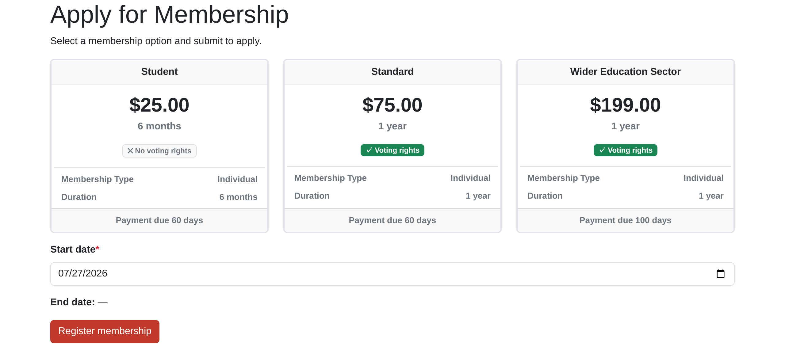
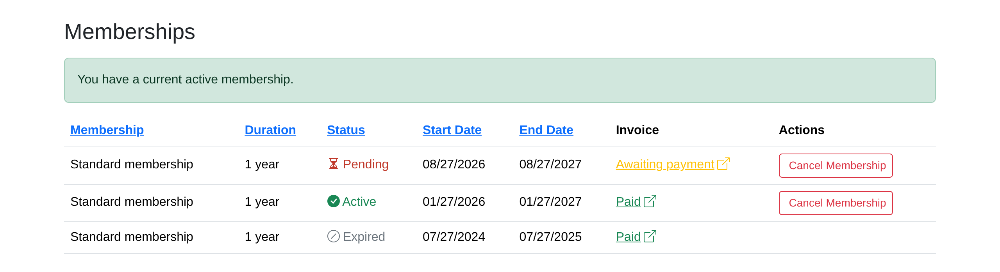
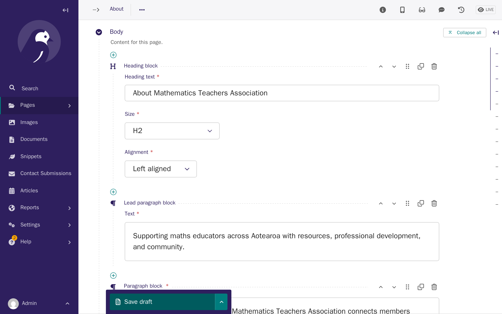
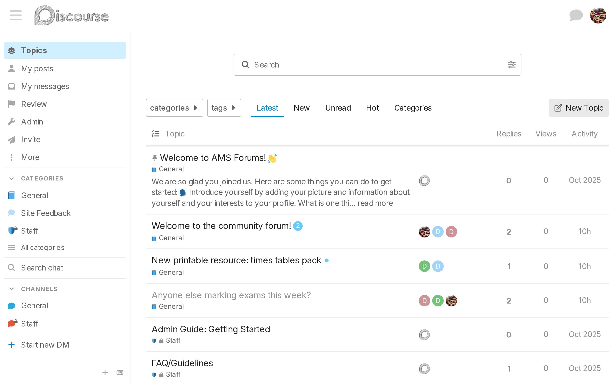
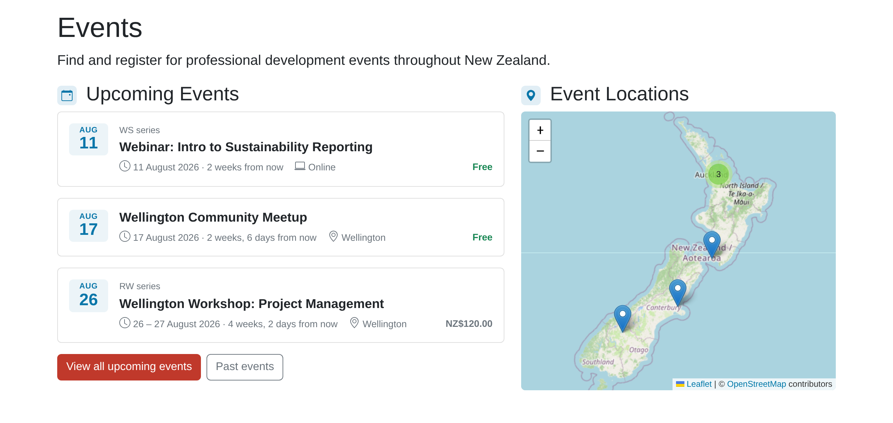
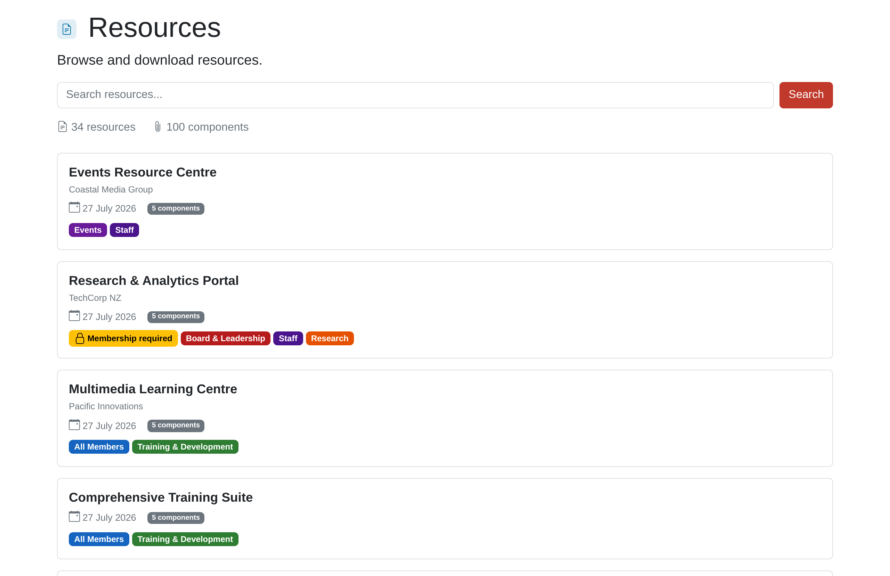
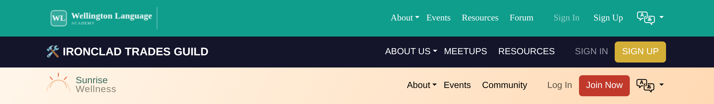

# Association Management Software (AMS)

**The open-source platform for modern association management**

[**Explore the Documentation »**](https://digital-technologies-teachers-aotearoa.github.io/ams/)

[View Demo](https://ams-dev.dtta.org.nz/)
&middot;
[Report Bug](https://github.com/digital-technologies-teachers-aotearoa/ams/issues/new?template=bug_report.md)
&middot;
[Request Feature](https://github.com/digital-technologies-teachers-aotearoa/ams/issues/new?template=feature_request.md)

<!-- [Screenshot: Main member dashboard showing membership status and navigation] -->

## What is AMS?

Association Management Software (AMS) is a comprehensive, open-source platform designed specifically for membership associations, professional bodies, clubs, and community organizations.
Built by the Digital Technologies Teachers Aotearoa (DTTA) for their own operational needs, AMS provides everything required to manage a modern association in one integrated system.

Unlike fragmented solutions that require multiple separate platforms for membership management, billing, content publishing, and community engagement, AMS delivers an all-in-one solution.
Whether you are managing individual memberships, organization-based memberships with seat allocation, or hybrid models, AMS handles the complexity while providing a seamless experience for both administrators and members.

Developed with New Zealand associations in mind, AMS includes native support for Xero accounting integration, and bilingual content (English and Te Reo Māori), while remaining flexible enough to serve associations worldwide.

## Key Features

### All-in-One Solution

AMS consolidates essential association management functions into a single platform, eliminating the need to integrate and maintain multiple separate systems. Members access everything through one unified portal with single sign-on authentication across all services.

### Membership Management

- **Individual and Organization Memberships:** Support for both individual members and organization-based memberships with seat allocation and management
- **Flexible Membership Types:** Configure multiple membership tiers with different pricing and renewal cycles
- **Member Self-Service:** Members can update their profiles, manage organization seats, and track their membership status independently

### Integrated Billing

- **Xero Integration:** Integration with Xero accounting software for seamless invoice generation and payment tracking
- **Automated Invoicing:** Automatic invoice creation for membership applications
- **Payment Tracking:** Real-time synchronization between AMS and Xero for accurate financial records

### Content Management System

- **Wagtail CMS:** Powerful, user-friendly content management powered by Wagtail, allowing rich, structured content with reusable blocks and components
- **Multi-Language Support:** Path-based multi-language routing with full support for English and Te Reo Māori
- **Preview and Workflow:** Draft, preview, and publish content with editorial workflow controls

### Community Forum

- **Discourse Integration:** Seamless integration with Discourse forum platform for member discussions
- **Single Sign-On:** Members use the same credentials across AMS and the forum with OAuth2 SSO
- **Membership-Based Access:** Automatic access control based on active membership status

### Events (Optional module)

- **Event Listings:** Browse upcoming and past events with detail pages, session schedules, and location maps
- **Event Management:** Manage events, series, locations, and regions via the Django admin
- **Series and Regions:** Group related events into series and organise locations by region

### Resources (Optional module)

- **Resource Library:** Browse, search, and download resources with full-text search and tag-based filtering
- **Private File Storage:** Files are served via authenticated URLs — never publicly hotlinkable
- **Taxonomy:** Admin-managed categories and tags for faceted filtering across the resource library

### Customization and Branding

- **Theme Customization:** Customize colors, logos, and branding to match your association's identity
- **Custom Profile Fields:** Add association-specific fields to member profiles without code changes
- **Bootstrap-Based Styling:** Modern, responsive design built on Bootstrap 5 with CSS variable customization

## Why Choose AMS?

### Open Source and Self-Hosted

AMS is released under an open-source license, providing complete transparency and freedom from vendor lock-in. Self-host on your own infrastructure for full control over your data, security, and privacy. No per-user pricing, no feature paywalls, and no forced upgrades.

### Built for Associations, by Associations

Developed by DTTA to solve real operational challenges faced by membership associations, AMS includes features that matter in practice—not just in theory. The platform continues to evolve based on actual association needs and operational experience.

### Comprehensive Solution

Stop managing multiple platforms, integrations, and vendor relationships. AMS consolidates membership management, billing, content publishing, and community forums into one cohesive system, reducing administrative overhead and improving the member experience.

### Active Development

AMS is under active development with regular updates, improvements, and new features. Built on modern, well-supported technologies (Django, Wagtail, PostgreSQL), the platform benefits from both dedicated development and the broader open-source ecosystem.

## Getting Started

To install and configure AMS for your association, please refer to the [installation guide](https://digital-technologies-teachers-aotearoa.github.io/ams/) in the documentation. The documentation provides comprehensive instructions for administrators, association staff, and developers.
