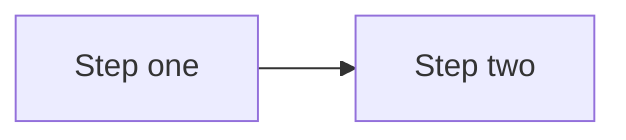

# Documentation conventions

**Who this page is for:** developers and the operator writing or updating AMS documentation.

This page is binding: it records the structural decisions made for the [client onboarding & website setup documentation effort](https://github.com/digital-technologies-teachers-aotearoa/ams).
Later documentation tasks follow these conventions rather than re-deciding them.

## Where each doc type lives

| Nav section                      | Directory                       | Audience                 | What goes here                                                                                                                                                       |
| --------------------------------- | -------------------------------- | ------------------------- | -------------------------------------------------------------------------------------------------------------------------------------------------------------------- |
| Home                              | `docs/docs/index.md`             | Everyone                  | What AMS is                                                                                                                                                          |
| Features                          | `docs/docs/features.md`          | Everyone                  | Product capability overview                                                                                                                                          |
| Getting started                   | `docs/docs/getting-started/`     | Client decision-makers    | Onboarding overview, decision questionnaire, costs sheet, accounts & access checklist, working-with-designers one-pager, and the two glossaries (settings and terms) |
| Your website                      | `docs/docs/website/index.md`     | Client website admins     | Landing page routing between the Setup guide and Feature reference groups                                                                                            |
| Your website → Setup guide        | `docs/docs/website/setup/`       | Client website admins     | The empty-site-to-launch tutorial series                                                                                                                             |
| Your website → Feature reference  | `docs/docs/website/reference/`   | Client website admins     | Standing reference (not a guided path) for CMS, events, resources, forum, theme customization                                                                        |
| Hosting AMS                       | `docs/docs/hosting/`             | Provider                  | Platform-agnostic deployment guide, DigitalOcean/Postmark/Cloudflare worked example, Xero billing setup, client-communication templates                              |
| Developing AMS                    | `docs/docs/developer/`           | Developer / contributor   | Codebase contribution, architecture                                                                                                                                   |

**Decision — Hosting AMS is top-level, not under Developing AMS.**
The provider's audience is "person running a client's instance," which has more in common with the Getting started/Your website audiences (a concrete client, a concrete handoff) than with "person contributing to the AMS codebase."
Keeping it top-level also means it doesn't get lost under codebase-contribution content a client-facing reader would never open.
The repo stays public and the runbook contains no secrets, so there's no publishing reason to nest it.

**Decision — both glossaries live under Getting started**, not in a separate top-level "Reference" section: `docs/docs/getting-started/settings-glossary.md` and `docs/docs/getting-started/glossary.md`.
Both are primarily consulted during onboarding and by non-technical readers, and adding a fourth top-level section for two pages isn't worth the nav complexity.
Other pages link to them with `getting-started/glossary.md#term` anchors.

**Decision — each new top-level section gets its own `index.md` landing page**, distinct from its content pages, following the existing pattern in `website/reference/index.md` (formerly `admin/index.md`).
The landing page states what the section is, who it's for, and links to its pages.
`getting-started/index.md` in particular becomes the onboarding overview & timeline page — the "front door" of the intake pack — rather than a separate landing plus a separate overview page.

## "Who this page is for" header

Every page in Getting started, Your website (both the Setup guide and Feature reference groups), Hosting AMS, and the working-with-designers one-pager starts with:

```markdown
**Who this page is for:** <audience>, <one clause of calibration if useful>.
```

Use the audience names verbatim (client decision-makers, client website admins, operator, third-party designers/agencies) so a reader skimming multiple pages recognises the same audience language.
Developer docs may omit this header (audience is implicit: developers) unless the page also serves the operator.

## Spelling

All documentation is written in **en-NZ** (New Zealand English): `colour` not `color`, `organisation` not `organization`, `customise`/`organise`/`authorise` not `customize`/`organize`/`authorize`, and so on.
This applies across every page, including developer pages — not just client-facing ones.

**Exemptions** — leave these exactly as they appear in the underlying system, even where that means American spelling:

- code identifiers (field names, class names, function names, settings names), whether backticked or not, e.g. `ColorField`, `AMS_BILLING_SERVICE_CLASS`;
- content inside fenced code blocks (CSS variables, JSON keys, shell comments);
- quoted or bolded UI labels copied verbatim from a real product screen, e.g. Xero's own **Client ID** field or a literal error string like `"Unauthorized"`.

If a word's spelling is genuinely ambiguous (is this prose, or the name of a field?), prefer leaving it — the point is to fix real prose drift, not to "correct" every string that merely contains an American letter sequence.

## Title casing

Headings (any level, on any page including developer pages) use **sentence case**: capitalise only the first word and any proper nouns/acronyms, lowercase everything else — including the word right after a colon or a step number, e.g. `## Step 3: authorise the connection`, `## Note: your everyday email vs your website's email`.

**Proper nouns and acronyms stay capitalised**, e.g. Wagtail, Django, Xero, MJML, TinyMCE, Discourse, DigitalOcean, Postmark, Cloudflare, CSS, URL, API, AMS, SSO, DNS, UAT, HTML, JSON. So do code identifiers and product-specific UI terms that are themselves proper nouns (Xero's "Custom Connection").

Renaming a heading only ever changes its rendered case, never its anchor slug — mkdocs' TOC extension lowercases every anchor regardless of source casing — so a pure case fix is anchor-safe by construction. It only becomes an anchor-breaking change if it also fixes a word's *spelling* (e.g. `color` → `colour` within a heading); check for `#`-anchored inbound links before making that kind of combined edit.

## Markdown source formatting

- **One sentence per line:** write prose as one sentence per source line (semantic linefeeds), not wrapped to a fixed column width.
  This keeps diffs scoped to the sentence that actually changed, instead of reflowing an entire paragraph.
  Markdown joins consecutive lines within a paragraph into one flowing line when rendered, so this is a source-only convention — it does not change how a page displays.
  Applies to prose paragraphs and list-item text across all documentation pages, including client-facing, provider, and developer pages; tables and code blocks are exempt (there's no useful "sentence" to split them by).
  A list item with more than one sentence continues on the next line, indented to align under the item's text, rather than starting a new list item.
- **Numbered list continuations use a fixed 4-space indent, not marker-width alignment.** Python-Markdown (which MkDocs uses) requires exactly 4 spaces for a list item's continuation content — a 3-space indent (visually aligned under `1. `) silently breaks the item out of the list, and if that happens right before a blank line and the next marker, each item renders as its own separate list restarting at "1." instead of one continuous list.

## Style rules for client-facing pages

Client-facing pages (Getting started, Your website: Setup guide and Feature reference) are written for everyone — assume no technical knowledge and possibly a tablet, not a desktop with two monitors.

- **Reading level:** aim for [Flesch–Kincaid grade 8](https://en.wikipedia.org/wiki/Flesch%E2%80%93Kincaid_readability_tests) or lower.
  Short sentences, common words, no unexplained acronyms.
- **Numbered steps:** any procedure is a numbered list, not prose paragraphs.
- **One action per step:** each numbered step is a single click, field entry, or decision — never "do X, then Y, then check Z."
- **Screenshot per step:** each step in a tutorial (Setup guide series) carries one screenshot showing the result of that step.
  Reference pages (Feature reference) use screenshots more sparingly, where they resolve ambiguity rather than illustrating every click.
  [Articles](../website/reference/articles.md) and [Terms & policies](../website/reference/terms.md) are deliberate exceptions, added on direct request rather than a reinterpretation of this rule: both walk through a full create-and-publish flow with one screenshot per step, closer to a Setup guide tutorial's density than a typical reference page's.
- **Glossary linking:** the first use of a jargon term on a page links to its entry in `getting-started/glossary.md#term`, with a relative path matching the page's own depth: one `../` from a top-level section page (e.g. `[DNS](../getting-started/glossary.md#dns)` from a Hosting AMS or Developing AMS page), two from a Setup guide/Feature reference page (e.g. `[DNS](../../getting-started/glossary.md#dns)`).
  Don't re-explain the term inline — link instead.

Hosting AMS pages use the opposite register deliberately: terse, technical, no glossary links, no reading-level target — the provider is technical.

## Tutorial series page template

Established by `website/setup/orientation.md`, binding on every later page in the "Setup guide" series.

- **Structure:** "Who this page is for" header, then a short "What you'll have at the end" intro stating concrete outcomes, then an optional "Before you start" section for prerequisites, then a numbered **Steps** list (one action per step, one screenshot per step showing the result of that step), then any reference material the task's own guidance calls for (e.g. a table distinguishing several parts of the system), then a "What's next" footer linking to the following tutorial.
- **Screenshot reuse within a page:** if a step's result is "you're back on a page already screenshotted earlier on the same page" (for example, returning from the CMS to your account page), reuse that screenshot's file rather than capturing a near-duplicate.
  It's still one manifest entry; the page just embeds it twice.
- **Forward-chaining stubs:** each tutorial task creates a minimal stub for the *next* tutorial in the series, so its own "What's next" link resolves under the strict build.
  The next task then replaces that stub in place, same filename, rather than renaming the file or re-editing the nav.
- **Series index:** `website/setup/index.md` keeps a numbered list of all twelve tutorials.
  Only the tutorials that exist so far are links; the rest stay as plain text until their task lands.

## Diagrams

Mermaid diagrams are supported via a `custom_fences` entry on `pymdownx.superfences` in `docs/mkdocs.yml` (following [Material for MkDocs' documented approach](https://squidfunk.github.io/mkdocs-material/reference/diagrams/)) — no extra JavaScript is needed beyond that config, since the `squidfunk/mkdocs-material` image this project's `docs` service runs bundles Mermaid rendering natively.
Use a fenced code block with the `mermaid` language tag:

````markdown

````

Prefer a diagram for sequence/flow relationships (e.g. an onboarding phase sequence) and a table when the content needs per-item detail (durations, owners, links) alongside the sequence — the two aren't mutually exclusive on the same page.

## Public absolute links (mkdocs-macros)

Most pages link to each other with ordinary relative Markdown links (`../getting-started/index.md`), which the strict build verifies resolve and which work identically in a local preview and on the published site.
Some pages are meant to be **copied out of the docs site** rather than read in place — `hosting/client-communication-templates.md` is the first example, since its email templates need real, clickable URLs once pasted into an email client, not relative paths that only resolve inside a docs build.

**Mechanism:** the [`mkdocs-macros` plugin](https://github.com/fralau/mkdocs-macros-plugin) (installed in `compose/local/docs/Dockerfile`, enabled in `docs/mkdocs.yml`) lets a page use `{{ config.site_url }}` — `site_url` is set in `docs/mkdocs.yml` to the site's real published URL — to build an absolute link that renders correctly regardless of where the docs are served from.

**Opt-in only, page by page — this is not a site-wide behaviour.** `docs/mkdocs.yml` sets `render_by_default: false`, so a page is only passed through Jinja2 rendering if its own YAML front matter says so:

```markdown
---
render_macros: true
---
```

This was a deliberate, tested decision, not the plugin's default: turning macro rendering on site-wide broke other pages that legitimately contain literal ``/`{{ }}` syntax as documented content (e.g. `developer/wagtail-cms.md`'s Django/Wagtail template examples), since the plugin tries to interpret every such token as a Jinja2 expression. Opt-in avoids that entirely — only pages that explicitly ask for it are rendered.

**Placeholder syntax and `on_undefined: keep`:** a page using this mechanism may also contain its own literal `{{placeholder}}`-style tokens meant for a human to find-and-replace later (the client-communication templates' `{{organisation}}`, `{{contact_name}}`, etc.) — these do **not** need escaping. The plugin's default `on_undefined: keep` setting renders any undefined bare name as-is rather than failing the build, so a plain `{{organisation}}` survives unchanged (Jinja2 reformats its spacing to `{{ organisation }}`, which is cosmetic only). This only covers bare names: an undefined *attribute* access (`{{ something.field }}`) still fails the build, so don't reuse this trick for anything more complex than a flat placeholder name.

**Trade-off — verify these links by hand.** The strict build's link-checking only understands ordinary Markdown references; it doesn't evaluate `{{ config.site_url }}...` expressions, so a page using this mechanism gets no automatic warning if a linked page is renamed or moved. After building (non-strict), grep the rendered page's `href="..."` attributes to confirm the resolved URLs are correct, the same verification pattern used throughout this documentation effort.

## Settings glossary anti-drift check

`docs/docs/getting-started/settings-glossary.md` documents every client-decidable `AMS_*` env var (settings a client decides during onboarding, via the decision questionnaire — part of the onboarding intake pack, not yet its own page).
It must never drift from `config/settings/base.py`: if a setting is added to the code but not documented, or removed from the code but left in the glossary, the docs would silently go stale.

**Mechanism (decision — generated check over hand-written page, not a fully generated page):** the glossary page is hand-written prose (so descriptions can stay plain-language for a non-technical audience), but a management command statically parses `config/settings/base.py` with Python's `ast` module to find every `AMS_*` string literal passed to `env(...)`/`env.bool(...)`/`env.list(...)`, and compares that set against every `AMS_*` name documented as a level-2 heading in the glossary.
A generated page was rejected: plain-language descriptions of what a setting does for a committee member can't be generated from a one-line `env.bool()` call, so the source of truth for _prose_ has to stay hand-written — the check only needs to guarantee the _set of settings_ can't drift, which a comparison script does without needing to generate content.

**Extended to cover [Deployment](../hosting/deployment.md) too.** Deployment.md's environment variable table used to duplicate several of these same `AMS_*` settings (in a developer register, alongside genuinely deployment-only variables), which is exactly the kind of two-source-of-truth drift risk this mechanism exists to prevent.
The same command now also regex-scans `deployment.md` for any `AMS_*` name used as a table-row cell, and fails if it finds one that's also documented in the glossary — deployment.md is expected to describe those settings in prose (a link to the glossary) rather than repeat them as table rows.
`AMS_BILLING_SERVICE_CLASS` and `AMS_BILLING_EMAIL_WHITELIST_REGEX` are unaffected by this: they're read in `config/settings/production.py`, not `base.py`, so they're outside the glossary's scope and can stay in deployment.md's table.

Run it with:

```
docker-compose exec django python manage.py check_settings_glossary
```

It fails loudly (non-zero exit, listing exactly which settings are missing or stale) if the two sides disagree.
It also runs as a step in the `django-test` job in `.github/workflows/ci.yml`, so a PR that adds or removes an `AMS_*` setting without updating the glossary fails CI — this is what makes the glossary page's "cannot silently go out of date" claim true, rather than just possible if someone remembers to run the check locally.

## Definition of done for feature PRs that change documented UI

A PR that changes UI covered by these docs is not done until:

1. The Playwright screenshot suite has been re-run and any changed screenshots are included in the PR;
2. Any page whose steps, labels, or field names changed is updated to match;
3. The manifest still has no orphaned or stale entries for the changed screens.

## Automated screenshots

### How to regenerate screenshots

The screenshot suite lives in `docs/screenshots/`.
It captures against Chromium only, since a single deterministic renderer is what matters for byte-stable images, not cross-browser coverage.

**File layout:** `run.mjs` is the entrypoint only — it merges every tutorial's `steps` object and runs `main()`'s capture loop, nothing more. Shared constants live in `shared/config.mjs`; Playwright helpers used by two or more tutorials live in `shared/browser-helpers.mjs`; the one bit of state one tutorial's steps set for a later tutorial's steps to read (`aboutPageId`/`contactPageId`) lives in `shared/shared-state.mjs`. Each tutorial's own capture steps, plus any constants or helpers only that tutorial needs, live in their own `steps/<tutorial>.mjs` — `docs-conventions-examples.mjs`, `orientation.mjs`, `branding-theme.mjs`, `first-pages.mjs`, `navigation-menus.mjs` (covers both the Main menu and footer parts of tutorial 4), `languages-translations.mjs`, `memberships.mjs`, `profile-fields.mjs`, `forum.mjs`, `events.mjs`, `resources.mjs`, `inviting-your-team.mjs`, `articles.mjs`, `terms.mjs`, `features-marketing.mjs` (`features.md`'s marketing screenshots — see "Marketing screenshots" above for the different seed script this one needs). `articles.mjs` and `terms.mjs` must stay the last two tutorial-derived entries in `manifest.json`, in that order, before the marketing set — see bullet 39 below.

**Prerequisites:**

1. From the repo root, run `./docs/screenshots/seed.sh` (or `just docs-seed`).
   This flushes the database and rebuilds a clean skeleton site — `setup_cms` (sites, home pages, locales) plus an admin account — deliberately **not** `sample_data`, since screenshots should show what a real new client's site looks like (empty), not `sample_data`'s fixture events, resources, and articles.
   It starts the Django dev server in the background, waiting until it responds before exiting.
   It deliberately does **not** set `AssociationSettings` to the demo name — `setup_cms` leaves that at a language-derived placeholder like "English AMS", and `run.mjs` sets it to "Mathematics Teachers Association" itself, through the CMS, as part of capturing Tutorial 2's own steps (see the demo organisation convention above).
   `manage.py flush` truncates data but doesn't replay migrations, which deletes Wagtail's root page/collection (created by data migrations inside the `wagtail` package) without restoring them — `seed.sh` runs `manage.py ensure_wagtail_root` straight after flushing to recreate them, otherwise `setup_cms` fails silently with "Root page not found."
   Screenshot content reflects whichever languages `AMS_ENABLED_LANGUAGES` has enabled in your `.envs/.local/django.ini` (e.g. the CMS dashboard's page list differs between an `en`-only env and an `mi,en` env) — keep this env var stable across regenerations of the same image, or expect unrelated-looking diffs.
2. **Discourse baseline (forum screenshots only).** Unlike everything else `seed.sh` prepares, it does not reset Discourse — see bullet 23 above for why. The forum screenshots assume Discourse's `docker compose up` default: the three categories a fresh Discourse ships with (General, Site Feedback, Staff) and nothing else added since. On a genuinely clean checkout this holds automatically the first time the `discourse`/`discourse_init` services come up. If you're regenerating against a long-lived local Discourse instance instead (as this task's own environment was), check `<forum-domain>/categories` first and remove anything not in that starter set before running the suite — as this task's own local environment needed, having accumulated a stray category from manual exploration before this caveat was written.

**Regenerate every screenshot in the manifest:**

```
docker-compose exec node npm run docs:screenshots
```

This overwrites every image listed in `docs/screenshots/manifest.json` deterministically — running it twice against a fresh seed produces the same images. `prepareForCapture()` in `shared/browser-helpers.mjs` is what makes that true: it hides `#djDebugRoot` (the Django Debug Toolbar), several other nondeterministic chrome elements, disables every CSS transition/animation, and blurs whatever's focused, all before every capture — see bullet 27 above for how this was measured and what it fixes.

**Regenerate screenshots for just one tutorial**, instead of rewriting and re-diffing all ~65 images:

```
docker-compose exec node npm run docs:screenshots -- events
```

Any number of prefixes can be given; a manifest entry runs if its `step` or `id` starts with any of them. Only reliable for a tutorial whose steps don't depend on an earlier tutorial's state (see bullet 8) — `events` is self-contained, but filtering to `navigation` alone, for example, would skip the `first-pages` steps that set up state `navigation`'s own steps read. When in doubt, run the full suite.

**Check for orphaned images** (in the manifest but not embedded in a doc page, or on disk but not in the manifest, or embedded in a doc page but missing from the manifest):

```
docker-compose exec node npm run docs:screenshots:check
```

**Adding a new screenshot:** add a capture step to the relevant tutorial's `steps` object in `docs/screenshots/steps/<tutorial>.mjs` (a new file, following the file layout above, if it's the first step for a new tutorial — then list it alongside the others in `run.mjs`'s merge), add an entry to `docs/screenshots/manifest.json` (file path per the naming convention above, the step name, and the doc page(s) that will embed it), embed the image in the doc page, then run the two commands above.

Two example screenshots below prove the pipeline end to end; they're captured by `steps/docs-conventions-examples.mjs`'s `exampleLogin` and `exampleDashboard` steps.
Later tutorial pages add their own capture steps for the screens they document, rather than reusing these.

### Screenshot conventions

1. **Directory layout:** `docs/docs/images/<section>/`, mirroring the nav section directories above (e.g. `docs/docs/images/getting-started/`, `docs/docs/images/website/setup/` for the deeper-nested Setup guide). `features.md` (no section directory of its own) uses `docs/docs/images/features/`; its screenshots are deliberately **marketing** shots, richer than a real new client's empty site — see "Marketing screenshots" below.
2. **File naming:** `<page-slug>-<step-number>-<short-description>.png`, all lowercase, hyphen-separated, e.g. `branding-theme-03-colour-picker.png`.
3. **Fixed viewport:** 1280×800px, captured at 2x device scale factor (exported PNGs are 2560×1600px) for byte-stable, crisp images — Material for MkDocs scales display size, only sharpness changes.
4. **Demo organisation:** all screenshots use the fictional association **"Mathematics Teachers Association"**, set through the CMS by `steps/branding-theme.mjs`'s `brandingAssociationName` step — the same step [Tutorial 2](../website/setup/branding-theme.md) documents — not by `seed.sh`/`sample_data`, which leave the name at a language-derived placeholder (`"{Language} AMS"`). Screenshots captured earlier in `manifest.json`'s order than that step (docs-conventions examples, all of Tutorial 1, Tutorial 2's own "before" shot) still show the placeholder — expected.
5. **Playwright-regenerable rule:** no screenshot may be committed unless the suite can regenerate it byte-for-visually-identical.
6. **Fixtures for upload screenshots:** small checked-in test files the suite uploads through the real UI, kept at `docs/screenshots/fixtures/` (not part of the manifest). E.g. `demo-logo.png`, a generated placeholder monogram — never a real client asset. `demo-article-cover.png` (an article's cover image) is a separate fixture rather than reusing `demo-logo.png`, since the latter is already uploaded earlier in the same run (`branding-theme.mjs`), which would trip the duplicate-image interstitial below on its first use, not just on a re-run.
7. **Ordering for capture steps that change site state:** a step that mutates data (uploading a logo, saving a theme colour) must run against a freshly-seeded site, and any later step expecting that change (e.g. a "logo is now live" shot) must be listed *after* it in `manifest.json` — state carries over between steps within one run. Running the suite twice without reseeding shows stale "before" state; the fix is always to reseed, never to run twice. **Related gotcha:** re-uploading the same fixture file twice in one run trips Wagtail's duplicate-image detection, showing a "seems to be a duplicate" interstitial instead of closing the chooser — a step's upload helper must detect and click through it.
8. **Uploaded media needs a host rewrite to render in the capture browser:** `DJANGO_MEDIA_PUBLIC_CUSTOM_DOMAIN` (`localhost:9000`) is correct for a host browser but unreachable from inside the `node` container. `shared/browser-helpers.mjs`'s `proxyMinioMedia()` reroutes `localhost:9000` → `minio:9000` via `page.route()` before every capture step.
9. **Django Debug Toolbar must be hidden in every frame, not just the top page** — Wagtail's "Toggle preview" panel renders the public page in its own `<iframe>` with its own `#djDebugRoot`. `prepareForCapture()` loops `page.frames()` to hide it in each one.
10. **Draftail (rich text editor) needs real keystrokes, and reading typed text back is not proof it saved.** `locator.fill()` sets DOM text directly without triggering Draftail's React state, so the field displays correctly but saves empty; use `pressSequentially()` instead. Draftail also debounces syncing to the hidden `body-<n>-value[-text]` input, so even with real keystrokes, saving immediately after typing can persist empty — `fillBodyText()` waits for that hidden input's actual value to contain the typed text before returning, rather than a fixed pause.
11. **`scroll-behavior: smooth` in Wagtail admin CSS means `element.scrollIntoView()` animates** — a screenshot taken right after still shows the pre-scroll position. Pass `behavior: "instant"` to skip the animation.
12. **The English home page's numeric ID depends on `AMS_ENABLED_LANGUAGES`'s order** — `setup_cms` creates one `HomePage` per configured language in that order, so which ID is English shifts if the env var changes. Resolve it at runtime with `getEnglishHomePageId()` rather than hard-coding.
13. **A page whose parent is Root (only the home page so far) redirects the post-publish flash message to the Root explorer**, which also lists Wagtail's own leftover "Welcome" page and the Māori home page — re-navigating loses the flash message the screenshot needs. `hideUnrelatedRootPages()` hides the unrelated rows in place with a scripted `page.evaluate()` after publishing (not the annotated-image exception — nothing is added by hand).
14. **A Title block's own widgets can clobber a sibling block's still-unsaved edit — a real Wagtail-editor bug, not just an automation-timing issue.** Filling a Title block, then a Lead paragraph block, then saving once intermittently saved an empty tagline: the hidden input holding the correct value silently reset to `null` moments later, before Save was even clicked. No in-session wait was reliable. The fix: save the Title block on its own first, then insert and fill the Lead paragraph block against a reload where the Title block is now server-rendered. Because this is a real editing hazard, [Tutorial 3](../website/setup/first-pages.md) itself documents separate "save your title" / "save your tagline" steps rather than one combined step.
15. **Adding a child page under an existing content page (not Home) skips the page-type chooser screen** — `ContentPage.subpage_types` allows only one child type, so Wagtail's `add_subpage` view goes straight to the add form. `createChildContentPage()` is a separate helper for this case (fills the title directly, no type-selection click); check which helper matches a given parent's `subpage_types` before assuming.
16. **Wagtail's page chooser modal closes with a fade, not an immediate removal** — a screenshot taken right after selection can capture it mid-fade. Wait for the modal to reach `hidden` state (scoped to `.modal.fade[role="dialog"]`, since a broader selector also matches the admin's keyboard-shortcuts dialog) rather than a fixed pause. Bootstrap's `.modal-backdrop` and `modal-open` also linger slightly after the modal itself hides — wait for the backdrop to detach too, or the page looks dimmed.
17. **Wagtail's "unsaved edits" footer warning debounces (~700-800ms) — but a timing fix confirmed only through the interactive Playwright MCP browser does not transfer to the actual headless `run.mjs` capture.** Waiting for the warning to appear worked reliably by hand, then never appeared within 30s on 10 of 14 real capture-run steps. The working fix was different in kind: hide the warning entirely via `prepareForCapture()`'s CSS injection, the same "remove nondeterministic chrome" pattern as `#djDebugRoot`, rather than pin down its timing. **General lesson (also seen in bullets 29 and 34): always re-run the actual capture pipeline before trusting a determinism fix confirmed only in the interactive MCP browser — headless Chromium behaves differently for some Stimulus controllers.**
18. **Only the header language switcher is gated to signed-out visitors** (`header_desktop.html`, inside the `` of an auth check) — the footer's switcher (`footer.html`) has no such gate and always renders. A capture step needing the footer switcher must not call `login(page)` (no explicit logout needed either, since `browser.newPage()` opens a fresh cookie-less context every time).
19. **A page's Slug field, once auto-filled from the title, silently reverts a `locator.fill()`-set value the next time any StreamField block is inserted** — but a value set with real keystrokes survives. The `w-slug` Stimulus controller doesn't count `fill()` as a real edit and re-syncs from the title on the next block-insertion event. `setPageSlug()` clears the field and types the replacement with `pressSequentially()`, waiting for the real value to match — and is only ever called immediately before publishing (i.e., do the slug edit last).
20. **`user_has_active_membership()` (`ams/utils/permissions.py`) returns `True` for any superuser before checking their own memberships**, and `create_sample_admin` creates a full superuser — so the account page's "active membership" banner shows regardless of that account's actual membership status. This is real product behaviour worth documenting, not a bug to route around: [Tutorial 6](../website/setup/memberships.md) points readers to the per-membership **Status** column instead, which does reflect the real state.
21. **Mailpit is reachable directly at `mailpit:8025`** from both `run.mjs`'s own Node process and the capture browser — no rewrite needed (unlike Minio, bullet 9). Mailpit isn't reset by `seed.sh`, so a step capturing an email must clear the inbox (`DELETE /api/v1/messages`) immediately before triggering it (`clearMailpit()`), then find the message by sender via the API (`getMailpitMessageIdByFrom()`) rather than clicking through Mailpit's UI. The screenshot itself is scoped to `#preview-html` only, not Mailpit's own inbox chrome, since a reader never sees Mailpit on a live site.
22. **Discourse (the forum) is not reset by `seed.sh`** — it's a separate service with its own database, so anything created there persists and accumulates forever. Every forum capture step is deliberately read-only on Discourse for this reason. **Separately, Discourse also carries its own per-account, history-dependent chrome** (unread badges, "Welcome back" vs "Welcome") depending on whether the SSO account has signed in before. `prepareForumCapture()` (run for every capture step via `prepareForCapture()`) strips these, the same "remove nondeterministic chrome" pattern used elsewhere.
23. **Reaching Discourse from the capture browser needs a Chromium launch flag, not a `page.route()` proxy.** `DISCOURSE_REDIRECT_DOMAIN` (`localhost:80`) is unreachable from inside the `node` container. A `page.route()` proxy (the Minio pattern) failed twice: `route.fetch()` follows redirects to the unreachable literal `Location` header before the route sees them, and re-fulfilling a `localhost`-addressed request with content from AMS's own origin breaks that content's relative asset URLs. The fix that worked: `chromium.launch({ args: ["--host-resolver-rules=MAP localhost:80 discourse:80"] })`, which remaps at the network layer before any request is made, so no cross-origin re-fulfilling is needed. Separately, Discourse's Ember app never goes idle (background polling), so forum steps wait for `"load"` instead of the suite's usual `"networkidle"`.
24. **A `ModelAdmin` with `save_on_top = True` (`EventAdmin`) renders its submit row twice**, so an unscoped `getByRole("button", { name: "Save" })` hits Playwright's strict-mode rejection; `saveAdminForm`/`saveAdminFormContinueEditing` scope to `.first()`. The Visibility fieldset (with the Published checkbox) sits below the fold and needs `scrollIntoViewInstantly` after a "Save and continue editing" reload. **TinyMCE** (behind the Description fields here) needs its own API rather than Draftail's: `window.tinymce.get(fieldId).setContent(html)` syncs the hidden textarea immediately, with none of Draftail's debounce race.
25. **A session's start/end time is computed fresh on every run** (`futureDateISO()`, using local date parts, not `toISOString()`, to avoid an off-by-one near midnight) rather than hard-coded, since a fixed date would eventually drop the demo event off the public Upcoming listing. **Consequence:** the public events page shows a relative "N weeks from now" string, so `events-06`/`events-07` are only byte-identical within the same calendar day, not across days.
26. **Most "no visible difference but the image changed" reports are real, byte-level nondeterminism — measure, don't guess.** Reseeding and running the full suite twice produced 33 of 65 images with nonzero pixel diffs before these fixes, traced mostly to the Wagtail admin sidebar's React re-mount animation (a "Help" nav badge landing at a different frame each time) — fixed with a blanket `transition: none !important; animation: none !important;` in `prepareForCapture()`. A smaller cause: a focused field's native focus ring painting inconsistently — fixed by blurring `document.activeElement` before every capture. A third: `WAGTAILIMAGES_ENABLE_UPDATE_CHECK`'s async "Upgrade available" banner, hidden the same way as `#djDebugRoot`. **Still expected to differ between runs, not a regression:** `memberships-06-approval-approved.png` (real wall-clock `Today`/`Now` fill), `resources-02-form-saved.png` (`auto_now_add`/`auto_now` timestamps), a ~2px line in `languages-translations-05`'s minimap (not root-caused further), `inviting-02-user-created.png` (Django admin shows the stored password hash, randomly salted every time), `articles-06-listing-live.png`/`articles-07-detail-live.png` (the article's displayed publication date is date-only, so stable within a day but not across one), and `terms-01-version-form-filled.png`/`terms-02-versions-list.png` (Date active is typed/displayed to the minute, so never byte-identical between two runs). **Method for any future unexplained churn:** reseed, run twice, diff byte-for-byte, bounding-box with Pillow to localize before guessing why.
27. **A `filter_horizontal` (`SelectFilter2`) multi-select's visible options rebuild from an in-memory `SelectBox.cache`, separate from the live DOM** — a double-click that isn't reflected in that cache gets silently discarded on the next redisplay, with no error. Call Django's own `window.SelectBox.move(fromId, toId)` from `page.evaluate()` instead of simulating the double-click, since it updates cache and DOM together.
28. **Wagtail's Minimap panel renders every item as an unlabelled dash under headless capture**, though it shows correct labels interactively — no headless-compatible fix was found (three approaches tried). The marketing Content Management System screenshot uses the main content editor instead, scrolled so it doesn't need the Minimap.
29. **This Discourse instance requires SSO sign-in to view anything, including its homepage** — there is no genuinely signed-out view to capture. Every forum capture signs in via `/forum/` first (`loginToForum`) and accepts the signed-in admin's own chrome.
30. **Composing several screenshots into one image via base64 `` tags sized by CSS is unreliable** — a PNG's own pixel dimensions (already 2x from `DEVICE_SCALE_FACTOR`) get misread as its natural CSS size, and `fullPage` doesn't shrink below the current viewport. Fix: set each ``'s `width`/`height` attributes explicitly from the known crop dimensions, and resize the viewport to the crops' total height before the final screenshot.
31. **`MembershipOption.archived` is also the right tool for keeping a billing-fixture-only option out of a picker screenshot** that must show an exact set of options — setting `archived: True` excludes it from the `apply-individual` queryset without touching memberships/invoices that already reference it.
32. **`title_block` is HomePage-only** — `ContentPage` (About, etc.) has no such block; use `heading_block` instead, a plain StructBlock with a `fill()`-able CharBlock text field plus a required Size select with no pre-selected default.
33. **A Draftail editor mounted immediately beforehand can silently drop keystrokes sent right away, headlessly only** — the same interactive-vs-headless gap as bullet 18, with no deterministic "finished mounting" signal found. Fix (local to this one call site, not the shared helpers): a flat `page.waitForTimeout(500)` between `insertBodyBlock` and `fillBodyText`.
34. **A wagtailmenus menu item's edit region matches a `hasText` filter for the linked page's name on *every* item**, not just the one pointing to it — every chooser widget repeats the choosable page names in its own markup. Target by position instead (`getByRole("region", { name: "Menu item 4" })`), reliable since `create_sample_cms_content` always creates the five default items in the same order.
35. **`<main>`'s `flex-grow-1` sticky-footer layout means the footer sits at the viewport bottom on a short page, not right after the content** — cropping "everything above the footer" captures extra blank space. Clip to the `.container` inside `<main>` instead, which reflects where the content actually ends.
36. **Check for a real, product-supported setting before scripting a capture-only DOM override.** A navbar's custom Sign In/Sign Up wording was first built as a `page.evaluate()` text replacement; `AssociationSettings.navbar_signin_label`/`navbar_signup_label` already exist for exactly this. Worth reading the template before assuming a capture-only trick is the only option.
37. **A wagtailmenus item backed by a custom URL (no `link_page`) requires non-blank Link text — submitting it blank silently fails the entire form**, reverting every field in the formset with no visible error, which looked like an unrelated fill()/timing bug on other fields in the same form. Root-caused by comparing the database directly against what the browser submitted. Fix: use the item's real seeded default text instead of `''` when a theme doesn't want to override it.
38. **Setting `element.style.display` directly from `page.evaluate()` didn't reliably hide the language switcher's toggle button, headlessly only** — not root-caused, but switching to `page.addStyleTag()` with `!important` (the mechanism `prepareForCapture` already uses elsewhere) fixed it.
39. **A brand-new page's Slug field (Promote tab) only gets auto-populated from the Title once the Title field genuinely blurs *and* an async slug-suggestion request Wagtail fires on that blur has resolved.** `.fill()`-ing the Title alone leaves the slug empty indefinitely — confirmed live: publishing straight after `.fill()` fails with "Slug — This field is required," and the field is still empty even after `saveDraft()`. Every existing tutorial that creates a page happens to dodge this already, incidentally: `fillBodyText`'s own real `.click()` into a StreamField block, done before the first save, provides both the blur and enough elapsed time for the request to resolve. Articles index page has no Body to click into, so `articlesIndexPublished` (`steps/articles.mjs`) clicks its Intro field on purpose and waits for `#id_slug` to actually hold a value, rather than assuming a fixed pause is long enough — the same "wait for the real signal" discipline as `fillBodyText`'s own hidden-input wait.
40. **`articles.mjs` and `terms.mjs` must stay the last two tutorial-derived entries in `manifest.json`, in that order.** `terms.mjs`'s `termsVersionsList` step activates a Term Version that's already enforceable (`date_active` in the past), and from that point on `login()` itself redirects any account without a recorded acceptance to `/terms/accept/` instead of wherever it would otherwise land — the same `TermsRequiredMixin`/`terms_required` gate documented on [Terms & policies](../website/reference/terms.md). Confirmed live that only `login()`'s own redirect target (the account page) and the forum are gated, not CMS/Django admin URLs, so this only matters for a step that relies on `login()` alone landing somewhere specific — `orientationYourAccount` (`steps/orientation.mjs`) is the one existing step that does, which is why it has to run (and does, much earlier in `manifest.json`) before `terms.mjs` ever activates a version.

**Marketing screenshots (`features.md` only).** Unlike the rest of the suite (captured against `seed.sh`'s empty skeleton, to teach a real client what their own new site looks like), `features.md`'s screenshots are deliberately richer — closer to a mature association's site, since the page is product marketing. They use their own seed script, `docs/screenshots/seed-marketing.sh`, and their own capture steps, `steps/features-marketing.mjs` (merged into `run.mjs`, run via `npm run docs:screenshots -- marketing`).

`seed-marketing.sh` layers `sample_data`'s `create_sample_events`/`create_sample_resources`, `create_sample_cms_content` (fills the home page and creates the main menu), and two bespoke fixtures neither can produce: `docs/screenshots/fixtures/marketing_billing_history.py` (a 3-period membership/invoice history via the ORM, since `Invoice`/`Account` have no usable admin add form) and `docs/screenshots/fixtures/marketing_forum_content.rb` (mock Discourse users/topics/replies via `bin/rails runner`, copied into the `discourse` container first). Two more fixtures, `demo-theme-example-1.png`/`demo-theme-example-3.svg` (generated wordmarks, no real client asset), are logo uploads for the Customisation screenshot — the SVG one relies on ``.

**The Discourse fixture is a deliberate, permanent exception to the "stay read-only on Discourse" rule** (bullet 23) — user-approved for this one screenshot, not a precedent. Every account it creates is prefixed `demo_`; the script is idempotent (finds existing users/topics by name) but not reversible.

**A capture step opening its own signed-out browser context** (Customisation and branding, to show a visitor's view) needs `proxyMinioMedia()` applied to that context too, not just the authenticated `page` — the Minio rewrite is scoped per-page.

**Regenerate with:**

```
./docs/screenshots/seed-marketing.sh
docker-compose exec node npm run docs:screenshots -- marketing
```

Never run a plain, unfiltered `npm run docs:screenshots` against a database `seed-marketing.sh` seeded — reseed with `seed.sh` first if switching back. Similarly, re-running a single marketing step without reseeding can hit state left over from an earlier run (guarded against for known cases, e.g. bullets 32/36, but a fresh reseed is the reliable check for anything new).

**One marketing screenshot (Events) is not guaranteed byte-stable across two fresh runs**, for the same real-calendar-time reason as bullet 26 (a live map tile plus relative event-date text) — it happened to match in the most recent verification pass, but expect occasional drift; diff and bounding-box (bullet 27's method) before treating a difference as a regression.


