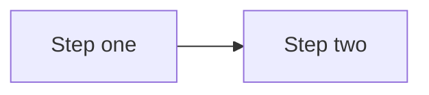
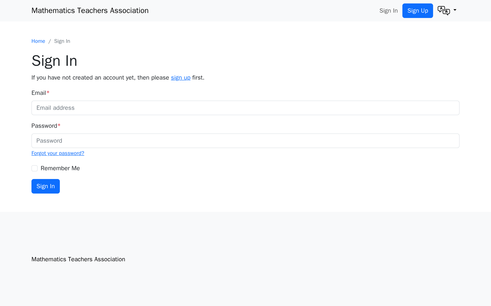
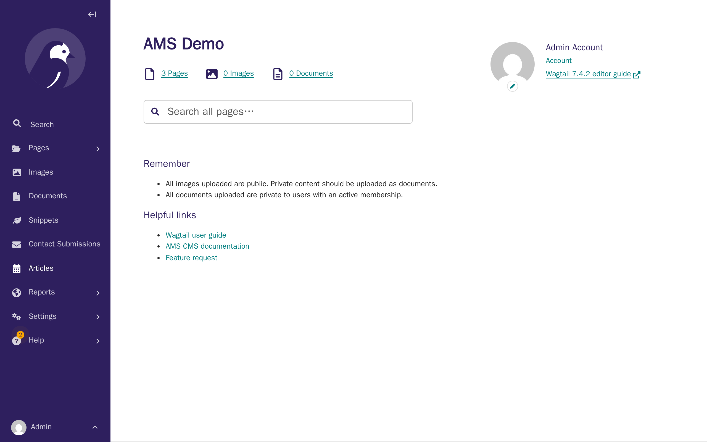

# Documentation conventions

**Who this page is for:** developers and the operator writing or updating AMS documentation.

This page is binding: it records the structural decisions made for the [client onboarding & website setup documentation effort](https://github.com/digital-technologies-teachers-aotearoa/ams).
Later documentation tasks follow these conventions rather than re-deciding them.

## Where each doc type lives

| Nav section                 | Directory                    | Audience                | What goes here                                                                                                                                                       |
| --------------------------- | ---------------------------- | ----------------------- | -------------------------------------------------------------------------------------------------------------------------------------------------------------------- |
| Home                        | `docs/docs/index.md`         | Everyone                | What AMS is                                                                                                                                                          |
| Features                    | `docs/docs/features.md`      | Everyone                | Product capability overview                                                                                                                                          |
| Getting started             | `docs/docs/getting-started/` | Client decision-makers  | Onboarding overview, decision questionnaire, costs sheet, accounts & access checklist, working-with-designers one-pager, and the two glossaries (settings and terms) |
| Building your website       | `docs/docs/tutorials/`       | Client website admins   | The empty-site-to-launch tutorial series                                                                                                                             |
| Website administrator guide | `docs/docs/admin/`           | Client website admins   | Standing reference (not a guided path) for CMS, events, resources, forum, billing, theme customization                                                               |
| Provider guide              | `docs/docs/provider/`        | Provider                | Provisioning runbook, client-communication templates                                                                                                                 |
| Developer documentation     | `docs/docs/developer/`       | Developer / contributor | Codebase contribution, architecture, platform-agnostic deployment                                                                                                    |

**Decision — Provider guide is top-level, not under Developer documentation.**
The operator runbook's audience is "person running a client's instance," which has more in common with the Getting started/Building your website audiences (a concrete client, a concrete handoff) than with "person contributing to the AMS codebase."
Keeping it top-level also means it doesn't get lost under codebase-contribution content a client-facing reader would never open.
The repo stays public and the runbook contains no secrets, so there's no publishing reason to nest it.

**Decision — both glossaries live under Getting started**, not in a separate top-level "Reference" section: `docs/docs/getting-started/settings-glossary.md` (T03) and `docs/docs/getting-started/glossary.md` (T04).
Both are primarily consulted during onboarding and by non-technical readers, and adding a fourth top-level section for two pages isn't worth the nav complexity.
Other pages link to them with `getting-started/glossary.md#term` anchors.

**Decision — each new top-level section gets its own `index.md` landing page**, distinct from its content pages, following the existing pattern in `admin/index.md`.
The landing page states what the section is, who it's for, and links to its pages.
`getting-started/index.md` in particular becomes the onboarding overview & timeline page (T05) — the "front door" of the intake pack — rather than a separate landing plus a separate overview page.

## "Who this page is for" header

Every page in Getting started, Building your website, the Website administrator guide, the Provider guide, and the working-with-designers one-pager starts with:

```markdown
**Who this page is for:** <audience>, <one clause of calibration if useful>.
```

Use the audience names from scope §3 verbatim (client decision-makers, client website admins, operator, third-party designers/agencies) so a reader skimming multiple pages recognises the same audience language.
Developer docs may omit this header (audience is implicit: developers) unless the page also serves the operator.

## Markdown source formatting

- **One sentence per line:** write prose as one sentence per source line (semantic linefeeds), not wrapped to a fixed column width.
  This keeps diffs scoped to the sentence that actually changed, instead of reflowing an entire paragraph.
  Markdown joins consecutive lines within a paragraph into one flowing line when rendered, so this is a source-only convention — it does not change how a page displays.
  Applies to prose paragraphs and list-item text across all documentation pages, including client-facing, provider, and developer pages; tables and code blocks are exempt (there's no useful "sentence" to split them by).
  A list item with more than one sentence continues on the next line, indented to align under the item's text, rather than starting a new list item.
- **Numbered list continuations use a fixed 4-space indent, not marker-width alignment.** Python-Markdown (which MkDocs uses) requires exactly 4 spaces for a list item's continuation content — a 3-space indent (visually aligned under `1. `) silently breaks the item out of the list, and if that happens right before a blank line and the next marker, each item renders as its own separate list restarting at "1." instead of one continuous list.
  Found in T13 (`tutorials/orientation.md`), where a step's continuation sentence *and* its screenshot both need to stay inside the same list item.
  Confirmed by testing directly against this project's Python-Markdown: a 3-space indent split a two-item list into two separate `<ol>` elements; a 4-space indent kept both items in one list with correct loose-list `<li><p>...</p></li>` structure.
  This matters most for the tutorial series (T13–T22), where every numbered step has a screenshot on its own indented, blank-line-separated line below the step text.

## Style rules for client-facing pages

Client-facing pages (Getting started, Building your website, Website administrator guide) are written for the audiences in scope §3 — assume no technical knowledge and possibly a tablet, not a desktop with two monitors.

- **Reading level:** aim for [Flesch–Kincaid grade 8](https://en.wikipedia.org/wiki/Flesch%E2%80%93Kincaid_readability_tests) or lower.
  Short sentences, common words, no unexplained acronyms.
- **Numbered steps:** any procedure is a numbered list, not prose paragraphs.
- **One action per step:** each numbered step is a single click, field entry, or decision — never "do X, then Y, then check Z."
- **Screenshot per step:** each step in a tutorial (Building your website series) carries one screenshot showing the result of that step.
  Reference pages (Website administrator guide) use screenshots more sparingly, where they resolve ambiguity rather than illustrating every click.
- **Glossary linking:** the first use of a jargon term on a page links to its entry in `getting-started/glossary.md#term` (e.g. `[DNS](../getting-started/glossary.md#dns)`).
  Don't re-explain the term inline — link instead.

Provider guide pages use the opposite register deliberately: terse, technical, no glossary links, no reading-level target — the operator is technical (scope §3).

## Screenshot conventions

1. **Directory layout:** `docs/docs/images/<section>/`, mirroring the nav section directory names above, e.g. `docs/docs/images/tutorials/`, `docs/docs/images/getting-started/`, `docs/docs/images/admin/`.
2. **File naming:** `<page-slug>-<step-number>-<short-description>.png`, all lowercase, words separated by hyphens.
   Example: `branding-theme-03-colour-picker.png` for step 3 of the branding & theme tutorial.
3. **Fixed viewport:** 1280×800px for every screenshot, regardless of the audience reading the docs on a tablet — the Wagtail/Django admin UI itself is desktop-oriented, and a fixed viewport is what makes screenshots byte-stable across regenerations (required by T02).
   The suite captures at a 2x device scale factor, so exported PNGs are 2560×1600px (twice the pixel density) for crisper rendering on high-DPI/Retina displays.
   This doesn't change on-page display size — Material for MkDocs scales images to fit the content column — only sharpness.
4. **Demo organisation:** all screenshots and examples use a fictional association **"Mathematics Teachers Association"**.
   This name is **not** what `sample_data`/`setup_cms` produce on their own — they leave `AssociationSettings.association_short_name`/`association_long_name` at `"{Language} AMS"` (e.g. "English AMS"), a language-derived placeholder, not a fixed org name.
   The demo name is set through the CMS itself, by `run.mjs`'s `brandingAssociationName` capture step — the same "enter your association's name" step [Tutorial 2](../tutorials/branding-theme.md) documents for a real client — rather than by `seed.sh` or any other out-of-tutorial script.
   **Consequence:** any screenshot captured earlier than that step in `manifest.json`'s order (the docs-conventions examples below, all of Tutorial 1, and Tutorial 2's own "before" shot of the Association settings page) still shows the language-derived placeholder, not "Mathematics Teachers Association" — expected, since a real new client's site has no name set until they do this step.
   Do not rename the organisation in `sample_data` itself unless a future decision says sample data should default to it too — that's a separate decision.
5. **Playwright-regenerable rule:** no screenshot may be committed unless the Playwright suite can regenerate it byte-for-visually-identical.
   If a page needs a screenshot before T02 exists (or before that screen is added to the manifest), leave a placeholder comment instead: `<!-- TODO screenshot: <description of what the image should show> -->` and note the gap in that task's completion notes.
6. **Annotated-image exception:** rare.
   Only when a callout (arrow, box, highlight) is necessary to point at a specific UI element that a caption alone can't clarify.
   An annotated image:
   - is still generated by first letting the Playwright suite capture the unannotated base screenshot (so the underlying UI stays regenerable), then adding the annotation as a manual, documented step;
   - is named with an `-annotated` suffix, e.g. `branding-theme-03-colour-picker-annotated.png`;
   - is recorded in the T02 manifest with a note of which base image it annotates and what tool/steps produced the annotation, so a future contributor can redo it after a UI change;
   - prefer a plain caption over an annotation whenever the caption alone resolves the ambiguity.
7. **Fixtures for upload screenshots:** a small, checked-in test file the suite uploads through the real UI (a logo, a document, an image for a content block), kept at `docs/screenshots/fixtures/`.
   Not part of the manifest or the `docs/docs/images/` tree — it's an input to a capture step, not a documented screenshot itself.
   Found in T14 (`branding-theme.md`'s logo-upload steps), which added `docs/screenshots/fixtures/demo-logo.png`, a generated placeholder monogram, rather than a real logo (no real client asset belongs in the public repo).
8. **Ordering for capture steps that change site state.** Read-only steps (like every T13 orientation step) can assume nothing about prior runs and don't care what order the manifest lists them in.
   A step that changes real data — uploading a logo, saving a theme colour — is different: it must run against a freshly-seeded site (the standard prerequisite below), and later steps that expect that change already made (e.g. a "your logo is now live" screenshot) must be listed in `manifest.json` *after* the step that saves it, since state genuinely carries over between capture steps within one `docs:screenshots` invocation.
   Running the suite a second time without re-seeding in between will show stale "before" state for steps like this — a real, accepted limitation, not a bug: the documented prerequisite is always to reseed first, never to run the suite twice in a row.
   Found in T14 (`branding-theme.md`'s logo and theme-colour steps): an earlier version of `run.mjs` tried to make every such step reset-and-verify its own starting state, which turned out to be needless complexity that also introduced real flakiness (Wagtail's image chooser widget always renders a placeholder `` with an empty `src`, even when nothing is chosen, so a naive "is an image present" check is always true — the actual signal is the chooser's own `blank` CSS class). Rely on manifest order and a fresh seed instead.
   **A related, separate gotcha for any capture step re-uploading the same fixture file more than once in one run: Wagtail's own duplicate-image detection.** Since the fixture's bytes are identical every time, uploading it a second time (e.g. `brandingLogoSaved` re-uploading after `brandingLogoSelected` already did) shows a "your new image seems to be a duplicate" interstitial with "Use new image" / "Use existing and delete new" links instead of closing the chooser modal immediately — a step's upload helper needs to detect and click through this, or it hangs waiting for a chosen state that never arrives.
9. **Uploaded media (real images/documents, not screenshot output) needs a host rewrite to render in the capture browser.** Django builds media URLs from `DJANGO_MEDIA_PUBLIC_CUSTOM_DOMAIN` (`localhost:9000/...` locally), correct for a browser on the host machine, but the capture browser runs *inside* the `node` container, where "localhost" is that container itself — nothing listens on port 9000 there, so any page showing a real uploaded image would capture a broken-image icon instead.
   `run.mjs`'s `proxyMinioMedia()` uses `page.route()` to reroute `http://localhost:9000/**` requests to `http://minio:9000/**` (the docker-network hostname the `node` container can actually reach) before every capture step runs.
   Found in T14, the first capture step to show a real uploaded image (the branding-theme logo) rather than the CMS admin chrome around one.
10. **The Django Debug Toolbar hide (bullet 1 above, "How to regenerate screenshots" below) must be applied to every frame, not just the main page.** Wagtail's edit-page "Toggle preview" panel loads the public page inside its own `<iframe>` — a separate browsing context with its own `#djDebugRoot` — so `page.addStyleTag()` on the top-level page alone leaves the toolbar visible (and, if previously expanded, its full panel) inside the preview.
    Found in T15 (`first-pages.md`'s home-page preview step) by inspecting a captured preview screenshot and seeing the toolbar's panel covering the preview content; `run.mjs`'s `prepareForCapture()` now loops `page.frames()` and hides it in each one.
11. **Draftail (the rich text editor behind `paragraph_block`/`lead_paragraph_block`) needs real keystrokes, not `locator.fill()`, and reading the typed text back from the DOM afterwards is not proof it will save.** `fill()` sets a contenteditable's DOM text directly; Draftail's own React state — the thing actually serialized to the hidden `body-<n>-value[-text]` input a save reads from — never sees an input event, so the field visibly shows the typed text in the browser but saves empty. `locator.pressSequentially(text)` (real keydown/input events) fixes that specific gap.
    But a second, separate race exists even with real keystrokes: Draftail debounces syncing its state to that hidden input, so saving immediately after typing can still persist an empty value — and the typed text reads back correctly via `locator.textContent()` throughout, so *that* check doesn't catch it either. The only reliable check is the hidden input's actual `value`; `fillBodyText()` waits for `document.querySelector('input[type="hidden"][id^="body-"]')`'s value to contain the typed text before returning, rather than a fixed pause (tried first, and flaky: right on a single-block page, unreliable once a second block's own widgets — see bullet 15 below — were also active on the page).
    Found in T15, the first capture steps to type into a rich text field rather than a plain `<input>` (Theme Settings' colour/font fields in T14 are plain inputs, not Draftail).
12. **Wagtail admin's CSS sets `scroll-behavior: smooth`, so a plain `element.scrollIntoView()` animates instead of jumping.** A screenshot taken right after still shows the pre-scroll position, since Playwright's next call runs before the animation completes.
    Pass `behavior: "instant"` to `scrollIntoView()` to skip the animation deterministically, rather than adding a wait long enough to outlast it.
    Found in T15, needed to bring a StreamField block or form field out from under the floating Save draft/More actions bar before capturing it.
13. **The English home page's numeric ID depends on `AMS_ENABLED_LANGUAGES`'s order, the page-tree version of the caveat above.** `setup_cms` creates one `HomePage` per configured language in `settings.LANGUAGES` order, so which page ID is English (rather than Māori) shifts if the env var's language order changes.
    A capture step that needs to edit the home page should resolve its ID at runtime (`run.mjs`'s `getEnglishHomePageId()`, which reads it off the page explorer) rather than hard-coding a number.
    Found in T15, the first tutorial to edit the home page itself rather than only reading settings pages.
14. **A page whose parent is Root (the home page is the only example so far) redirects the post-publish confirmation banner to the Root explorer, which also lists Wagtail's own unrelated "Welcome to your new Wagtail site!" leftover page and, in this dev environment, the Māori home page.** None of that is meaningful to a first-time reader, but re-navigating to a cleaner page loses the one-time flash message the screenshot exists to show.
    `run.mjs`'s `hideUnrelatedRootPages()` hides the unrelated table rows in place with a scripted `page.evaluate()` after publishing — this is still fully automated and regenerable, not the annotated-image exception (bullet 6 above), since nothing is added by hand.
    Found in T15 (`first-pages.md`'s home-page publish step).
15. **A Title block's own widgets (its colour pickers, its autosize textarea) can clobber a sibling block's still-unsaved edit — this is a real Wagtail-editor bug a real user could hit too, not just an automation-timing issue, and it changes what the *tutorial page itself* says to do, not only `run.mjs`.** Inserting a Title block, filling it, inserting a Lead paragraph block underneath, filling that, and saving once — all in one editing session — intermittently saved an empty tagline. This isn't the same race as bullet 11: instrumenting the hidden `body-1-value-text` input showed it briefly held the *correct* typed value a moment after typing, then reset to `null` on its own several hundred ms later, well before Save draft was even clicked. The reset didn't reproduce with the Lead paragraph block alone (no Title block present) — something about the Title block's widgets appears to trigger a StreamField-wide re-render that overwrites a sibling block's fresh edit before it's saved.
    No amount of waiting inside one session was found to be reliable (reproduced the failure 3 different ways: empty save, and the deterministic hidden-field wait from bullet 11 timing out entirely — the reset can also happen mid-wait). What *was* reliable, 4 clean runs in a row: save the Title block on its own first, then insert and fill the Lead paragraph block against a page reload where the Title block is now server-rendered/static rather than a live, still-mounting widget.
    Because this is a real editing hazard and not just a scripting inconvenience, the tutorial text itself was changed to match — [Tutorial 3](../tutorials/first-pages.md) has separate "add your title, save" and "add your tagline, save" steps, rather than describing the two-block sequence as one step and only splitting it in the capture script.

## Tutorial series page template

Established by T13 (`tutorials/orientation.md`), binding on every later page in the "Building your website" series (T14–T22).

- **Structure:** "Who this page is for" header, then a short "What you'll have at the end" intro stating concrete outcomes, then an optional "Before you start" section for prerequisites, then a numbered **Steps** list (one action per step, one screenshot per step showing the result of that step), then any reference material the task's own guidance calls for (e.g. a table distinguishing several parts of the system), then a "What's next" footer linking to the following tutorial.
- **Screenshot reuse within a page:** if a step's result is "you're back on a page already screenshotted earlier on the same page" (for example, returning from the CMS to your account page), reuse that screenshot's file rather than capturing a near-duplicate.
  It's still one manifest entry; the page just embeds it twice.
- **Forward-chaining stubs:** each tutorial task creates a minimal stub for the *next* tutorial in the series (same pattern T01/T05 used for forward references), so its own "What's next" link resolves under the strict build.
  The next task then replaces that stub in place, same filename, rather than renaming the file or re-editing the nav.
- **Series index:** `tutorials/index.md` keeps a numbered list of all ten tutorials.
  Only the tutorials that exist so far are links; the rest stay as plain text until their task lands.

## Diagrams

Mermaid diagrams are supported via a `custom_fences` entry on `pymdownx.superfences` in `docs/mkdocs.yml` (added in T05, following [Material for MkDocs' documented approach](https://squidfunk.github.io/mkdocs-material/reference/diagrams/)) — no extra JavaScript is needed beyond that config, since the `squidfunk/mkdocs-material` image this project's `docs` service runs bundles Mermaid rendering natively.
Use a fenced code block with the `mermaid` language tag:

````markdown

````

Prefer a diagram for sequence/flow relationships (e.g. an onboarding phase sequence) and a table when the content needs per-item detail (durations, owners, links) alongside the sequence — the two aren't mutually exclusive on the same page.

## Public absolute links (mkdocs-macros)

Most pages link to each other with ordinary relative Markdown links (`../getting-started/index.md`), which the strict build verifies resolve and which work identically in a local preview and on the published site.
Some pages are meant to be **copied out of the docs site** rather than read in place — `provider/client-communication-templates.md` is the first example, since its email templates need real, clickable URLs once pasted into an email client, not relative paths that only resolve inside a docs build.

**Mechanism:** the [`mkdocs-macros` plugin](https://github.com/fralau/mkdocs-macros-plugin) (installed in `compose/local/docs/Dockerfile`, enabled in `docs/mkdocs.yml`) lets a page use `{{ config.site_url }}` — `site_url` is set in `docs/mkdocs.yml` to the site's real published URL — to build an absolute link that renders correctly regardless of where the docs are served from.

**Opt-in only, page by page — this is not a site-wide behaviour.** `docs/mkdocs.yml` sets `render_by_default: false`, so a page is only passed through Jinja2 rendering if its own YAML front matter says so:

```markdown
---
render_macros: true
---
```

This was a deliberate, tested decision, not the plugin's default: turning macro rendering on site-wide broke other pages that legitimately contain literal ``/`{{ }}` syntax as documented content (e.g. `developer/wagtail-cms.md`'s Django/Wagtail template examples), since the plugin tries to interpret every such token as a Jinja2 expression. Opt-in avoids that entirely — only pages that explicitly ask for it are rendered.

**Placeholder syntax and `on_undefined: keep`:** a page using this mechanism may also contain its own literal `{{placeholder}}`-style tokens meant for a human to find-and-replace later (the client-communication templates' `{{organisation}}`, `{{contact_name}}`, etc.) — these do **not** need escaping. The plugin's default `on_undefined: keep` setting renders any undefined bare name as-is rather than failing the build, so a plain `{{organisation}}` survives unchanged (Jinja2 reformats its spacing to `{{ organisation }}`, which is cosmetic only). This only covers bare names: an undefined *attribute* access (`{{ something.field }}`) still fails the build, so don't reuse this trick for anything more complex than a flat placeholder name.

**Trade-off — verify these links by hand.** The strict build's link-checking only understands ordinary Markdown references; it doesn't evaluate `{{ config.site_url }}...` expressions, so a page using this mechanism gets no automatic warning if a linked page is renamed or moved. After building (non-strict), grep the rendered page's `href="..."` attributes to confirm the resolved URLs are correct, the same verification pattern used throughout this documentation effort.

## Settings glossary anti-drift check

`docs/docs/getting-started/settings-glossary.md` documents every client-decidable `AMS_*` env var (settings a client decides during onboarding, via the decision questionnaire — part of the onboarding intake pack, not yet its own page as of T03).
It must never drift from `config/settings/base.py`: if a setting is added to the code but not documented, or removed from the code but left in the glossary, the docs would silently go stale.

**Mechanism (decision — generated check over hand-written page, not a fully generated page):** the glossary page is hand-written prose (so descriptions can stay plain-language for a non-technical audience), but a management command statically parses `config/settings/base.py` with Python's `ast` module to find every `AMS_*` string literal passed to `env(...)`/`env.bool(...)`/`env.list(...)`, and compares that set against every `AMS_*` name documented as a level-2 heading in the glossary.
A generated page was rejected: plain-language descriptions of what a setting does for a committee member can't be generated from a one-line `env.bool()` call, so the source of truth for _prose_ has to stay hand-written — the check only needs to guarantee the _set of settings_ can't drift, which a comparison script does without needing to generate content.

**Extended to cover [Deployment](deployment.md) too.** Deployment.md's environment variable table used to duplicate several of these same `AMS_*` settings (in a developer register, alongside genuinely deployment-only variables), which is exactly the kind of two-source-of-truth drift risk this mechanism exists to prevent.
The same command now also regex-scans `deployment.md` for any `AMS_*` name used as a table-row cell, and fails if it finds one that's also documented in the glossary — deployment.md is expected to describe those settings in prose (a link to the glossary) rather than repeat them as table rows.
`AMS_BILLING_SERVICE_CLASS` and `AMS_BILLING_EMAIL_WHITELIST_REGEX` are unaffected by this: they're read in `config/settings/production.py`, not `base.py`, so they're outside the glossary's scope (per T06's note) and can stay in deployment.md's table.

Run it with:

```
docker-compose exec django python manage.py check_settings_glossary
```

It fails loudly (non-zero exit, listing exactly which settings are missing or stale) if the two sides disagree.
It also runs as a step in the `django-test` job in `.github/workflows/ci.yml`, so a PR that adds or removes an `AMS_*` setting without updating the glossary fails CI — this is what makes the glossary page's "cannot silently go out of date" claim true, rather than just possible if someone remembers to run the check locally.

## Definition of done for feature PRs that change documented UI

A PR that changes UI covered by these docs is not done until:

1. The Playwright screenshot suite has been re-run and any changed screenshots are included in the PR;
2. Any page whose steps, labels, or field names changed is updated to match;
3. The manifest still has no orphaned or stale entries for the changed screens.

## How to regenerate screenshots

The screenshot suite lives in `docs/screenshots/`.
It captures against Chromium only, since a single deterministic renderer is what matters for byte-stable images, not cross-browser coverage.

**Prerequisites:**

1. From the repo root, run `./docs/screenshots/seed.sh` (or `just docs-seed`).
   This flushes the database and rebuilds a clean skeleton site — `setup_cms` (sites, home pages, locales) plus an admin account — deliberately **not** `sample_data`, since screenshots should show what a real new client's site looks like (empty), not `sample_data`'s fixture events, resources, and articles.
   It starts the Django dev server in the background, waiting until it responds before exiting.
   It deliberately does **not** set `AssociationSettings` to the demo name — `setup_cms` leaves that at a language-derived placeholder like "English AMS", and `run.mjs` sets it to "Mathematics Teachers Association" itself, through the CMS, as part of capturing Tutorial 2's own steps (see the demo organisation convention above).
   `manage.py flush` truncates data but doesn't replay migrations, which deletes Wagtail's root page/collection (created by data migrations inside the `wagtail` package) without restoring them — `seed.sh` runs `manage.py ensure_wagtail_root` straight after flushing to recreate them, otherwise `setup_cms` fails silently with "Root page not found."
   Screenshot content reflects whichever languages `AMS_ENABLED_LANGUAGES` has enabled in your `.envs/.local/django.ini` (e.g. the CMS dashboard's page list differs between an `en`-only env and an `mi,en` env) — keep this env var stable across regenerations of the same image, or expect unrelated-looking diffs.

**Regenerate every screenshot in the manifest:**

```
docker-compose exec node npm run docs:screenshots
```

This overwrites every image listed in `docs/screenshots/manifest.json` deterministically — running it twice produces the same images (the suite hides `#djDebugRoot`, the Django Debug Toolbar's container, before every capture, since its live query/timing stats would otherwise change on every request and break determinism).

**Check for orphaned images** (in the manifest but not embedded in a doc page, or on disk but not in the manifest, or embedded in a doc page but missing from the manifest):

```
docker-compose exec node npm run docs:screenshots:check
```

**Adding a new screenshot:** add a capture step to the `steps` object in `docs/screenshots/run.mjs`, add an entry to `docs/screenshots/manifest.json` (file path per the naming convention above, the step name, and the doc page(s) that will embed it), embed the image in the doc page, then run the two commands above.

Two example screenshots below prove the pipeline end to end; they're captured by `run.mjs`'s `exampleLogin` and `exampleDashboard` steps.
Tutorial tasks (T13 onward) add their own steps for the screens they document, rather than reusing these.




