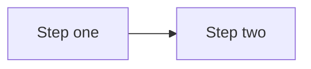

# Documentation conventions

**Who this page is for:** developers and the operator writing or updating AMS documentation.

This page is binding: it records the structural decisions made for the [client onboarding & website setup documentation effort](https://github.com/digital-technologies-teachers-aotearoa/ams).
Later documentation tasks follow these conventions rather than re-deciding them.

## Where each doc type lives

| Nav section                      | Directory                       | Audience                 | What goes here                                                                                                                                                       |
| --------------------------------- | -------------------------------- | ------------------------- | -------------------------------------------------------------------------------------------------------------------------------------------------------------------- |
| Home                              | `docs/docs/index.md`             | Everyone                  | What AMS is                                                                                                                                                          |
| Features                          | `docs/docs/features.md`          | Everyone                  | Product capability overview                                                                                                                                          |
| Getting started                   | `docs/docs/getting-started/`     | Client decision-makers    | Onboarding overview, decision questionnaire, costs sheet, accounts & access checklist, working-with-designers one-pager, and the two glossaries (settings and terms) |
| Your website                      | `docs/docs/website/index.md`     | Client website admins     | Landing page routing between the Setup guide and Feature reference groups                                                                                            |
| Your website → Setup guide        | `docs/docs/website/setup/`       | Client website admins     | The empty-site-to-launch tutorial series                                                                                                                             |
| Your website → Feature reference  | `docs/docs/website/reference/`   | Client website admins     | Standing reference (not a guided path) for CMS, events, resources, forum, theme customization                                                                        |
| Hosting AMS                       | `docs/docs/hosting/`             | Provider                  | Platform-agnostic deployment guide, DigitalOcean/Postmark/Cloudflare worked example, Xero billing setup, client-communication templates                              |
| Developing AMS                    | `docs/docs/developer/`           | Developer / contributor   | Codebase contribution, architecture                                                                                                                                   |

**Decision — Hosting AMS is top-level, not under Developing AMS.**
The provider's audience is "person running a client's instance," which has more in common with the Getting started/Your website audiences (a concrete client, a concrete handoff) than with "person contributing to the AMS codebase."
Keeping it top-level also means it doesn't get lost under codebase-contribution content a client-facing reader would never open.
The repo stays public and the runbook contains no secrets, so there's no publishing reason to nest it.

**Decision — both glossaries live under Getting started**, not in a separate top-level "Reference" section: `docs/docs/getting-started/settings-glossary.md` (T03) and `docs/docs/getting-started/glossary.md` (T04).
Both are primarily consulted during onboarding and by non-technical readers, and adding a fourth top-level section for two pages isn't worth the nav complexity.
Other pages link to them with `getting-started/glossary.md#term` anchors.

**Decision — each new top-level section gets its own `index.md` landing page**, distinct from its content pages, following the existing pattern in `website/reference/index.md` (formerly `admin/index.md`).
The landing page states what the section is, who it's for, and links to its pages.
`getting-started/index.md` in particular becomes the onboarding overview & timeline page (T05) — the "front door" of the intake pack — rather than a separate landing plus a separate overview page.

## "Who this page is for" header

Every page in Getting started, Your website (both the Setup guide and Feature reference groups), Hosting AMS, and the working-with-designers one-pager starts with:

```markdown
**Who this page is for:** <audience>, <one clause of calibration if useful>.
```

Use the audience names from scope §3 verbatim (client decision-makers, client website admins, operator, third-party designers/agencies) so a reader skimming multiple pages recognises the same audience language.
Developer docs may omit this header (audience is implicit: developers) unless the page also serves the operator.

## Spelling

All documentation is written in **en-NZ** (New Zealand English): `colour` not `color`, `organisation` not `organization`, `customise`/`organise`/`authorise` not `customize`/`organize`/`authorize`, and so on.
This applies across every page, including developer pages — not just client-facing ones.

**Exemptions** — leave these exactly as they appear in the underlying system, even where that means American spelling:

- code identifiers (field names, class names, function names, settings names), whether backticked or not, e.g. `ColorField`, `AMS_BILLING_SERVICE_CLASS`;
- content inside fenced code blocks (CSS variables, JSON keys, shell comments);
- quoted or bolded UI labels copied verbatim from a real product screen, e.g. Xero's own **Client ID** field or a literal error string like `"Unauthorized"`.

If a word's spelling is genuinely ambiguous (is this prose, or the name of a field?), prefer leaving it — the point is to fix real prose drift, not to "correct" every string that merely contains an American letter sequence.

## Title casing

Headings (any level, on any page including developer pages) use **sentence case**: capitalise only the first word and any proper nouns/acronyms, lowercase everything else — including the word right after a colon or a step number, e.g. `## Step 3: authorise the connection`, `## Note: your everyday email vs your website's email`.

**Proper nouns and acronyms stay capitalised**, e.g. Wagtail, Django, Xero, MJML, TinyMCE, Discourse, DigitalOcean, Postmark, Cloudflare, CSS, URL, API, AMS, SSO, DNS, UAT, HTML, JSON. So do code identifiers and product-specific UI terms that are themselves proper nouns (Xero's "Custom Connection").

Renaming a heading only ever changes its rendered case, never its anchor slug — mkdocs' TOC extension lowercases every anchor regardless of source casing — so a pure case fix is anchor-safe by construction. It only becomes an anchor-breaking change if it also fixes a word's *spelling* (e.g. `color` → `colour` within a heading); check for `#`-anchored inbound links before making that kind of combined edit.

## Markdown source formatting

- **One sentence per line:** write prose as one sentence per source line (semantic linefeeds), not wrapped to a fixed column width.
  This keeps diffs scoped to the sentence that actually changed, instead of reflowing an entire paragraph.
  Markdown joins consecutive lines within a paragraph into one flowing line when rendered, so this is a source-only convention — it does not change how a page displays.
  Applies to prose paragraphs and list-item text across all documentation pages, including client-facing, provider, and developer pages; tables and code blocks are exempt (there's no useful "sentence" to split them by).
  A list item with more than one sentence continues on the next line, indented to align under the item's text, rather than starting a new list item.
- **Numbered list continuations use a fixed 4-space indent, not marker-width alignment.** Python-Markdown (which MkDocs uses) requires exactly 4 spaces for a list item's continuation content — a 3-space indent (visually aligned under `1. `) silently breaks the item out of the list, and if that happens right before a blank line and the next marker, each item renders as its own separate list restarting at "1." instead of one continuous list.
  Found in T13 (`website/setup/orientation.md`), where a step's continuation sentence *and* its screenshot both need to stay inside the same list item.
  Confirmed by testing directly against this project's Python-Markdown: a 3-space indent split a two-item list into two separate `<ol>` elements; a 4-space indent kept both items in one list with correct loose-list `<li><p>...</p></li>` structure.
  This matters most for the tutorial series (T13–T23), where every numbered step has a screenshot on its own indented, blank-line-separated line below the step text.

## Style rules for client-facing pages

Client-facing pages (Getting started, Your website: Setup guide and Feature reference) are written for the audiences in scope §3 — assume no technical knowledge and possibly a tablet, not a desktop with two monitors.

- **Reading level:** aim for [Flesch–Kincaid grade 8](https://en.wikipedia.org/wiki/Flesch%E2%80%93Kincaid_readability_tests) or lower.
  Short sentences, common words, no unexplained acronyms.
- **Numbered steps:** any procedure is a numbered list, not prose paragraphs.
- **One action per step:** each numbered step is a single click, field entry, or decision — never "do X, then Y, then check Z."
- **Screenshot per step:** each step in a tutorial (Setup guide series) carries one screenshot showing the result of that step.
  Reference pages (Feature reference) use screenshots more sparingly, where they resolve ambiguity rather than illustrating every click.
- **Glossary linking:** the first use of a jargon term on a page links to its entry in `getting-started/glossary.md#term`, with a relative path matching the page's own depth: one `../` from a top-level section page (e.g. `[DNS](../getting-started/glossary.md#dns)` from a Hosting AMS or Developing AMS page), two from a Setup guide/Feature reference page (e.g. `[DNS](../../getting-started/glossary.md#dns)`).
  Don't re-explain the term inline — link instead.

Hosting AMS pages use the opposite register deliberately: terse, technical, no glossary links, no reading-level target — the provider is technical (scope §3).

## Screenshot conventions

1. **Directory layout:** `docs/docs/images/<section>/`, mirroring the nav section directory names above, e.g. `docs/docs/images/getting-started/`, `docs/docs/images/website/reference/`.
   The Setup guide section nests one level deeper than the others (`docs/docs/website/setup/`), so its images live at the matching two-level path, `docs/docs/images/website/setup/`, not `docs/docs/images/setup/`.
   **`features.md` is the one page with no section directory of its own** (it sits at `docs/docs/features.md`, directly under the docs root) — its own screenshots (T40) live at `docs/docs/images/features/`, named for the page itself rather than a nav section, the same pattern as every other page-slug-prefixed file. Unlike every other screenshot in this suite, `features.md`'s are deliberately **marketing** screenshots — richer and more populated than a real new client's empty site, generated by a different seed script against `sample_data`-style content rather than `seed.sh`'s skeleton. See "Marketing screenshots" below.
2. **File naming:** `<page-slug>-<step-number>-<short-description>.png`, all lowercase, words separated by hyphens.
   Example: `branding-theme-03-colour-picker.png` for step 3 of the branding & theme tutorial.
3. **Fixed viewport:** 1280×800px for every screenshot, regardless of the audience reading the docs on a tablet — the Wagtail/Django admin UI itself is desktop-oriented, and a fixed viewport is what makes screenshots byte-stable across regenerations (required by T02).
   The suite captures at a 2x device scale factor, so exported PNGs are 2560×1600px (twice the pixel density) for crisper rendering on high-DPI/Retina displays.
   This doesn't change on-page display size — Material for MkDocs scales images to fit the content column — only sharpness.
4. **Demo organisation:** all screenshots and examples use a fictional association **"Mathematics Teachers Association"**.
   This name is **not** what `sample_data`/`setup_cms` produce on their own — they leave `AssociationSettings.association_short_name`/`association_long_name` at `"{Language} AMS"` (e.g. "English AMS"), a language-derived placeholder, not a fixed org name.
   The demo name is set through the CMS itself, by `steps/branding-theme.mjs`'s `brandingAssociationName` capture step — the same "enter your association's name" step [Tutorial 2](../website/setup/branding-theme.md) documents for a real client — rather than by `seed.sh` or any other out-of-tutorial script.
   **Consequence:** any screenshot captured earlier than that step in `manifest.json`'s order (the docs-conventions examples below, all of Tutorial 1, and Tutorial 2's own "before" shot of the Association settings page) still shows the language-derived placeholder, not "Mathematics Teachers Association" — expected, since a real new client's site has no name set until they do this step.
   Do not rename the organisation in `sample_data` itself unless a future decision says sample data should default to it too — that's a separate decision.
5. **Playwright-regenerable rule:** no screenshot may be committed unless the Playwright suite can regenerate it byte-for-visually-identical.
   If a page needs a screenshot before T02 exists (or before that screen is added to the manifest), leave a placeholder comment instead: `<!-- TODO screenshot: <description of what the image should show> -->` and note the gap in that task's completion notes.
6. **Annotated-image exception:** rare.
   Only when a callout (arrow, box, highlight) is necessary to point at a specific UI element that a caption alone can't clarify.
   An annotated image:
   - is still generated by first letting the Playwright suite capture the unannotated base screenshot (so the underlying UI stays regenerable), then adding the annotation as a manual, documented step;
   - is named with an `-annotated` suffix, e.g. `branding-theme-03-colour-picker-annotated.png`;
   - is recorded in the T02 manifest with a note of which base image it annotates and what tool/steps produced the annotation, so a future contributor can redo it after a UI change;
   - prefer a plain caption over an annotation whenever the caption alone resolves the ambiguity.
7. **Fixtures for upload screenshots:** a small, checked-in test file the suite uploads through the real UI (a logo, a document, an image for a content block), kept at `docs/screenshots/fixtures/`.
   Not part of the manifest or the `docs/docs/images/` tree — it's an input to a capture step, not a documented screenshot itself.
   Found in T14 (`branding-theme.md`'s logo-upload steps), which added `docs/screenshots/fixtures/demo-logo.png`, a generated placeholder monogram, rather than a real logo (no real client asset belongs in the public repo).
8. **Ordering for capture steps that change site state.** Read-only steps (like every T13 orientation step) can assume nothing about prior runs and don't care what order the manifest lists them in.
   A step that changes real data — uploading a logo, saving a theme colour — is different: it must run against a freshly-seeded site (the standard prerequisite below), and later steps that expect that change already made (e.g. a "your logo is now live" screenshot) must be listed in `manifest.json` *after* the step that saves it, since state genuinely carries over between capture steps within one `docs:screenshots` invocation.
   Running the suite a second time without re-seeding in between will show stale "before" state for steps like this — a real, accepted limitation, not a bug: the documented prerequisite is always to reseed first, never to run the suite twice in a row.
   Found in T14 (`branding-theme.md`'s logo and theme-colour steps): an earlier version of `run.mjs` tried to make every such step reset-and-verify its own starting state, which turned out to be needless complexity that also introduced real flakiness (Wagtail's image chooser widget always renders a placeholder `` with an empty `src`, even when nothing is chosen, so a naive "is an image present" check is always true — the actual signal is the chooser's own `blank` CSS class). Rely on manifest order and a fresh seed instead.
   **A related, separate gotcha for any capture step re-uploading the same fixture file more than once in one run: Wagtail's own duplicate-image detection.** Since the fixture's bytes are identical every time, uploading it a second time (e.g. `brandingLogoSaved` re-uploading after `brandingLogoSelected` already did) shows a "your new image seems to be a duplicate" interstitial with "Use new image" / "Use existing and delete new" links instead of closing the chooser modal immediately — a step's upload helper needs to detect and click through this, or it hangs waiting for a chosen state that never arrives.
9. **Uploaded media (real images/documents, not screenshot output) needs a host rewrite to render in the capture browser.** Django builds media URLs from `DJANGO_MEDIA_PUBLIC_CUSTOM_DOMAIN` (`localhost:9000/...` locally), correct for a browser on the host machine, but the capture browser runs *inside* the `node` container, where "localhost" is that container itself — nothing listens on port 9000 there, so any page showing a real uploaded image would capture a broken-image icon instead.
   `shared/browser-helpers.mjs`'s `proxyMinioMedia()` uses `page.route()` to reroute `http://localhost:9000/**` requests to `http://minio:9000/**` (the docker-network hostname the `node` container can actually reach) before every capture step runs.
   Found in T14, the first capture step to show a real uploaded image (the branding-theme logo) rather than the CMS admin chrome around one.
10. **The Django Debug Toolbar hide (bullet 1 above, "How to regenerate screenshots" below) must be applied to every frame, not just the main page.** Wagtail's edit-page "Toggle preview" panel loads the public page inside its own `<iframe>` — a separate browsing context with its own `#djDebugRoot` — so `page.addStyleTag()` on the top-level page alone leaves the toolbar visible (and, if previously expanded, its full panel) inside the preview.
    Found in T15 (`first-pages.md`'s home-page preview step) by inspecting a captured preview screenshot and seeing the toolbar's panel covering the preview content; `shared/browser-helpers.mjs`'s `prepareForCapture()` now loops `page.frames()` and hides it in each one.
11. **Draftail (the rich text editor behind `paragraph_block`/`lead_paragraph_block`) needs real keystrokes, not `locator.fill()`, and reading the typed text back from the DOM afterwards is not proof it will save.** `fill()` sets a contenteditable's DOM text directly; Draftail's own React state — the thing actually serialised to the hidden `body-<n>-value[-text]` input a save reads from — never sees an input event, so the field visibly shows the typed text in the browser but saves empty. `locator.pressSequentially(text)` (real keydown/input events) fixes that specific gap.
    But a second, separate race exists even with real keystrokes: Draftail debounces syncing its state to that hidden input, so saving immediately after typing can still persist an empty value — and the typed text reads back correctly via `locator.textContent()` throughout, so *that* check doesn't catch it either. The only reliable check is the hidden input's actual `value`; `fillBodyText()` waits for `document.querySelector('input[type="hidden"][id^="body-"]')`'s value to contain the typed text before returning, rather than a fixed pause (tried first, and flaky: right on a single-block page, unreliable once a second block's own widgets — see bullet 15 below — were also active on the page).
    Found in T15, the first capture steps to type into a rich text field rather than a plain `<input>` (Theme Settings' colour/font fields in T14 are plain inputs, not Draftail).
12. **Wagtail admin's CSS sets `scroll-behavior: smooth`, so a plain `element.scrollIntoView()` animates instead of jumping.** A screenshot taken right after still shows the pre-scroll position, since Playwright's next call runs before the animation completes.
    Pass `behavior: "instant"` to `scrollIntoView()` to skip the animation deterministically, rather than adding a wait long enough to outlast it.
    Found in T15, needed to bring a StreamField block or form field out from under the floating Save draft/More actions bar before capturing it.
13. **The English home page's numeric ID depends on `AMS_ENABLED_LANGUAGES`'s order, the page-tree version of the caveat above.** `setup_cms` creates one `HomePage` per configured language in `settings.LANGUAGES` order, so which page ID is English (rather than Māori) shifts if the env var's language order changes.
    A capture step that needs to edit the home page should resolve its ID at runtime (`shared/browser-helpers.mjs`'s `getEnglishHomePageId()`, which reads it off the page explorer) rather than hard-coding a number.
    Found in T15, the first tutorial to edit the home page itself rather than only reading settings pages.
14. **A page whose parent is Root (the home page is the only example so far) redirects the post-publish confirmation banner to the Root explorer, which also lists Wagtail's own unrelated "Welcome to your new Wagtail site!" leftover page and, in this dev environment, the Māori home page.** None of that is meaningful to a first-time reader, but re-navigating to a cleaner page loses the one-time flash message the screenshot exists to show.
    `steps/first-pages.mjs`'s `hideUnrelatedRootPages()` hides the unrelated table rows in place with a scripted `page.evaluate()` after publishing — this is still fully automated and regenerable, not the annotated-image exception (bullet 6 above), since nothing is added by hand.
    Found in T15 (`first-pages.md`'s home-page publish step).
15. **A Title block's own widgets (its colour pickers, its autosize textarea) can clobber a sibling block's still-unsaved edit — this is a real Wagtail-editor bug a real user could hit too, not just an automation-timing issue, and it changes what the *tutorial page itself* says to do, not only `run.mjs`.** Inserting a Title block, filling it, inserting a Lead paragraph block underneath, filling that, and saving once — all in one editing session — intermittently saved an empty tagline. This isn't the same race as bullet 11: instrumenting the hidden `body-1-value-text` input showed it briefly held the *correct* typed value a moment after typing, then reset to `null` on its own several hundred ms later, well before Save draft was even clicked. The reset didn't reproduce with the Lead paragraph block alone (no Title block present) — something about the Title block's widgets appears to trigger a StreamField-wide re-render that overwrites a sibling block's fresh edit before it's saved.
    No amount of waiting inside one session was found to be reliable (reproduced the failure 3 different ways: empty save, and the deterministic hidden-field wait from bullet 11 timing out entirely — the reset can also happen mid-wait). What *was* reliable, 4 clean runs in a row: save the Title block on its own first, then insert and fill the Lead paragraph block against a page reload where the Title block is now server-rendered/static rather than a live, still-mounting widget.
    Because this is a real editing hazard and not just a scripting inconvenience, the tutorial text itself was changed to match — [Tutorial 3](../website/setup/first-pages.md) has separate "add your title, save" and "add your tagline, save" steps, rather than describing the two-block sequence as one step and only splitting it in the capture script.
16. **Adding a child page under an existing content page (rather than under Home) skips the page-type chooser screen entirely, going straight to the add form.** `ContentPage.subpage_types` (`ams/cms/models/pages.py`) restricts a content page's own children to further content pages only, one allowed type — Wagtail's `add_subpage` view only shows the intermediate "choose a page type" screen when more than one type is allowed, so `createContentPage`'s `.getByRole("link", { name: "Content page", exact: true }).click()` step (needed under Home, which allows several types) has nothing to click on and would hang.
    `shared/browser-helpers.mjs`'s `createChildContentPage()` is a separate helper for this case: it opens the add-subpage URL and fills the title directly, with no type-selection click.
    Found in T16 (`navigation-menus.md`'s "Our story" page, created as a child of About to demonstrate an automatic dropdown) — confirmed live via the Playwright MCP browser before writing the capture step, not assumed from the model code alone.
    Any later tutorial adding a page under something other than Home (T18–T22 are the likely candidates) should check which of the two helpers actually matches its parent page's `subpage_types` rather than assuming.
17. **Wagtail's page chooser modal closes with a fade-out transition, not an immediate removal — a screenshot taken right after picking a page can capture the dialog mid-fade, semi-transparent and overlapping the page underneath, instead of the clean "page chosen" state the step exists to show.** Found live in T16 (`navigation-menus.md`'s "About item added" step): the underlying form already showed the correct chosen page, but the fading dialog was still visible on top of it in the capture.
    The same fix pattern as bullet 12's `scroll-behavior: smooth`: wait for the actual end state (the modal reaching Playwright's `hidden` state, which Bootstrap's fade transition reaches by setting `display: none`) instead of a fixed pause. `steps/navigation-menus.mjs`'s `addMainMenuItem()` does this after every page selection, scoped to `.modal.fade[role="dialog"]` specifically — the CMS admin also has a permanently-present keyboard shortcuts dialog with its own `[role="dialog"]`/`aria-hidden`, and a broader selector matching both makes Playwright reject it as ambiguous (also found live, on the first attempt at this fix).
    A second, separate remnant survives even after the modal itself is hidden: Bootstrap's `.modal-backdrop` dimming overlay and a `modal-open` class on `<body>` are removed slightly *after* the modal's own fade finishes, not at the same instant — confirmed live by counting `.modal-backdrop` right after `modal.waitFor({ state: "hidden" })` (still 1) versus after also waiting for it to detach (0). Skipping this second wait leaves the whole page looking dimmed/disabled in the capture, a subtler version of the same problem. `addMainMenuItem()` waits for both.
    Worth checking for on any later capture step that opens a Wagtail chooser modal (image, document, or page) and screenshots the moment right after a selection.
18. **Wagtail's "You have unsaved edits" footer warning appears on a debounce (~700-800ms after a field change, confirmed by direct timing), not instantly — but the fix that works when timing it by hand does *not* transfer to the actual headless capture browser, and this is worth internalising, not just the specific bullet.** The first fix tried was waiting for the warning to *appear* before capturing (the same pattern as bullets 12 and 17: wait for a real end state instead of racing a fixed pause). That fix was verified by hand through the interactive Playwright MCP browser — the warning reliably appeared within a second. It then failed badly in the actual `docs:screenshots` run: the warning never appeared at all within a generous 30-second wait, on 10 of 14 `navigation-menus` steps, every time, across two separate full-pipeline runs.
    The two browser contexts are not interchangeable for verifying a timing fix — the interactive MCP browser (used to explore the UI and confirm a flow works at all) and the headless Chromium `run.mjs` launches for the actual capture are different processes with, apparently, different behaviour for this particular Stimulus controller. *Why* they differ was not root-caused (not needed once the fix direction changed).
    The fix that actually worked was different in kind, not just in detail: hide the warning entirely via `prepareForCapture()`'s existing CSS-injection mechanism (`[data-controller='w-messages'] { display: none !important; }`), the same "remove the nondeterministic chrome element" approach already used for `#djDebugRoot`, rather than trying to pin down its timing. None of these tutorials teach what this warning means, so hiding it loses nothing.
    The general lesson for later tutorial tasks: a timing fix confirmed only through the interactive MCP browser is not yet confirmed for `run.mjs` — always re-run the actual capture pipeline (not just a live spot-check) before trusting a determinism fix, and prefer hiding a nondeterministic *chrome* element over waiting for it when the element itself isn't part of what the page is teaching.
19. **Only the *header* language switcher (`includes/language_dropdown.html`) is gated to signed-out visitors — the footer's own switcher (`footer.html`) has no such gate and always renders.** `header_desktop.html` includes the dropdown from the `` branch of an `` check, alongside the Sign In/Sign Up links, whereas `footer.html`'s equivalent block is gated only on ``, with no authentication check at all. Every earlier "public site" screenshot in this suite calls `login()` first and shows the signed-in avatar menu (not the header dropdown) — but the footer links were present in those screenshots the whole time, easy to miss since nothing in this suite had pointed a step at them specifically before T17.
    Found in T17 (`languages-translations.md`), the first tutorial to document the switcher itself. A capture step needing it must not call `login(page)` at all — no explicit logout step is needed either, since `browser.newPage()` opens a fresh, cookie-less browser context every time (confirmed by reading the Playwright docs and by the existing suite's own behaviour: every step already re-authenticates from scratch, which would be pointless if a previous step's session carried over).
20. **A page's Slug field (Promote tab), once auto-filled from its title, silently reverts a `locator.fill()`-set value back to the auto-generated slug the next time a StreamField block is inserted anywhere on the page — but a value set with real keystrokes survives.** Confirmed by direct, repeated testing: filling the slug then inserting a body block read the field back as the plain auto-slugified title again, as if the fill() had never happened; the same edit done with `pressSequentially()` survived an identical insert-block action unchanged.
    The field is driven by a `w-slug` Stimulus controller (`data-action="blur->w-slug#slugify w-sync:check->w-slug#compare w-sync:apply->w-slug#urlify:prevent"`), which appears not to count a `fill()`-set value as a real edit, so it re-syncs from the title on the next block-insertion event regardless of what the field currently displays. The exact internal trigger wasn't root-caused (not needed once the fix direction changed, the same call made for bullet 18's warning-timing gotcha) — the reliable fix is to do the slug edit *last*, after every content block is already in place, never before.
    Found in T17 (`languages-translations.md`), the first page needing a client to deliberately override the auto-filled slug (to match the same page's web address in another language) rather than accept it. `shared/browser-helpers.mjs`'s `setPageSlug()` clicks the field, clears it with `Control+a`/`Backspace`, types the replacement with `pressSequentially()`, and waits for the field's real value to match before returning — and is only ever called immediately before publishing.
21. **`user_has_active_membership()` (`ams/utils/permissions.py`) returns `True` immediately for any superuser, before it ever looks at that user's own memberships — and `create_sample_admin` creates a full superuser, not just an `is_staff` account.** This means the account page's "you have a current active membership" banner is always shown while signed in as the account used throughout this tutorial series, regardless of what its own membership rows actually say. Confirmed live: applying for a brand-new paid membership (still `Pending`, no payment recorded) still showed the green "active" banner immediately after submitting.
    This isn't a documentation bug to work around — it's real product behaviour worth telling a reader about, since a site administrator applying for their own membership would see the same misleading banner. The per-membership **Status** column in the table below it (driven by `MembershipStatusBadgeColumn`, which reads each row's own `status()` independent of the viewing user) is what actually reflects `Pending`/`Active`, and is what [Tutorial 6](../website/setup/memberships.md) tells a reader to trust instead.
    Found in T18 (`memberships.md`), the first tutorial to apply for something whose approval state matters to what's on screen.
22. **Mailpit (the local dev mail catcher) is reachable directly by its compose service hostname, `mailpit:8025`, from both the script's own Node process and the Playwright-controlled browser it launches — no `localhost` rewrite or route interception needed, unlike bullet 9's Minio case.** Confirmed live: a plain `fetch("http://mailpit:8025/api/v1/messages")` from `run.mjs` itself (not from a `page`) successfully reached Mailpit's HTTP API to clear its inbox and to look up a specific message's ID, and `page.goto("http://mailpit:8025/view/<id>")` in the capture browser rendered that message directly.
    Mailpit accumulates every message sent since the environment last started — it isn't reset by `seed.sh` — so a capture step that screenshots an email needs to clear the inbox first (`DELETE /api/v1/messages`) immediately before triggering whatever sends it, otherwise leftover messages from earlier manual testing or an earlier partial run make the result non-deterministic (which message is "the" staff notification). `steps/memberships.mjs`'s `clearMailpit()` does this; a later step that only *views* a message Mailpit already holds relies on manifest order rather than clearing again itself, the same "mutate once, view later" pattern bullet 8 already establishes for on-site state. `getMailpitMessageIdByFrom()` then finds that message's ID via the API (matching on the sender address) so the step can open it by URL, rather than clicking through Mailpit's own inbox UI to find it.
    **The screenshot itself is scoped to just the email's own rendered content (`page.locator("#preview-html").screenshot(...)`), not a whole-page capture of Mailpit's surrounding inbox/tabs/sidebar chrome.** A reader only ever needs to know what the email itself looks like — Mailpit is a local-dev-only tool with no equivalent on a live client site, so including its UI in the screenshot would put the most visually prominent thing in the image in front of something the reader will never actually see. This is the first screenshot in the suite that captures a single element rather than the whole viewport; `main()`'s capture loop now passes each step function the image's output path and lets it return `true` to signal it already wrote the file itself, skipping the default whole-viewport `page.screenshot()` for that entry only — every other existing step is unaffected, since ignoring the extra argument and not returning anything falls through to the same default behaviour as before.
    Found in T18 (`memberships.md`), the first tutorial screenshot of an email itself rather than the AMS UI that sent it.
23. **Discourse (the forum) is drivable by this suite — confirmed live, not assumed — but it is *not* reset by `seed.sh`, since it runs as its own separate service with its own database that `manage.py flush` never touches.** A category or topic created by a capture step would therefore persist, and accumulate, across every future run of this suite forever, on whatever machine happens to run it. Every forum capture step is deliberately read-only on the Discourse side for exactly this reason (view categories, view the empty New category form without submitting it) — see the "Discourse baseline" note under "How to regenerate screenshots" below for the assumption this leaves the forum screenshots resting on.
    **A second, separate risk even for read-only steps: Discourse carries its own per-account, history-dependent chrome that persists the same way.** An unread-notification bell badge, an unread dot beside "Topics" in the sidebar, a "New (N)" count in the top tab strip, and a personalised "Welcome back, `<username>`!" vs. "Welcome, `<username>`!" banner all depend on whether this SSO account has ever signed in to the forum before — confirmed live: a brand-new SSO account showed "Welcome, jamiemember!" with no badges, while the long-lived admin account (already SSO'd into this environment's Discourse before this task) showed "Welcome back, admin1!" with a stale unread badge from an unrelated notification. `shared/browser-helpers.mjs`'s `prepareForumCapture()` (called from `prepareForCapture()`, so every capture step gets it, not just forum ones) removes these elements and strips `(N)` counts via `page.evaluate()`, the same "remove the nondeterministic chrome element" pattern as `#djDebugRoot` above, rather than trying to normalise the underlying read-state.
    Found in T19 (`forum.md`), the first tutorial to capture a page from a different origin (Discourse itself, not the AMS Django app) rather than styling within it.
24. **Reaching Discourse from the capture browser needs a Chromium launch flag, not a `page.route()` proxy — found the hard way, after the proxy approach genuinely failed twice for two different reasons.** `DISCOURSE_REDIRECT_DOMAIN` (`http://localhost`, port 80) is correct for a browser on the host machine, but the `node` container's own "localhost" is the `node` container itself, where nothing listens on port 80 — the same class of problem `MEDIA_LOCALHOST_ORIGIN`/`proxyMinioMedia()` (bullet 9) already solves for Minio, so a `page.route()` proxy rewriting `http://localhost/**` to `http://discourse:80/**` was the first thing tried, matching that existing pattern.
    It failed twice, in two different ways, both confirmed live rather than assumed: first, `route.fetch()` follows redirects internally by default, resolving each hop's *literal* (unreachable) `Location` header itself before `page.route()` ever sees it as a new request — passing `maxRedirects: 0` and re-fulfilling each hop by hand fixed that specific failure. Second, once hops were handled by hand, fulfilling the *original* intercepted request (still `http://localhost/...` as far as the browser is concerned) with content actually fetched from AMS's own origin broke that content's own relative asset URLs, which the browser resolves against the URL it's on, not the origin the bytes came from — confirmed live by seeing the served login page render with no CSS, every static asset 404ing.
    The fix that actually worked, found instead of pursuing this further: Chromium's own `--host-resolver-rules` launch flag (`args: ["--host-resolver-rules=MAP localhost:80 discourse:80"]`, passed once to `chromium.launch()` in `main()`, covering every step's page for the whole run), which remaps a hostname:port at the browser's network layer itself, before any request is made. Every request to `localhost:80` — the initial navigation, every background request Discourse's own Ember app makes back to its own origin while it runs — transparently reaches the `discourse` container instead, indistinguishable from genuinely being on that origin, so nothing needs re-fulfilling across origins and asset resolution stays correct. No route registration needed for this at all.
    **A related, separate finding once navigation itself worked:** Discourse's Ember app keeps a background connection open for live-update polling that never goes idle, so `page.waitForLoadState("networkidle")` — this suite's usual choice everywhere else — reliably timed out on Discourse pages even once genuinely finished rendering. Forum capture steps wait for `"load"` instead.
    Found in T19 (`forum.md`).
25. **A `ModelAdmin` with `save_on_top = True` (`EventAdmin`) renders its whole submit row twice — once above the form, once below — so an unscoped `getByRole("button", { name: "Save" })` resolves to two identically-named elements and Playwright's strict mode rejects the click.** `saveAdminForm`/`saveAdminFormContinueEditing` (used since T18) now scope to `.first()`, harmless on every earlier admin form this suite drives, none of which set `save_on_top`, where `.first()` was already the only match. Found live, the first time this suite's own click failed with a strict-mode-violation error rather than a timeout.
    A second, separate fix on the same form: the **Visibility** fieldset (with the **Published** checkbox this task's own screenshot needs) sits well below the fold, after Name, Description, Series, Organisers, Sponsors, Price, Location and Registration — a screenshot taken right after a `Save and continue editing` reload shows the top of the page, not the checkbox, unless scrolled into view first (`scrollIntoViewInstantly`, the same fix bullet 12 already established for a different field).
    **TinyMCE (the rich text widget behind the Description fields here) needs its own editor API, not Draftail's approach.** Unlike Draftail (bullet 11), which renders a plain contenteditable and needs real keystrokes via `pressSequentially()`, TinyMCE exposes `window.tinymce.get(fieldId).setContent(html)` as its documented way to set content programmatically — confirmed live that this syncs the underlying hidden textarea a form submit actually reads from immediately, with none of Draftail's debounce race to guard against.
    Found in T20 (`events.md`), the first tutorial to fill in a TinyMCE field (`HTMLField`, used by `Event.description`/`Session.description`) rather than a Draftail one.
26. **A session's start/end time is a real future date, computed fresh on every run, not a fixed one — a hard-coded date would eventually become "past" and drop the demo event off the public Upcoming events listing this tutorial's own screenshots show.** `futureDateISO()` adds a fixed number of days to today and formats from local date parts (`getFullYear`/`getMonth`/`getDate`), not `toISOString()` (UTC), to avoid an off-by-one day near midnight in whatever timezone the script happens to run in.
    **A consequence worth knowing, not a bug to fix:** the public events page renders a relative "N weeks/months from now" string next to the event's date, computed from the real gap between the capture time and the stored future date — this means `events-06-event-live.png` and `events-07-event-detail.png` are *not* byte-identical across two runs on different calendar days, only within the same day (confirmed: two runs on the same day produced byte-identical images for all seven of this tutorial's screenshots). The same category of real-calendar-time dependency as bullet 21's Approved datetime field (`Today`/`Now` quick-fill links), just surfacing as relative text instead of an absolute timestamp.
    Found in T20 (`events.md`).
27. **Most "the suite regenerated an image with no visible difference" reports turned out to be real, byte-level nondeterminism, not imagination — measured directly rather than guessed at.** Reseeding and running the full suite twice in a row (same day, same env) produced 33 of 65 images with nonzero pixel diffs before this bullet's fixes, all but three of them traced to one cause: Wagtail's admin sidebar is client-side (React) rendered and re-mounts on every page load, including the "Help" nav item's unread-count badge, whose mount animation lands at a different frame depending on real wall-clock timing — a handful of sub-pixel antialiasing differences confined to that one corner of the viewport, but present on nearly every Wagtail-admin screenshot in the suite since the sidebar is on all of them. Confirmed directly: loading the same admin page twice in a row produced a diff bounded to exactly that badge's screen region; adding a blanket `transition: none !important; animation: none !important;` rule for every element during capture (`prepareForCapture()`, `shared/browser-helpers.mjs`) made the same two loads byte-identical.
    A second cause, smaller in scope but the same class of bug: a field left focused when the capture happens can show a present/absent native focus ring depending on whether the browser had painted it yet (found on `eventsLocationFormEmpty`'s autofocus'd Name field) — not a CSS transition, so the animation rule above doesn't touch it. Fixed by blurring `document.activeElement` right before every capture, the same "remove the nondeterministic chrome" pattern applied one level higher.
    A third, much smaller and separate source was also found while measuring this (`WAGTAIL_ENABLE_UPDATE_CHECK`'s dashboard-only "Upgrade available" banner, unhidden by an async fetch to Wagtail's own release-check API) and hidden the same way `#djDebugRoot` already is, even though it can only reach two captures (`exampleDashboard`, `orientationCmsDashboard`).
    **What this bullet's fixes did *not* explain, and what's still expected to differ between runs:** `memberships-06-approval-approved.png` (the real wall-clock time written by the Approved datetime field's `Today`/`Now` quick-fill links, same category as bullet 21), `resources-02-form-saved.png` (`Resource.datetime_added`/`datetime_updated` are plain `auto_now_add`/`auto_now` fields, shown as absolute timestamps in the admin changelist's Datetime added/Datetime updated columns — confirmed via a bounding-box diff bounded to exactly those two columns, found in T21), and a ~2px vertical line in `languages-translations-05-about-content-slug.png`'s minimap/outline panel on the right edge of the editor (traced to that specific region via a bounding-box diff, but not root-caused further — small enough, and rare enough in this suite, that chasing it further wasn't worth it once the two broad causes above were fixed). If a future tutorial's screenshots show unexplained churn again, repeat this bullet's method — reseed, run the suite twice, diff byte-for-byte, and bounding-box any differing file with Pillow (already available in the `django` container) to find *where* the pixels differ before guessing why — rather than assuming it's already covered.
    Found while investigating this task's own report of "a lot of images regenerate with no visible difference."
    `inviting-02-user-created.png` joins this list too: Django admin's Change user page shows the stored password hash in the clear (`algorithm: argon2 ... salt: ... hash: ...`), and both the salt and hash are randomly generated per password set, so this image is expected to differ, visibly, on every regeneration — found in T22.
28. **A `filter_horizontal` (`SelectFilter2`) multi-select's visible `<option>`s are rebuilt from an in-memory `SelectBox.cache`, entirely separate from the live DOM — a double-click or a direct DOM edit that isn't reflected in that cache gets silently discarded the next time anything redisplays the box, with no error and no visible sign at the moment of the click.** Django's own `admin/js/SelectBox.js` keeps this cache per select and its `redisplay()` (called after every move, including the one `SelectFilter2`'s own double-click handler triggers) unconditionally rebuilds the box's `<option>`s from it. A real double-click was tried first (the same interaction already relied on for the `filter_horizontal` Author field in `resources.mjs`) and intermittently left the option in "Available" with an empty "Chosen" list saved — confirmed live, reproduced in isolation, and traced to this cache by reading `SelectBox.js` directly, not guessed. Calling Django's own exposed `window.SelectBox.move(fromId, toId)` from `page.evaluate()` (after marking the option `.selected`) — the same function the UI's own click handlers call internally — updates cache and DOM together and isn't subject to either failure mode. Found in T22 (`inviting-your-team.md`, granting a Group via the Users admin's Permissions fieldset).
29. **Wagtail's "Minimap" side panel (a compact icon+label outline of every StreamField block, permanently visible beside the main content editor) renders every item as a bare, unlabelled dash under this suite's actual headless capture, even though it shows correct labels immediately on a fresh interactive load.** Tried three fixes live against the real `docs:screenshots` pipeline before abandoning the approach: an explicit wait for a known label to be `visible` (passed without fixing anything, meaning the wait condition itself was satisfied by something other than real content), and a Collapse-all/Expand-all click sequence copied from what fixed it interactively (no effect headlessly either). This is the same category of gap bullet 18 already warns about — confirmed only through the interactive Playwright MCP browser is not confirmed for the actual headless capture — but unlike bullet 18, no headless-compatible fix was found for the Minimap specifically; the marketing Content Management System screenshot (T40) uses the main content editor instead (scrolled so `Body`'s own region sits at the top of the viewport, which also keeps Visibility/Is structure only — `ams/cms/models/pages.py`'s `content_panels` puts them above Body — out of frame for free).
30. **This Discourse instance requires SSO sign-in to view anything at all, including its own homepage — there is no genuinely signed-out view to capture.** Found live: navigating to Discourse's origin with no prior AMS login redirects straight to AMS's own sign-in page (the same page `forum.mjs`'s `forumSignInPrompt` step already screenshots deliberately), not a public homepage. Every forum capture in this suite, marketing or tutorial, therefore signs in via the `/forum/` SSO entry point first (`loginToForum`, `forum.mjs`) and accepts the signed-in admin's own chrome (sidebar Admin link, "Welcome back" banner) rather than a true visitor's view.
31. **Composing several screenshots into one image by embedding them as base64 `` tags and relying on CSS to size them is unreliable — a PNG's own pixel dimensions (already 2x the CSS size, from this suite's `DEVICE_SCALE_FACTOR`) get misread as the image's "natural" CSS size, and `fullPage` screenshots don't shrink below the current viewport when the real content is shorter than it.** Found building `features.md`'s Customisation and branding composite (T40, three navbar crops stacked into one image): the first attempt (`img { width: 100% }` plus `page.screenshot({ fullPage: true })`) produced a correct-looking navbar stack sitting atop several hundred pixels of blank space, reproduced consistently, not a one-off. The fix that worked: capture each crop's own CSS-pixel dimensions alongside its buffer (already known from the same `boundingBox()` call that produced the clip), set each ``'s `width`/`height` attributes explicitly instead of relying on CSS or browser inference, and resize the viewport to the crops' own known total height before the final screenshot rather than trusting `fullPage` or a post-hoc `scrollHeight` measurement (also tried, also wrong for the same underlying reason — the measurement happens against a viewport that hasn't been resized down yet).
32. **`MembershipOption.archived` (intended for retiring an option that existing memberships still reference, per its own help text) is also the right tool for keeping a billing-fixture-only option out of a picker screenshot that must show an exact, deliberate set of options.** Found building the Integrated Billing marketing screenshot (T40): its 3-period membership history needs a `MembershipOption` to attach to, but creating one under an unremarkable name (`"Standard membership"`) made it show up as an unwanted fourth option on the Membership Management screenshot's own picker (`MembershipOption.Meta.ordering = ["order", "cost"]`, so it sorted in by cost alongside the three real branded options). Setting `archived: True` on the fixture-only option excludes it from `apply-individual`'s queryset (`archived=False`) without needing a different name or touching the three memberships/invoices that already reference it — `IMMUTABLE_FIELDS` doesn't cover `archived`, so it stays freely toggleable after creation.
33. **`title_block` is HomePage-only — `ContentPage` (About, and every other non-home page) doesn't offer it at all, even though it's the obvious first choice for a page's own heading.** Confirmed live: "Insert a block" on About's Body has no "Title block" option in its list, only `heading_block`/`paragraph_block`/`lead_paragraph_block`/etc. `heading_block` is the ContentPage equivalent, but it's a different shape — a plain StructBlock with a `"Heading text*"` CharBlock field (a real `fill()`-able textbox, not Draftail, the same reasoning `fillTitleBlockText` already documents for HomePage's TypographyBlock) plus a required `"Size*"` select with no pre-selected default (`"Select a heading size"` is a placeholder, not a real choice — the block is invalid if left on it). Found building the Content Management System marketing screenshot (T40), the first capture step to add a heading to a `ContentPage` rather than `HomePage`.
34. **A Draftail editor mounted immediately beforehand by `insertBodyBlock` can silently drop keystrokes sent right away — headlessly only, not interactively — with no error and nothing for `fillBodyText`'s own hidden-input wait to catch, since the keystrokes never registered with Draftail's editor state at all.** Same interactive-vs-headless gap bullet 18 already warns about, found again building the Content Management System marketing screenshot's About page (a `heading_block` saved, page reloaded, then a fresh `lead_paragraph_block` inserted and immediately typed into) — confirmed live and interactively working every time, then confirmed failing consistently in the real `docs:screenshots` run, `fillBodyText`'s own 5-second wait timing out with no hidden input ever containing the typed text. No deterministic "this Draftail instance has finished mounting" signal was found; the fix used is a flat `page.waitForTimeout(500)` between `insertBodyBlock` and `fillBodyText` for this specific sequence — a fallback, not a preferred pattern, kept local to this one call site rather than added to the shared `fillBodyText`/`insertBodyBlock` helpers other tutorials already use successfully without it.
35. **A wagtailmenus main-menu item's own edit region matches a `hasText` filter for the *linked page's name*, even for items linked to a completely different page — every item's chooser widget repeats the choosable page names somewhere in its own markup, not just the one item actually pointing to it.** Found live: `page.getByRole("region").filter({ hasText: "Members Only" })` was meant to find the one item linking to the Members Only page, and instead matched all 5 menu items, failing Playwright's strict mode rather than silently picking the wrong one (the safer failure mode, at least). Fixed by targeting position instead — `page.getByRole("region", { name: "Menu item 4" })` — reliable here specifically because `create_sample_cms_content` always creates these five items in the same fixed order (About, Events, Resources, Members Only, Articles). Found building the Customisation and branding marketing screenshot's "Members Only" → "Forum" menu-label rename (T40).
36. **`<main>`'s `flex-grow-1` (a sticky-footer layout) means the footer sits at the bottom of the *viewport* on a page shorter than it, not right after the real content — cropping "everything above the footer" on such a page captures a lot of blank space, not just the real content.** Found building the Events and Resources marketing screenshots' shared `captureMainContent` helper (crops out the header/breadcrumbs/footer, T40): clipping from the breadcrumb nav's bottom to the footer's own top produced a correct-looking crop with several hundred pixels of blank space beneath the real content, reproduced consistently. The `<div class="container">` inside `<main>` (base.html) that actually wraps the breadcrumb and content together isn't itself flex-stretched, so its own bottom edge reflects where the content really ends — clipping to that instead of the footer fixed it.
37. **Check for a real, product-supported setting before scripting a capture-only DOM override.** The Customisation and branding marketing screenshot's third navbar needed different Sign In/Sign Up button wording — first built as a `page.evaluate()` text-node replacement purely for the capture, on the assumption AMS had no such setting. Reading `header_desktop.html` while working out where the buttons render found `AssociationSettings.navbar_signin_label`/`navbar_signup_label` already exist for exactly this (blank falls back to the translated default) — replaced the DOM hack with the real settings fields, the same pair `custom_css` already established as real ThemeSettings fields for the same screenshot. Worth the extra few minutes of reading before assuming a capture-only trick is the only option.
38. **A wagtailmenus main-menu item backed by a custom URL (not an internal page) requires a non-blank Link text — and submitting it blank doesn't just leave that one field unchanged, it silently fails the *entire* form, reverting every field in the formset to whatever it was before, with no visible error.** Found building three navbars that each need different menu wording (T40): "Events" (Menu item 2, `link_url="/events/"`, no `link_page`) is a custom-URL item, unlike About or the Members Only-linked item (both real Wagtail pages, where a blank Link text falls back to the page's own title, and saving blank is valid). Two themes' own scripts tried to blank Events back to "no override" using `''`, which this rejects — and because the rejection reverts the *whole* save, it looked exactly like a fill()/timing bug on the *other*, unrelated fields (About, the Members Only item) too, which is what made this one genuinely hard to isolate: confirmed live, repeatedly, that the values sent were correct immediately before clicking Save, and still didn't persist. Root-caused by comparing the database directly (`MainMenuItem.objects.filter(...)`) against what the browser had just submitted, not by inspecting the DOM further. Fixed by using the item's own real seeded default text (`"Events"`, matching what `create_sample_cms_content` sets) instead of `''` whenever a theme doesn't want to override it — "no override" now means "explicitly the real default," never blank, for any custom-URL menu item.
39. **Hiding an element by setting `element.style.display` directly from `page.evaluate()` didn't reliably stick for one specific element (the language switcher's toggle button) — headlessly only, not interactively, and not for any of this same screenshot's other hidden elements (plain nav items), which used the identical direct-mutation approach successfully.** Not root-caused (this is a plain anchor with no special JS framework attached, unlike the Stimulus-controller cases bullets 18/20 document); switching to `page.addStyleTag()` with an `!important` rule — the same mechanism `prepareForCapture` already uses for every other nondeterministic-chrome hide in this suite — fixed it. Found building the Customisation and branding marketing screenshot's second navbar (T40), which hides the language picker entirely.

**Marketing screenshots (`features.md` only).** Every other screenshot in this suite is captured against `seed.sh`'s deliberately empty skeleton, because it's teaching a real client what their own new site looks like. `features.md`'s screenshots (T40, revised 2026-07-27) are the one deliberate exception — richer and more populated, closer to what a mature, active association's site looks like, because the page they illustrate is product marketing, not a tutorial. This needs different underlying data than the rest of the suite provides, so it gets its own seed script (`docs/screenshots/seed-marketing.sh`, not `seed.sh`) and its own capture steps (`steps/features-marketing.mjs`, merged into `run.mjs` the same way every other tutorial's steps are, so `npm run docs:screenshots -- marketing` uses the existing prefix-filter mechanism rather than a separate entrypoint script).

`seed-marketing.sh` layers three things on top of the same skeleton `seed.sh` builds: `sample_data`'s own `create_sample_events`/`create_sample_resources` commands (dozens of events spread across several NZ regions for genuine map pins, 30+ resources), `create_sample_cms_content` (fills the home page with one of every StreamField block type, and a real main menu — the Content Management System screenshot itself uses the main menu this creates, but shows the About page's *own* content, populated separately by the capture step itself, not this command's Home-page showcase blocks), and two bespoke fixture scripts for the two things neither `sample_data` nor the Django admin can produce: `docs/screenshots/fixtures/marketing_billing_history.py` (a 3-period membership/invoice renewal history — `Invoice`/`Account` have no usable admin add form, every field is `readonly`, so the ORM via `manage.py shell` is the only route) and `docs/screenshots/fixtures/marketing_forum_content.rb` (mock Discourse users/topics/replies, run via Discourse's own `bin/rails runner` inside the `discourse` container, copied in first with `docker compose cp` since that container has no bind mount into this repo). Two more fixtures, `docs/screenshots/fixtures/demo-theme-example-1.png` and `demo-theme-example-3.svg` (generated wordmarks, following the same "no real client asset in the public repo" rule as `demo-logo.png`, bullet 7), are real logo uploads for the Customisation screenshot's first and third navbars respectively — the SVG one relies on `` (`snippets/navbar_logo_or_name.html`), a real, deliberate Wagtail feature for serving vector logos as-is rather than trying to raster-resize them, confirmed by `WAGTAILIMAGES_EXTENSIONS` already whitelisting `svg` in `config/settings/base.py`.

**The Discourse fixture is a deliberate, permanent exception to this suite's "stay read-only on Discourse" rule** (bullet 23) — user-approved for this one screenshot specifically, not a precedent for forum tutorial screenshots to start doing the same. Every account it creates is prefixed `demo_` so the content stays identifiable as fixture data indefinitely; the script is idempotent (finds existing users/topics by name rather than duplicating them on a second run), but idempotent is not the same as reversible — there is no reseed step that undoes it, unlike everything else `seed-marketing.sh` touches.

**A capture step opening its own separate, signed-out browser context (Customisation and branding, to show a visitor's view rather than the admin's) needs `proxyMinioMedia()` applied to that context too, not just the authenticated `page` run.mjs's own main() loop already sets it up on** — otherwise an uploaded image (this screenshot's own wordmark logo) renders as a broken image in that context specifically, since the Minio rewrite (bullet 9) is a `page.route()` registration scoped to whichever `page` it's called on.

**Regenerate with:**

```
./docs/screenshots/seed-marketing.sh
docker-compose exec node npm run docs:screenshots -- marketing
```

Never run a plain, unfiltered `npm run docs:screenshots` against a database `seed-marketing.sh` seeded (it would try to run every tutorial's steps against the wrong, over-populated state) — reseed with `seed.sh` again first if switching back to regenerating the rest of the suite. Similarly, re-running a single marketing step without reseeding first can hit state left over from an earlier run in the same database (an already-uploaded logo's chooser showing a different widget state, a theme/custom-CSS/menu-label change from a later theme bleeding into an earlier one) — the steps guard against the cases found so far (bullets 32, 36's sibling finding on `applyNavbarTheme`/`setAssociationBranding` always writing every field rather than only the ones a given theme wants), but a fresh reseed is still the reliable way to verify a change.

**One marketing screenshot is not guaranteed to be perfectly byte-stable across two fresh reseed-and-capture runs, for a reason already established elsewhere in this file, not a new bug:** the Events screenshot embeds a live-tile map image and relative "N weeks from now" event-date text, the same real-calendar-time dependency bullet 26 already documents. The most recent verification pass (T40, after the wagtailmenus fixes in bullets 38–39) happened to produce all 7 images byte-identical across two fresh reseed-and-capture runs, including Events — but that's incidental to running both on the same calendar day, not a guarantee; expect Events to differ occasionally, and use the same method bullet 27 recommends (diff byte-for-byte, bounding-box with Pillow) to confirm a difference is confined to the map/date region before treating it as a real regression.

## Tutorial series page template

Established by T13 (`website/setup/orientation.md`), binding on every later page in the "Setup guide" series (T14–T23).

- **Structure:** "Who this page is for" header, then a short "What you'll have at the end" intro stating concrete outcomes, then an optional "Before you start" section for prerequisites, then a numbered **Steps** list (one action per step, one screenshot per step showing the result of that step), then any reference material the task's own guidance calls for (e.g. a table distinguishing several parts of the system), then a "What's next" footer linking to the following tutorial.
- **Screenshot reuse within a page:** if a step's result is "you're back on a page already screenshotted earlier on the same page" (for example, returning from the CMS to your account page), reuse that screenshot's file rather than capturing a near-duplicate.
  It's still one manifest entry; the page just embeds it twice.
- **Forward-chaining stubs:** each tutorial task creates a minimal stub for the *next* tutorial in the series (same pattern T01/T05 used for forward references), so its own "What's next" link resolves under the strict build.
  The next task then replaces that stub in place, same filename, rather than renaming the file or re-editing the nav.
- **Series index:** `website/setup/index.md` keeps a numbered list of all twelve tutorials.
  Only the tutorials that exist so far are links; the rest stay as plain text until their task lands.

## Diagrams

Mermaid diagrams are supported via a `custom_fences` entry on `pymdownx.superfences` in `docs/mkdocs.yml` (added in T05, following [Material for MkDocs' documented approach](https://squidfunk.github.io/mkdocs-material/reference/diagrams/)) — no extra JavaScript is needed beyond that config, since the `squidfunk/mkdocs-material` image this project's `docs` service runs bundles Mermaid rendering natively.
Use a fenced code block with the `mermaid` language tag:

````markdown

````

Prefer a diagram for sequence/flow relationships (e.g. an onboarding phase sequence) and a table when the content needs per-item detail (durations, owners, links) alongside the sequence — the two aren't mutually exclusive on the same page.

## Public absolute links (mkdocs-macros)

Most pages link to each other with ordinary relative Markdown links (`../getting-started/index.md`), which the strict build verifies resolve and which work identically in a local preview and on the published site.
Some pages are meant to be **copied out of the docs site** rather than read in place — `hosting/client-communication-templates.md` is the first example, since its email templates need real, clickable URLs once pasted into an email client, not relative paths that only resolve inside a docs build.

**Mechanism:** the [`mkdocs-macros` plugin](https://github.com/fralau/mkdocs-macros-plugin) (installed in `compose/local/docs/Dockerfile`, enabled in `docs/mkdocs.yml`) lets a page use `{{ config.site_url }}` — `site_url` is set in `docs/mkdocs.yml` to the site's real published URL — to build an absolute link that renders correctly regardless of where the docs are served from.

**Opt-in only, page by page — this is not a site-wide behaviour.** `docs/mkdocs.yml` sets `render_by_default: false`, so a page is only passed through Jinja2 rendering if its own YAML front matter says so:

```markdown
---
render_macros: true
---
```

This was a deliberate, tested decision, not the plugin's default: turning macro rendering on site-wide broke other pages that legitimately contain literal ``/`{{ }}` syntax as documented content (e.g. `developer/wagtail-cms.md`'s Django/Wagtail template examples), since the plugin tries to interpret every such token as a Jinja2 expression. Opt-in avoids that entirely — only pages that explicitly ask for it are rendered.

**Placeholder syntax and `on_undefined: keep`:** a page using this mechanism may also contain its own literal `{{placeholder}}`-style tokens meant for a human to find-and-replace later (the client-communication templates' `{{organisation}}`, `{{contact_name}}`, etc.) — these do **not** need escaping. The plugin's default `on_undefined: keep` setting renders any undefined bare name as-is rather than failing the build, so a plain `{{organisation}}` survives unchanged (Jinja2 reformats its spacing to `{{ organisation }}`, which is cosmetic only). This only covers bare names: an undefined *attribute* access (`{{ something.field }}`) still fails the build, so don't reuse this trick for anything more complex than a flat placeholder name.

**Trade-off — verify these links by hand.** The strict build's link-checking only understands ordinary Markdown references; it doesn't evaluate `{{ config.site_url }}...` expressions, so a page using this mechanism gets no automatic warning if a linked page is renamed or moved. After building (non-strict), grep the rendered page's `href="..."` attributes to confirm the resolved URLs are correct, the same verification pattern used throughout this documentation effort.

## Settings glossary anti-drift check

`docs/docs/getting-started/settings-glossary.md` documents every client-decidable `AMS_*` env var (settings a client decides during onboarding, via the decision questionnaire — part of the onboarding intake pack, not yet its own page as of T03).
It must never drift from `config/settings/base.py`: if a setting is added to the code but not documented, or removed from the code but left in the glossary, the docs would silently go stale.

**Mechanism (decision — generated check over hand-written page, not a fully generated page):** the glossary page is hand-written prose (so descriptions can stay plain-language for a non-technical audience), but a management command statically parses `config/settings/base.py` with Python's `ast` module to find every `AMS_*` string literal passed to `env(...)`/`env.bool(...)`/`env.list(...)`, and compares that set against every `AMS_*` name documented as a level-2 heading in the glossary.
A generated page was rejected: plain-language descriptions of what a setting does for a committee member can't be generated from a one-line `env.bool()` call, so the source of truth for _prose_ has to stay hand-written — the check only needs to guarantee the _set of settings_ can't drift, which a comparison script does without needing to generate content.

**Extended to cover [Deployment](../hosting/deployment.md) too.** Deployment.md's environment variable table used to duplicate several of these same `AMS_*` settings (in a developer register, alongside genuinely deployment-only variables), which is exactly the kind of two-source-of-truth drift risk this mechanism exists to prevent.
The same command now also regex-scans `deployment.md` for any `AMS_*` name used as a table-row cell, and fails if it finds one that's also documented in the glossary — deployment.md is expected to describe those settings in prose (a link to the glossary) rather than repeat them as table rows.
`AMS_BILLING_SERVICE_CLASS` and `AMS_BILLING_EMAIL_WHITELIST_REGEX` are unaffected by this: they're read in `config/settings/production.py`, not `base.py`, so they're outside the glossary's scope (per T06's note) and can stay in deployment.md's table.

Run it with:

```
docker-compose exec django python manage.py check_settings_glossary
```

It fails loudly (non-zero exit, listing exactly which settings are missing or stale) if the two sides disagree.
It also runs as a step in the `django-test` job in `.github/workflows/ci.yml`, so a PR that adds or removes an `AMS_*` setting without updating the glossary fails CI — this is what makes the glossary page's "cannot silently go out of date" claim true, rather than just possible if someone remembers to run the check locally.

## Definition of done for feature PRs that change documented UI

A PR that changes UI covered by these docs is not done until:

1. The Playwright screenshot suite has been re-run and any changed screenshots are included in the PR;
2. Any page whose steps, labels, or field names changed is updated to match;
3. The manifest still has no orphaned or stale entries for the changed screens.

## How to regenerate screenshots

The screenshot suite lives in `docs/screenshots/`.
It captures against Chromium only, since a single deterministic renderer is what matters for byte-stable images, not cross-browser coverage.

**File layout:** `run.mjs` is the entrypoint only — it merges every tutorial's `steps` object and runs `main()`'s capture loop, nothing more. Shared constants live in `shared/config.mjs`; Playwright helpers used by two or more tutorials live in `shared/browser-helpers.mjs`; the one bit of state one tutorial's steps set for a later tutorial's steps to read (`aboutPageId`/`contactPageId`) lives in `shared/shared-state.mjs`. Each tutorial's own capture steps, plus any constants or helpers only that tutorial needs, live in their own `steps/<tutorial>.mjs` — `docs-conventions-examples.mjs`, `orientation.mjs`, `branding-theme.mjs`, `first-pages.mjs`, `navigation-menus.mjs` (covers both the Main menu and footer parts of tutorial 4), `languages-translations.mjs`, `memberships.mjs`, `profile-fields.mjs`, `forum.mjs`, `events.mjs`, `resources.mjs`, `inviting-your-team.mjs`, `features-marketing.mjs` (`features.md`'s marketing screenshots — see "Marketing screenshots" above for the different seed script this one needs).

**Prerequisites:**

1. From the repo root, run `./docs/screenshots/seed.sh` (or `just docs-seed`).
   This flushes the database and rebuilds a clean skeleton site — `setup_cms` (sites, home pages, locales) plus an admin account — deliberately **not** `sample_data`, since screenshots should show what a real new client's site looks like (empty), not `sample_data`'s fixture events, resources, and articles.
   It starts the Django dev server in the background, waiting until it responds before exiting.
   It deliberately does **not** set `AssociationSettings` to the demo name — `setup_cms` leaves that at a language-derived placeholder like "English AMS", and `run.mjs` sets it to "Mathematics Teachers Association" itself, through the CMS, as part of capturing Tutorial 2's own steps (see the demo organisation convention above).
   `manage.py flush` truncates data but doesn't replay migrations, which deletes Wagtail's root page/collection (created by data migrations inside the `wagtail` package) without restoring them — `seed.sh` runs `manage.py ensure_wagtail_root` straight after flushing to recreate them, otherwise `setup_cms` fails silently with "Root page not found."
   Screenshot content reflects whichever languages `AMS_ENABLED_LANGUAGES` has enabled in your `.envs/.local/django.ini` (e.g. the CMS dashboard's page list differs between an `en`-only env and an `mi,en` env) — keep this env var stable across regenerations of the same image, or expect unrelated-looking diffs.
2. **Discourse baseline (forum screenshots only).** Unlike everything else `seed.sh` prepares, it does not reset Discourse — see bullet 23 above for why. The forum screenshots assume Discourse's `docker compose up` default: the three categories a fresh Discourse ships with (General, Site Feedback, Staff) and nothing else added since. On a genuinely clean checkout this holds automatically the first time the `discourse`/`discourse_init` services come up. If you're regenerating against a long-lived local Discourse instance instead (as this task's own environment was), check `<forum-domain>/categories` first and remove anything not in that starter set before running the suite — as this task's own local environment needed, having accumulated a stray category from manual exploration before this caveat was written.

**Regenerate every screenshot in the manifest:**

```
docker-compose exec node npm run docs:screenshots
```

This overwrites every image listed in `docs/screenshots/manifest.json` deterministically — running it twice against a fresh seed produces the same images. `prepareForCapture()` in `shared/browser-helpers.mjs` is what makes that true: it hides `#djDebugRoot` (the Django Debug Toolbar), several other nondeterministic chrome elements, disables every CSS transition/animation, and blurs whatever's focused, all before every capture — see bullet 27 above for how this was measured and what it fixes.

**Regenerate screenshots for just one tutorial**, instead of rewriting and re-diffing all ~65 images:

```
docker-compose exec node npm run docs:screenshots -- events
```

Any number of prefixes can be given; a manifest entry runs if its `step` or `id` starts with any of them. Only reliable for a tutorial whose steps don't depend on an earlier tutorial's state (see bullet 8) — `events` is self-contained, but filtering to `navigation` alone, for example, would skip the `first-pages` steps that set up state `navigation`'s own steps read. When in doubt, run the full suite.

**Check for orphaned images** (in the manifest but not embedded in a doc page, or on disk but not in the manifest, or embedded in a doc page but missing from the manifest):

```
docker-compose exec node npm run docs:screenshots:check
```

**Adding a new screenshot:** add a capture step to the relevant tutorial's `steps` object in `docs/screenshots/steps/<tutorial>.mjs` (a new file, following the file layout above, if it's the first step for a new tutorial — then list it alongside the others in `run.mjs`'s merge), add an entry to `docs/screenshots/manifest.json` (file path per the naming convention above, the step name, and the doc page(s) that will embed it), embed the image in the doc page, then run the two commands above.

Two example screenshots below prove the pipeline end to end; they're captured by `steps/docs-conventions-examples.mjs`'s `exampleLogin` and `exampleDashboard` steps.
Tutorial tasks (T13 onward) add their own steps for the screens they document, rather than reusing these.


