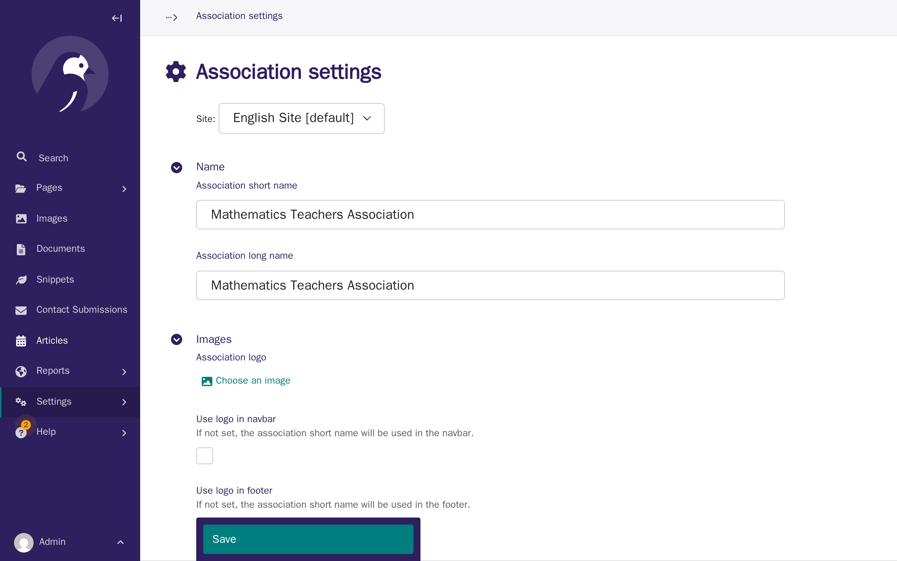
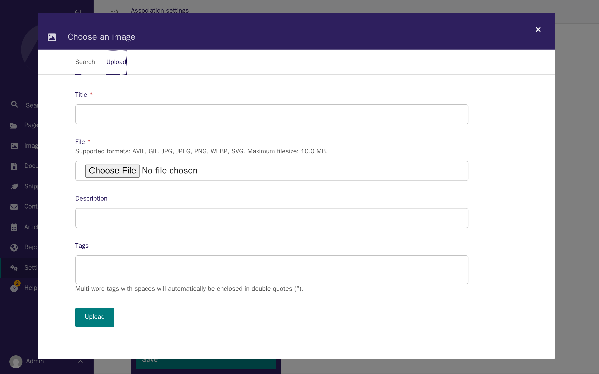
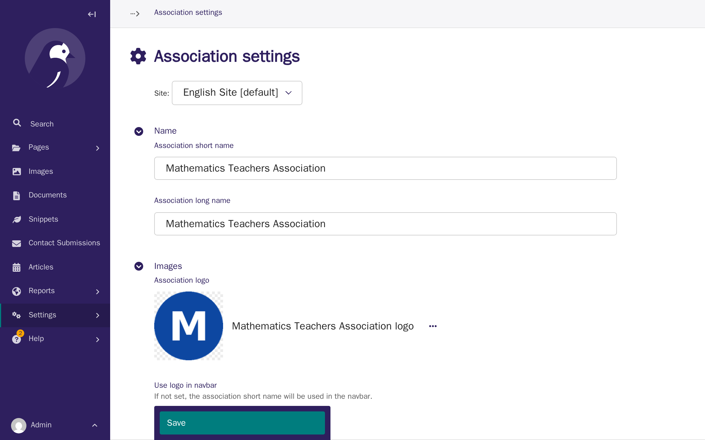
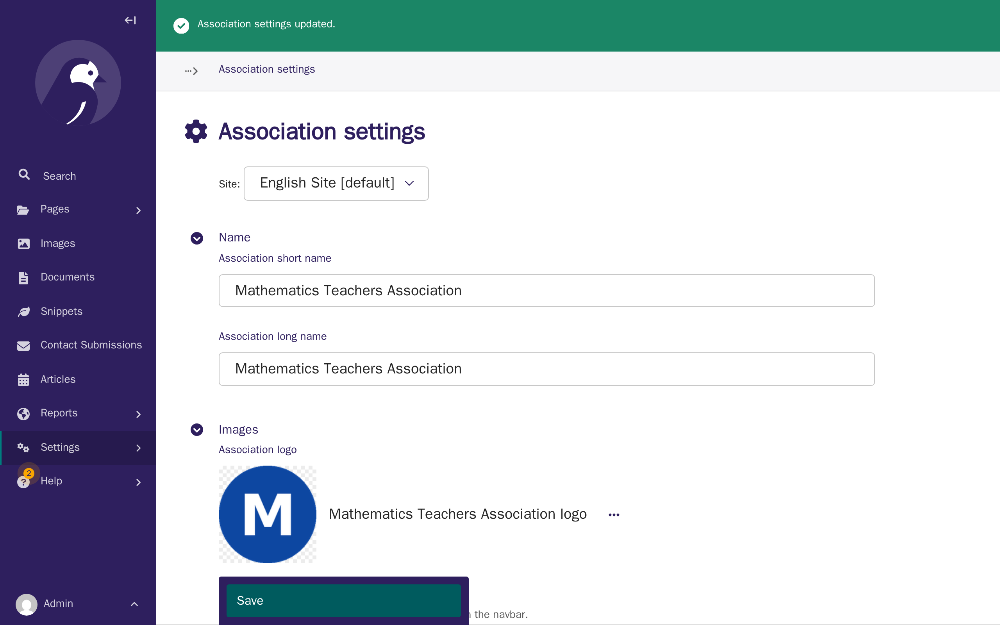
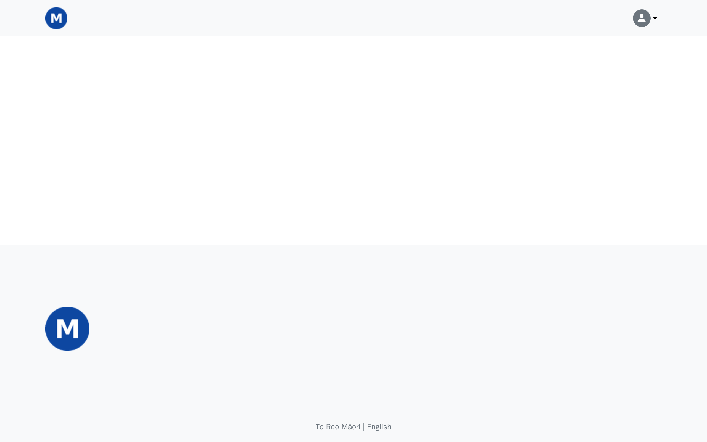
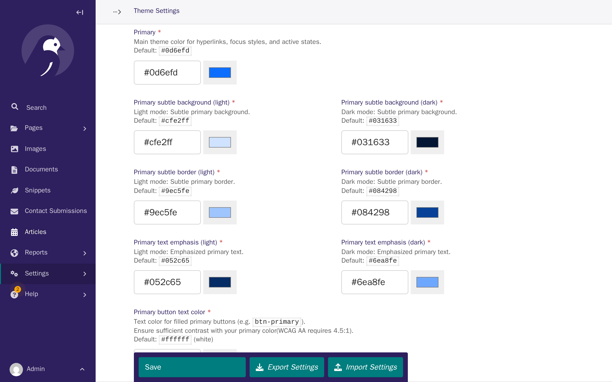
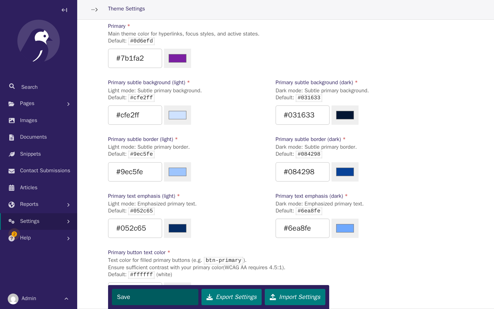
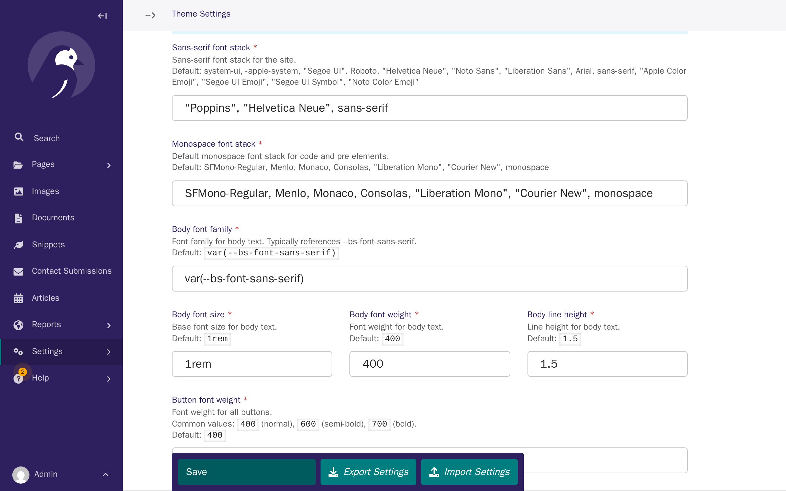

# Tutorial 2: Make it yours — branding & theme

**Who this page is for:** client website admins — the volunteers who will load content and run the day-to-day site, generally with no prior web-admin experience.

## What you'll have at the end

Your logo will show in your website's navbar and footer.
Your website's main colour and font will match your brand.
You'll know where to go for every other colour and font option.

## Before you start

You need your logo file ready.
Your website can use PNG, JPEG, GIF, WEBP, AVIF, or SVG formats — see [question 7 of the decision questionnaire](../getting-started/decision-questionnaire.md#7-branding-assets) if you're not sure yours is ready.
It helps to also have your brand's main colour as a hex code, such as `#7B1FA2`, though your provider can match a colour "by eye" from your logo if you don't have one.
You should already be signed in to the [CMS](../getting-started/glossary.md#cms) — see [Tutorial 1: Orientation](orientation.md) if you're not.

## Steps

1. In the CMS, open **Settings** in the left sidebar, then click **Association settings**.

    

2. In the **Images** section, click **Choose an image** next to **Association logo**, then click the **Upload** tab.

    

3. Add a title for your logo, choose your logo file, then click **Upload**.
    Your logo now appears in the Association logo field.

    

4. Turn on **Use logo in navbar** and **Use logo in footer**, then click **Save**.

    

5. Open your website's home page in a new tab to see your logo live.

    

6. Back in the CMS, open **Settings** again, click **Theme Settings**, and scroll down to the **Primary** section.
    This is your website's main colour, used for links, buttons, and highlights across every page.

    

7. Replace the **Primary** value with your brand colour's hex code, then click **Save**.

    

8. Further down the same page, find **Fonts**.
    Replace **Sans-serif font stack** with your font's name, then click **Save**.

    

## Every other colour and font

Every other field on this page — navbar and footer colours, body text, buttons, and the rest of the font settings — works exactly the same way as the two you just changed: enter a value, then click **Save**.
The [theme customization reference](../admin/theme-customization.md) covers every field, along with accessibility guidance for choosing colours with enough contrast.

## What's next

Now that your site carries your branding, the next tutorial covers [your first pages](first-pages.md) — creating your home page and the core pages every site needs.
