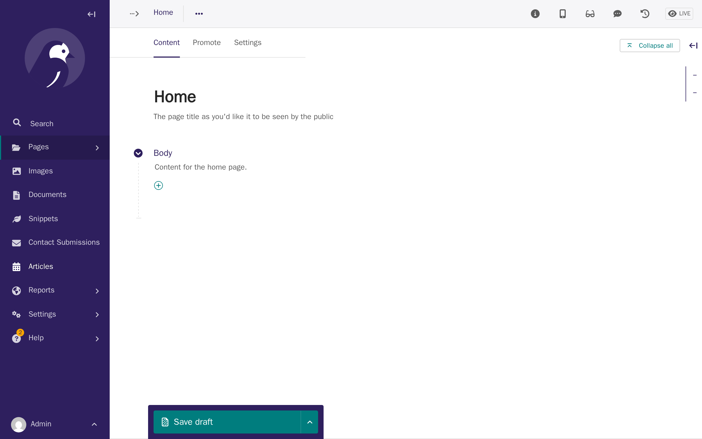
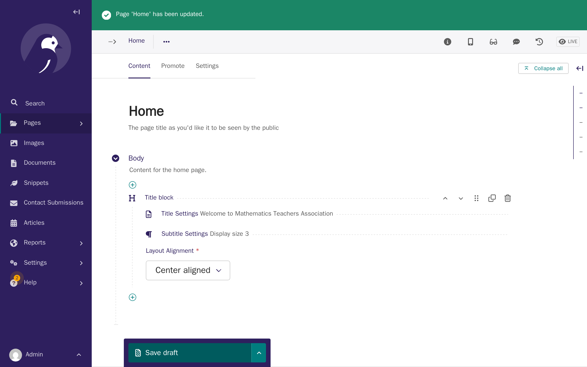
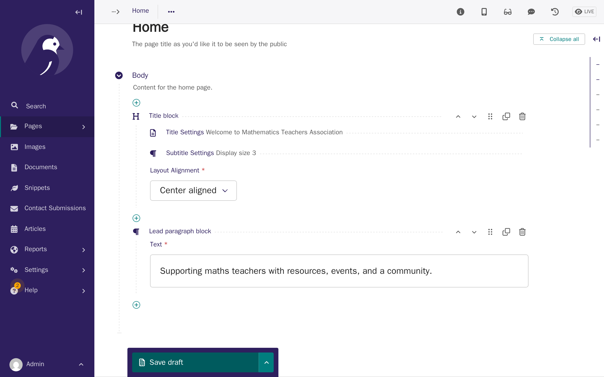
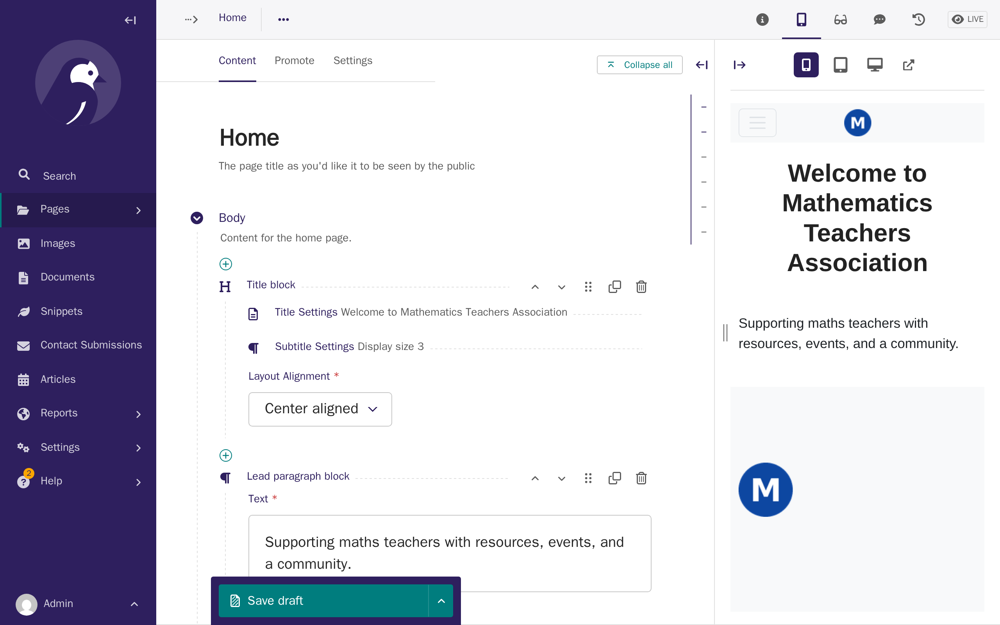
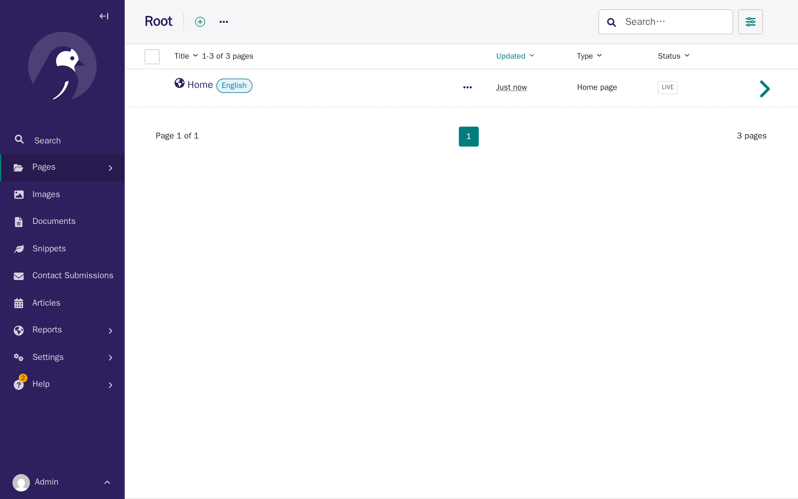
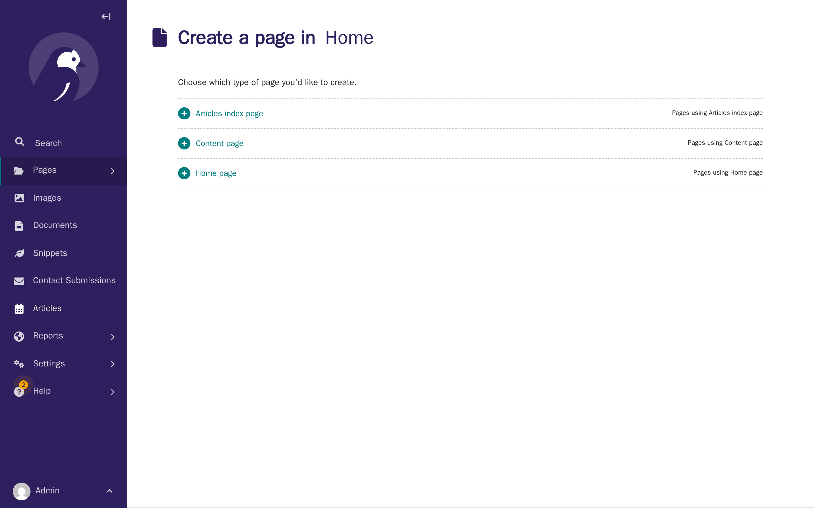
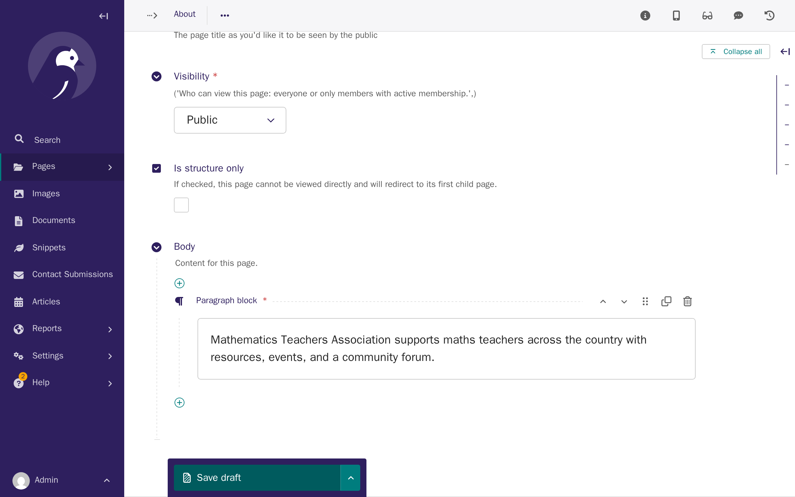
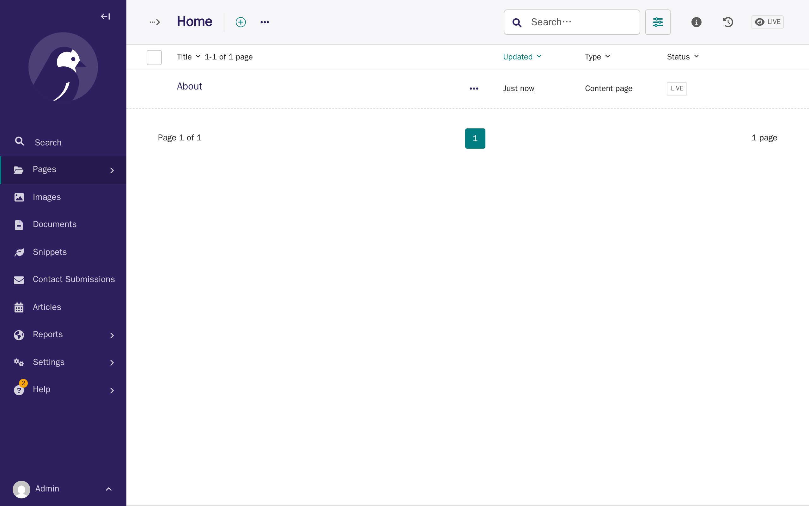
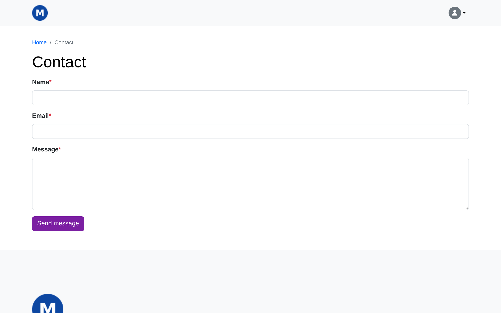

# Tutorial 3: Your first pages

**Who this page is for:** client website admins — the volunteers who will load content and run the day-to-day site, generally with no prior web-admin experience.

## What you'll have at the end

Your home page will have a heading and a welcome message.
You'll have an About page and a Contact page, both published and visible to visitors.
You'll know the difference between saving a draft and publishing, and how to preview a page before anyone else sees it.

## Before you start

You should already be signed in to the [CMS](../getting-started/glossary.md#cms) — see [Tutorial 1: Orientation](orientation.md) if you're not.

## Steps

1. In the CMS, click **Pages** in the left sidebar, click **Home**, then click **Actions**, then **Edit**.
    Your home page already exists — your provider created it for you — but it starts empty.

    

2. In the **Body** section, click the **+** button and choose **Title block**.
    Click **Title Settings** to expand it, then type your page's main heading — for example, a welcome message using your association's name.
    Click **Save draft** to save your heading without publishing it yet.

    

3. Click the **+** button again, choose **Lead paragraph block**, and write a short tagline underneath your heading.
    Click **Save draft** again.
    Saving after each block, rather than adding several and saving once at the end, is a good habit generally.

    

4. Click **Toggle preview** (top right) to see how your heading and tagline will look on your live site, before anyone else can see it.

    

5. Click the arrow next to **Save draft**, then click **Publish**, to make your home page's new content visible to visitors.

    

6. Go back to **Pages > Home**.
    Click **Add child page**, then click **Content page**.

    

7. Type **About** as the title.
    In the **Body** section, click the **+** button, choose **Paragraph block**, and write a sentence or two about your association.

    

8. Click the arrow next to **Save draft**, then click **Publish**.

    

9. Create a **Contact** page the same way — but for its content, choose **Contact Form** instead of a paragraph, and enter your association's email address as the recipient.
    This is the address that receives a message whenever a visitor fills in the form.

    

10. Click the arrow next to **Save draft**, then click **Publish**, then open your new Contact page on your live site to see the form visitors will use.

    

## Create more pages the same way

Repeat steps 6–8 for any other core pages your site needs, such as an "Our story" page.
Every content page follows the same pattern: add a child page, choose **Content page**, give it a title and some content, then publish it.

A handful of short words — `admin`, `cms`, `forum`, and a few others — are reserved for the website's own use, and can't be used as a page's web address (its slug, normally set automatically from the title) when the page sits directly under Home — a page titled "Our story" is fine; one titled "Forum" directly under Home isn't.
See the [CMS admin guide's Reserved URL Patterns](../admin/cms.md#reserved-url-patterns) for the main ones — you'll only hit this if you try to create one of those pages, and the CMS tells you clearly if you do.

## Save draft vs. Publish

These two buttons do different things, and it's worth knowing the difference:

- **Save draft** keeps your changes private.
  Only people signed in to the CMS can see a draft — visitors to your site still see the old version, or nothing at all if the page has never been published.
- **Publish** makes your changes visible to every visitor immediately.

You can save a draft as many times as you like while you're still working on a page, and publish it only when you're happy with it.
**Toggle preview** lets you check a draft looks right before you publish it, without anyone else seeing it first.

## What's next

Your new pages exist and are published, but they won't appear in your site's menus yet.
The next tutorial covers [navigation & menus](navigation-menus.md) — adding your new pages so visitors can actually find them.
