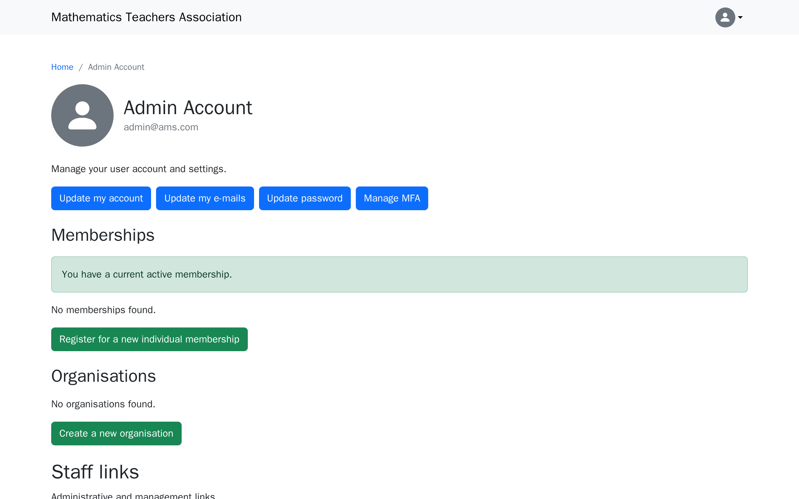
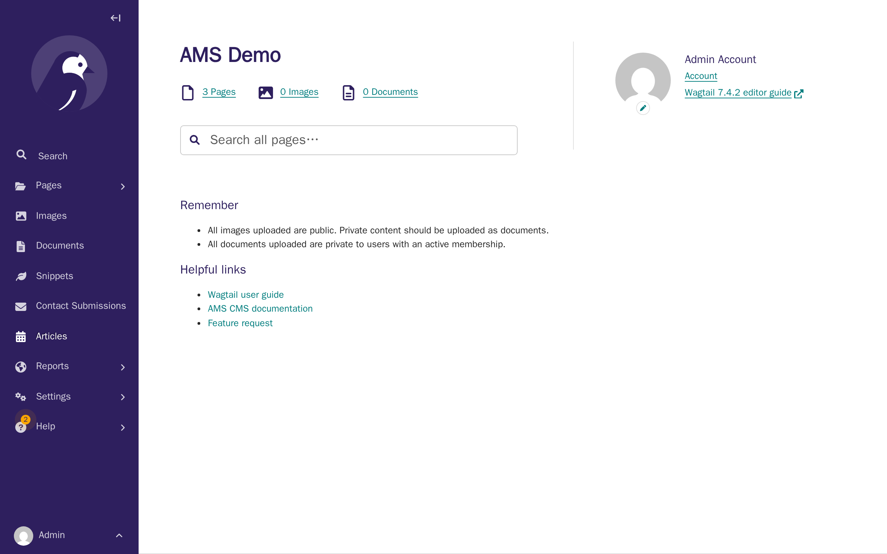
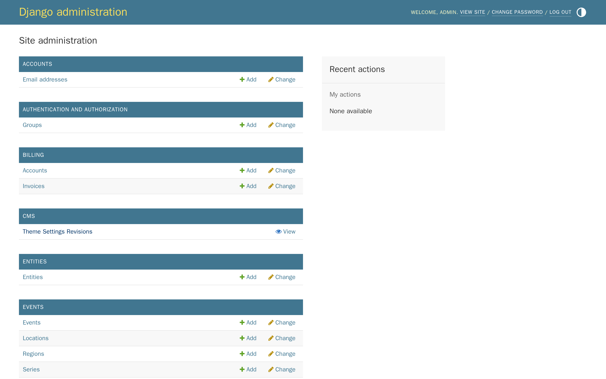

# Tutorial 1: Orientation

**Who this page is for:** client website admins — the volunteers who will load content and run the day-to-day site, generally with no prior web-admin experience.

## What you'll have at the end

You'll be signed in to your website.
You'll know how to reach the two admin areas your provider set up for you.
You'll understand what each part of your site is for, so the later tutorials make sense.

## Before you start

You need the sign-in details your provider gave you: your email address and a password.
If you don't have these yet, ask your provider before continuing.

## Steps

1. Go to your website's sign-in page.
    Your provider will give you the exact web address, or you can click **Sign In** at the top of any page on your site.

    

2. Enter your email and password, then click **Sign In**.
    You'll land on your own account page.

    

3. Scroll down past **Memberships** and **Organisations** to **Staff links**, then click **Wagtail CMS**.
    This opens the [CMS](../getting-started/glossary.md#cms) — the tool you'll use most often to edit pages, upload images, and manage menus.

    

4. Click your profile icon (top right of any page) and choose **My Dashboard** to go back to your account page.

    

5. Scroll down to **Staff links** again, and this time click **Website Admin**.
    This opens the Django admin: a more technical screen, mainly used by your provider for setup and troubleshooting.
    You probably won't need it for everyday content work — the rest of this tutorial series uses the CMS.

    

## The four parts of your site

Your AMS website is actually four separate things, working together.
This tutorial series is mostly about the second one.

| Part | Where you'll find it | What it's for | Who uses it |
| --- | --- | --- | --- |
| Public site | Your website's normal address | What visitors and members see and use | Everyone |
| CMS (Wagtail) | `/cms/`, via the **Wagtail CMS** button | Editing pages, images, documents, and menus — your main work area | Content loaders, editors, the site admin |
| Django admin | `/admin/`, via the **Website Admin** button | Technical records such as memberships, billing, and user accounts — used occasionally, mostly for setup | The site admin, your provider |
| [Forum](../getting-started/glossary.md#forum) | A separate address your provider gives you | Member discussions, powered by a connected product called Discourse | Members, forum moderators |

Signing in to the public site also signs you in to the forum automatically, through [single sign-on](../getting-started/glossary.md#sso) — you never need a separate forum password.

## What's next

Now that you know your way around, the next tutorial covers [making it yours: branding & theme](branding-theme.md) — uploading your logo and setting your colours.
