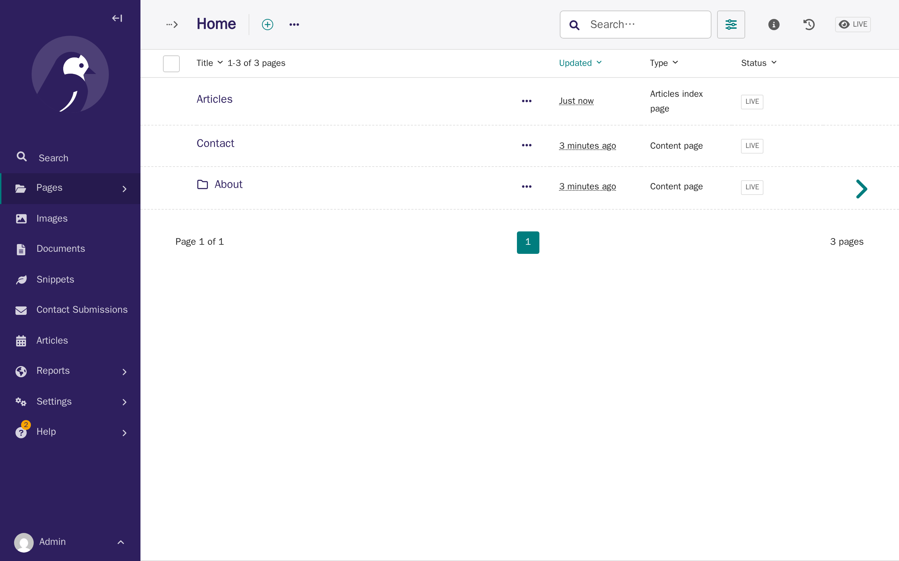
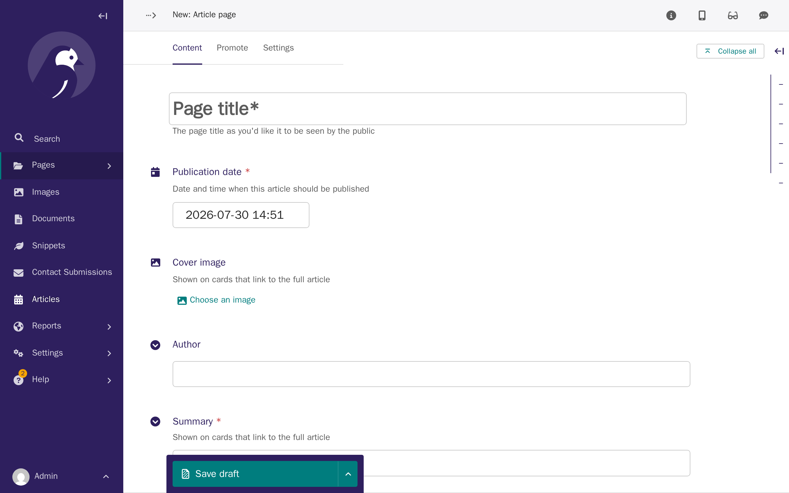
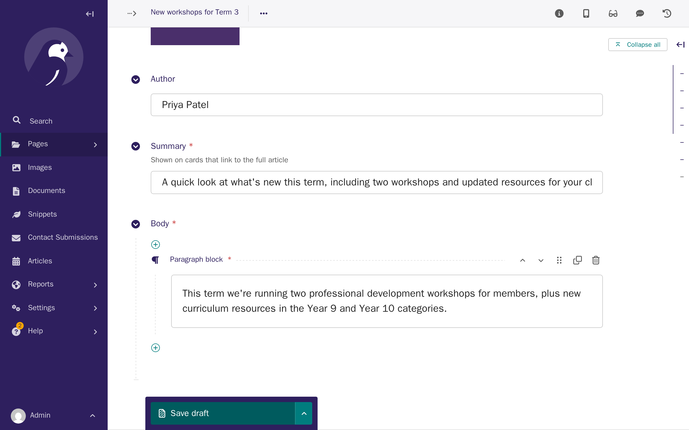
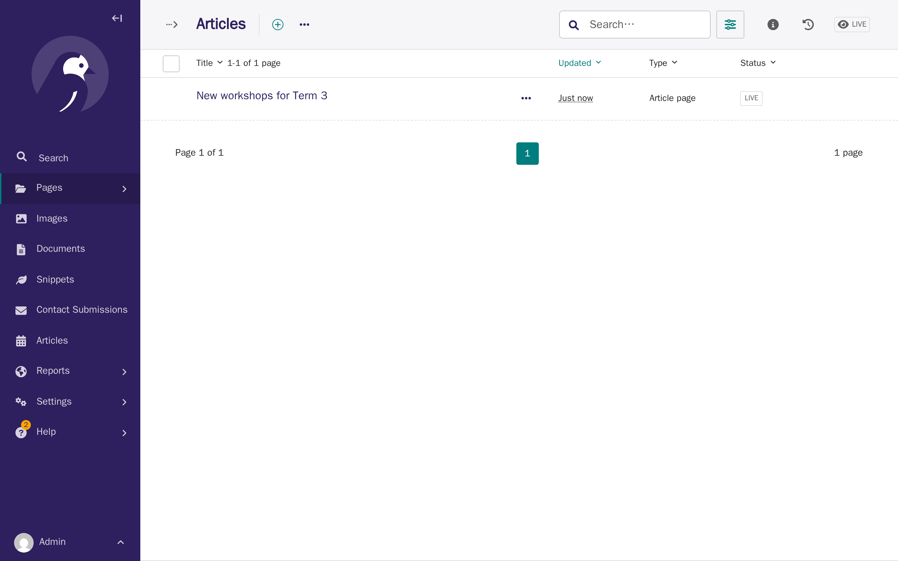
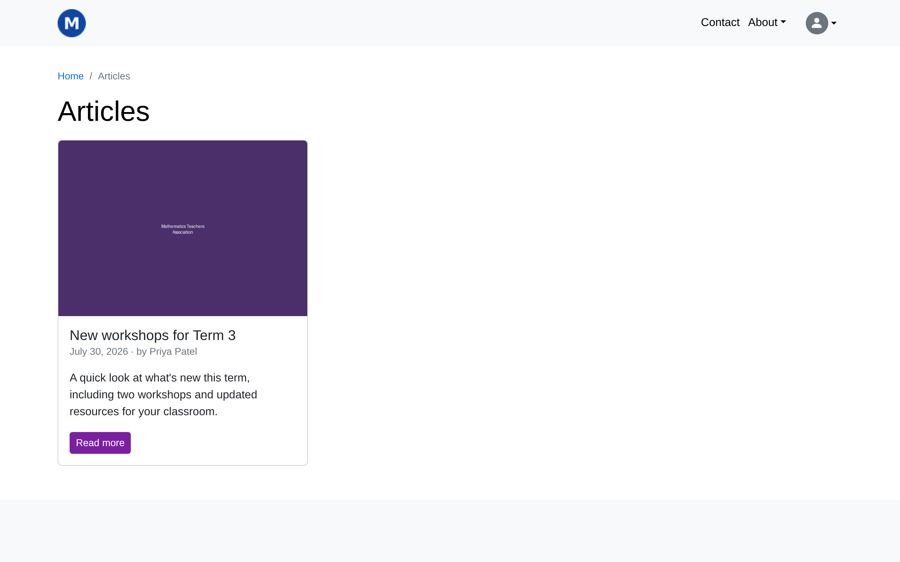
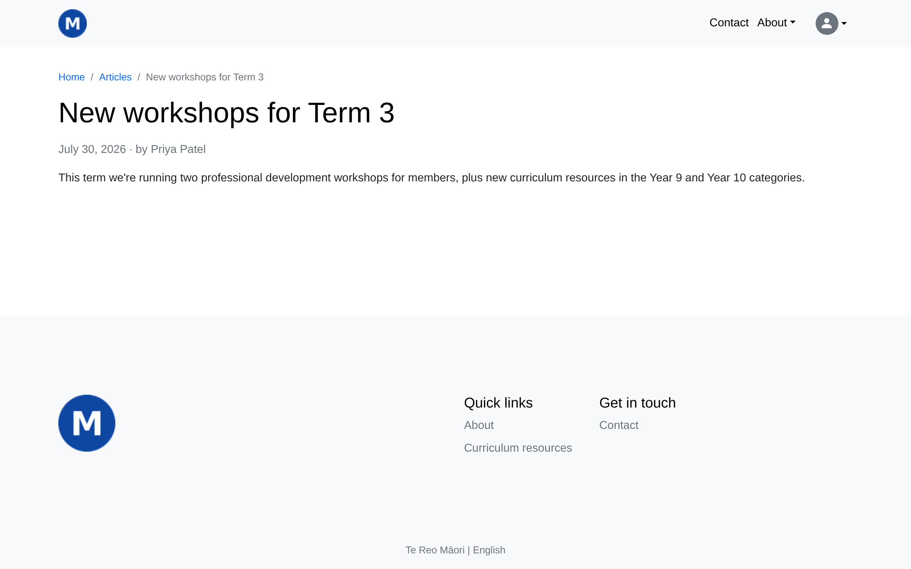
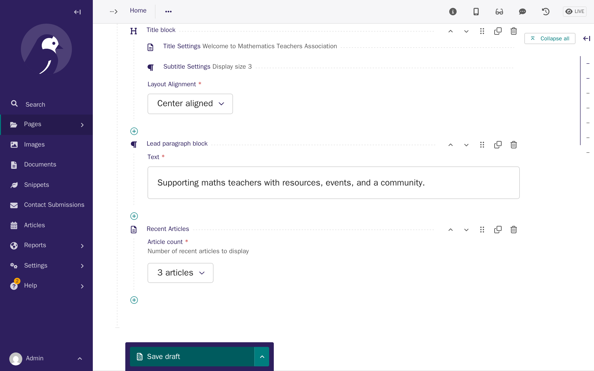
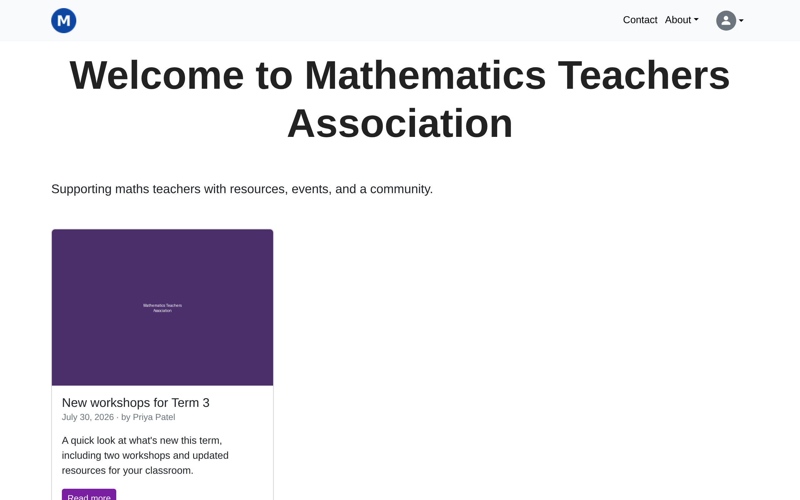

# Articles

**Who this page is for:** client website admins — the volunteers who load content and run the day-to-day site.

Articles are blog-style posts — news, updates, and announcements — published from the CMS, the same way you manage other pages.
Unlike [Events](events.md) or [Resources](resources.md), articles aren't an optional feature switched on by your provider: they're always available, the same as ordinary pages.

## Set up an articles index page (one-time)

Before you can add any articles, your site needs one **Articles index page** — a single page that lists every published article.
Most sites only ever need one.

1. In the CMS, go to **Pages**, open **Home**, and click **Add child page**.
   Both **Articles index page** and **Content page** are offered here — choose **Articles index page**.

    

2. Give it a title (e.g. "Articles") and an optional intro, then publish it the same way you'd publish any other page — see [Tutorial 3: Your first pages](../setup/first-pages.md) if you're not sure how.

    

## Add an article

Once an articles index page exists, the quickest way to add a new article is the **Articles** item in the CMS sidebar — it lists every article on the site, whichever index page it's under, and its **Add article page** link takes you straight to a new article form.
If your site only has one articles index page, that link skips straight to the form below; with more than one, you're asked which one to add it under first.

1. In the CMS sidebar, click **Articles**, then **Add article page**.

    

2. Fill in the fields below.

    | Field | What it does |
    | --- | --- |
    | Title | The article's heading. |
    | Publication date | Controls the order articles are listed in, and when an article starts appearing on the listing page and the Recent Articles widget — see [Publication date vs page status](#publication-date-vs-page-status) below. Defaults to now. |
    | Cover image | Shown on the article's card on the listing page and the widget. Optional — a plain placeholder shows if you leave it out. |
    | Author | Free text, shown alongside the publication date. Optional. |
    | Summary | Shown on cards that link to the full article. Required. |
    | Body | The article's full content, built from the same content blocks as an ordinary page — see [CMS: Content blocks](cms.md#content-blocks). Required. |

    

3. Publish it the same way as any other page, from **More actions**.

    

## How articles display

Published articles are listed newest-first at `/articles/`, 12 per page.

Clicking through to an article shows its full body, publication date, and author.

## Publication date vs page status

Two separate things control whether an article is visible, easy to mix up:

- **Page status** (Live/Draft, same as any CMS page) controls whether the article's own page can be opened at all.
- **Publication date** only controls the listing page and the Recent Articles widget: an article is left out of both until its publication date arrives, even once it's Live.

Publication date does **not** hide a Live article's own page — anyone with the direct link can open it before its publication date, the same way an unlisted page works.
If you need a hard embargo, keep the article as a draft until you're ready for it to be visible anywhere, and use publication date only to control the order it appears in once you do publish it.

## The Recent Articles widget

The **Recent Articles** block adds a grid of your most recently published articles — the same cards used on the articles listing page.
It's only available on the **Home page**, alongside the Title block — see [CMS: Content blocks](cms.md#content-blocks).

1. Edit your home page and insert a **Recent Articles** block into the Body, the same way you'd insert any other block — see [Tutorial 3: Your first pages](../setup/first-pages.md).
   Choose how many articles to show, **3** or **6**.

    

2. Publish the home page. Visitors now see your most recent articles on it.

    
