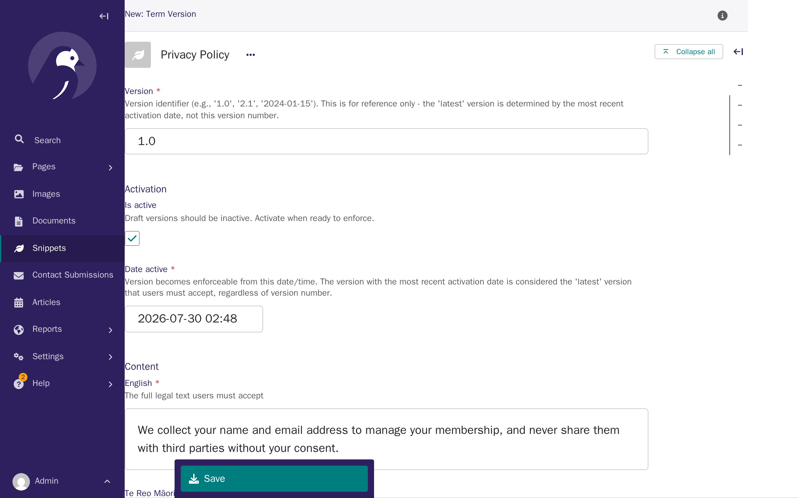
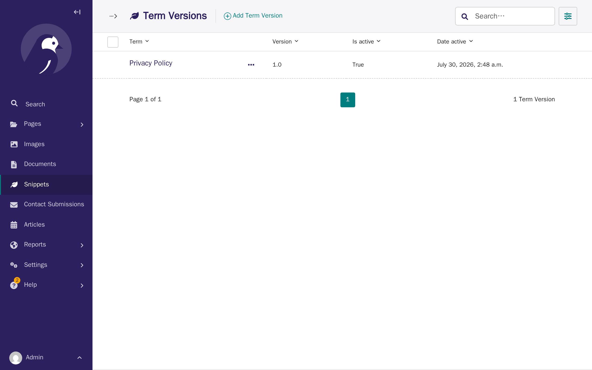
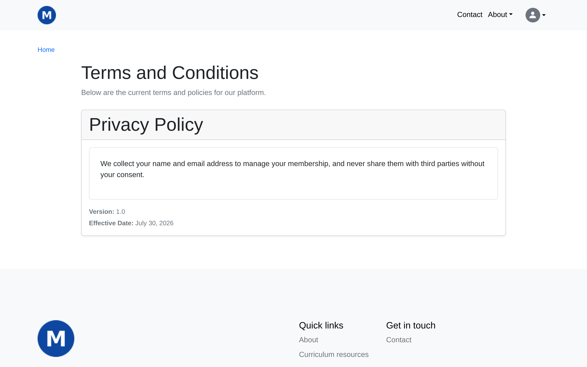
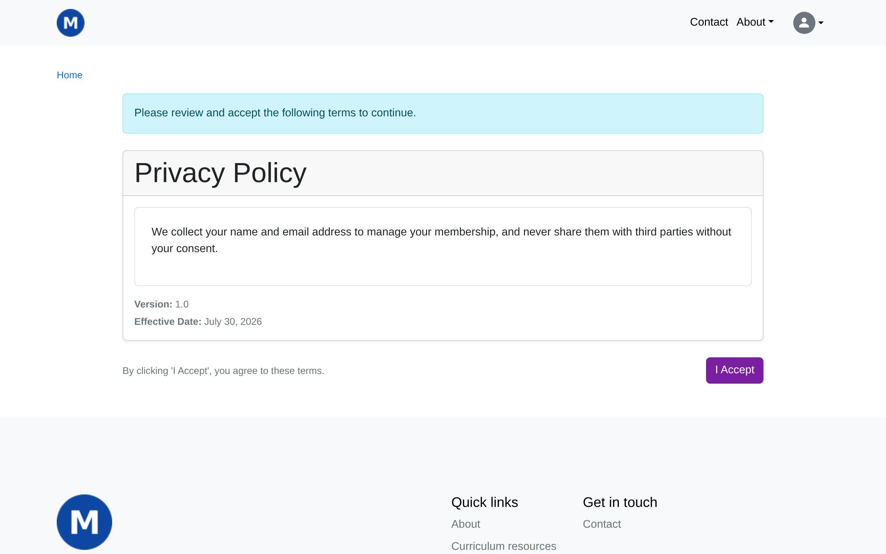

# Terms & policies

**Who this page is for:** client website admins — the volunteers who load content and run the day-to-day site.

Use this feature for any legal document you want members to agree to before using your site — a privacy policy, terms of service, or similar. You create and publish these from the CMS, the same way you manage other content.

## Term and Term Version

Two things work together:

- **A Term** is the document itself — for example "Privacy Policy". It just has a name and a short internal description; it holds no legal text on its own.
- **A Term Version** is one dated version of that document's actual wording. Each Term can have several versions over time, as you update your policy.

Only one version of each Term is ever shown to members or the public at a time: whichever version is both switched on (**Is active**) and has the most recent **Date active**.

**Version numbers are just a label — they don't decide which version is current.** A version you label "1.5" with a later Date active will show instead of a version labelled "2.0" with an earlier Date active. Always check the Date active field, not the version number, when you want to know what a member will actually see.

## Create and publish a term

1. In the CMS, go to **Snippets → Terms**.
2. Click **Add Term**, give it a **Key** (a short internal code, e.g. `privacy-policy`) and a **Name** (what members see, e.g. "Privacy Policy"), then save.
3. Go to **Snippets → Term Versions**.
4. Click **Add Term Version** and choose the Term you just created.
5. Enter a **Version** label (e.g. "1.0") — for your own reference only.
6. Write the legal text in **Content**, in each language your site supports.
7. Set **Date active** to when this version should take effect. This can be a future date and time, so you can schedule a policy change ahead of time.
8. Tick **Is active** and save.

    

A version with **Is active** unticked is a draft: it's saved but never shown to anyone, however far in the past its Date active is set.

Every Term Version you've created is listed under **Snippets → Term Versions**, with its Term, Version, Is active, and Date active columns — useful for checking which version is actually current without opening each one.

## The public terms page

Every current version — one per Term — is listed at `/terms/`, visible to everyone, including visitors who aren't signed in. This is also the page a "Terms and Conditions" menu link points to (see [CMS: Menus](cms.md#menus)).

## What happens when you publish a new version

This is the part to plan around: as soon as a Term Version's **Date active** arrives, every signed-in member who hasn't yet accepted it is stopped and shown that version, with an **I Accept** button, the next time they try to reach:

- **Their own account page**, or
- **The forum** (if you have one).

They're shown one pending term at a time and can't get past this screen until they accept every outstanding one. They are *not* blocked from the rest of your public site, and admins with CMS or Django admin access are not blocked from those either — only the two member-facing pages above check for pending terms.

Because this can interrupt a member mid-visit, avoid publishing a new version (or one dated to take effect) right before or during an event that depends on members reaching their account or the forum — a membership renewal deadline or a forum-based event sign-up, for example.

Once a member accepts a version, that acceptance is kept permanently, along with the date, their IP address, and the browser they used — so you always have a record of who agreed to what, and when.
