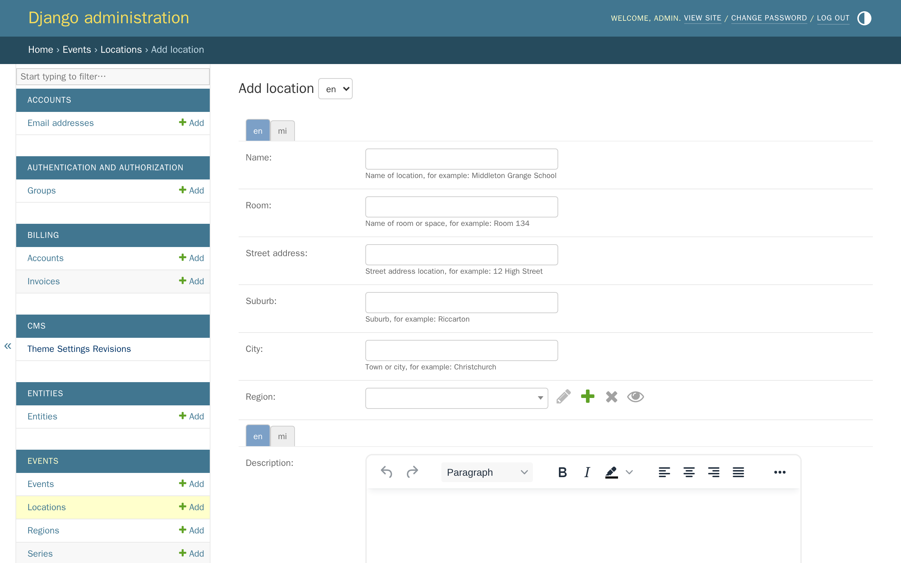
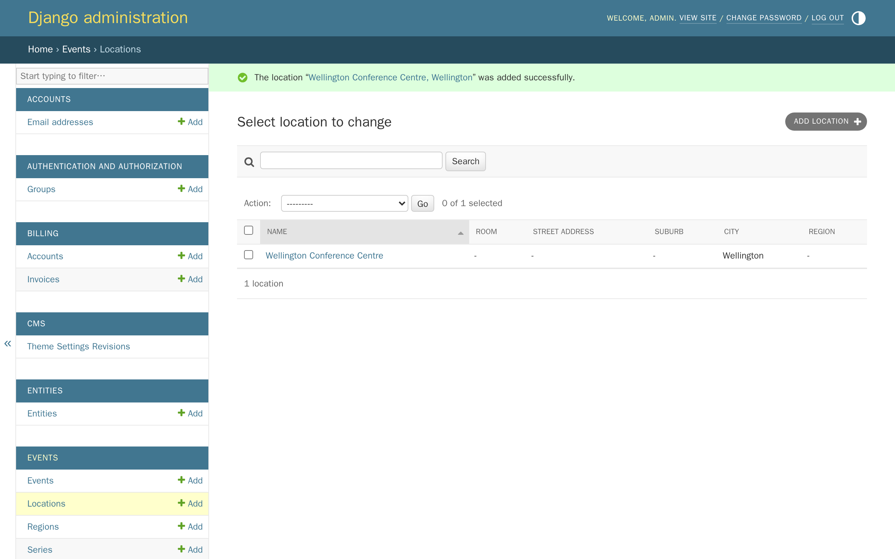
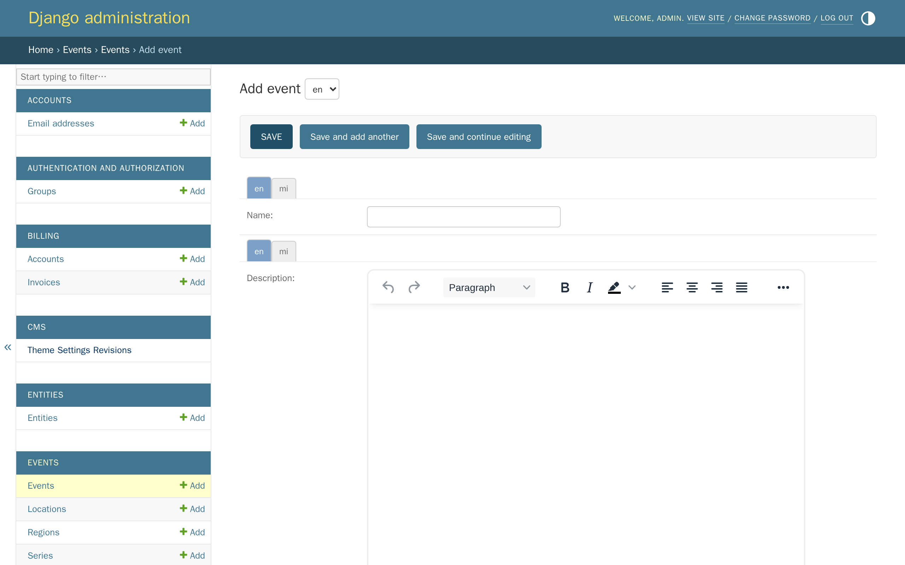
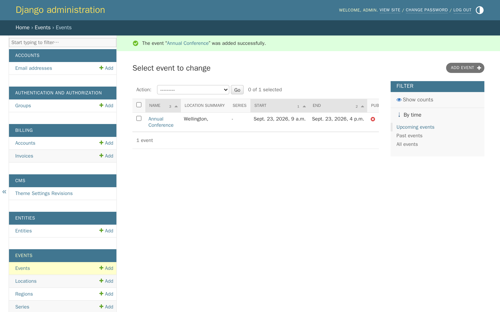
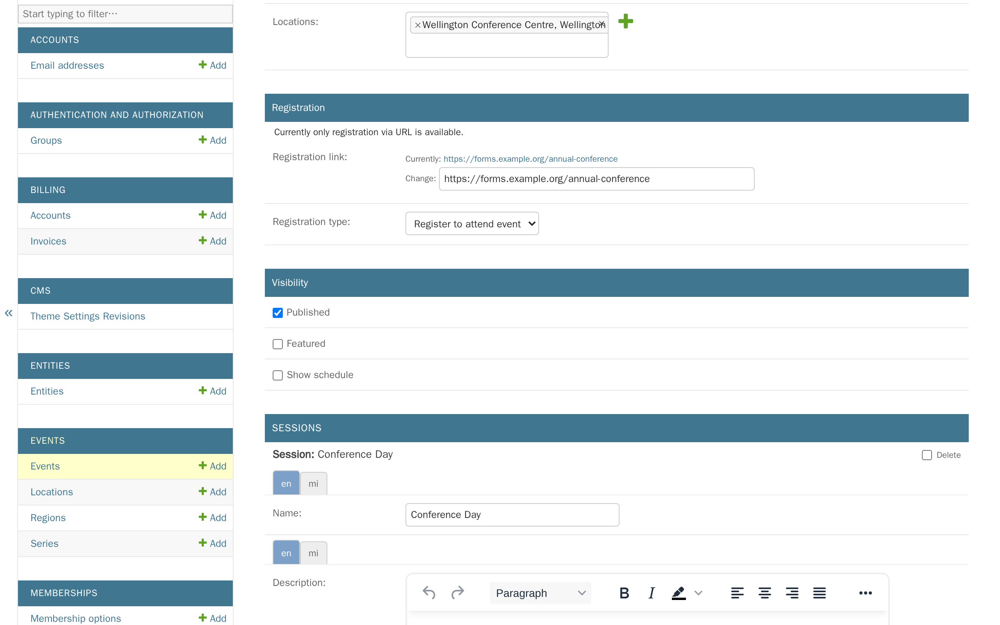
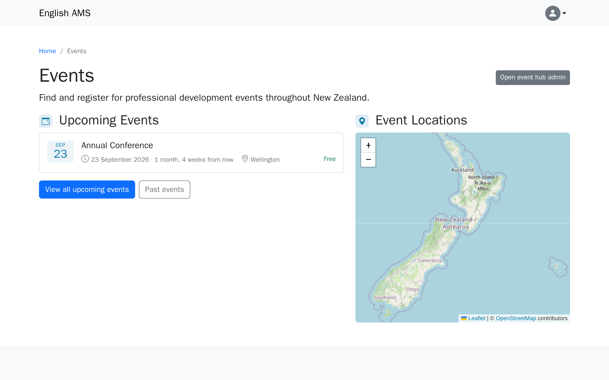
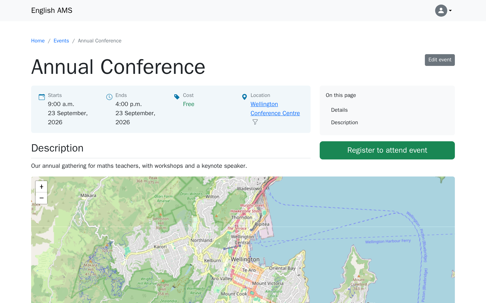

# Tutorial 9: Events

**Who this page is for:** client website admins — the volunteers who will load content and run the day-to-day site, generally with no prior web-admin experience.

## What you'll have at the end

You'll have added a location, created an event with a session, published it, and seen it live on your public site.

## Before you start

Whether your site has events at all is a decision from onboarding — see [question 5 of the decision questionnaire](../../getting-started/decision-questionnaire.md#5-optional-features).
Turning it on ([`AMS_EVENTS_ENABLED`](../../getting-started/settings-glossary.md#ams_events_enabled)) needs an environment change and a restart, so if you don't see **Events** in the Django admin yet, your provider hasn't switched it on — see the [events admin guide](../reference/events.md).
Events are managed in the **Django admin**, not the CMS — see [Tutorial 1: Orientation](orientation.md) if you're not sure how to get there.

## Steps

1. In the Django admin, click **Events**, then click **Add** next to **Locations**.

    

2. Fill in a **Name** and **City**, then click **Save**.
    Everything else on this form is optional.

    

    A **Region** groups several locations together — useful if your association runs events in more than one part of the country.
    Add one later from **Regions**, in the same Events section, if you need it.

3. Click **Events**, then click **Add** next to **Events**.

    

4. Fill in the fields below, add at least one session, then click **Save**.

    | Field | What it does |
    | --- | --- |
    | Name | The event's title. |
    | Description | Shown on the event's own page. |
    | Locations | Where the event is held — pick the location you just added. Leave blank, and check **Accessible online** instead, for an online-only event. |
    | Price | The cost to attend. A cost of 0 makes this a free event. |
    | Registration link | Where a visitor goes to register — your registration form, ticketing page, or similar. Required unless **Registration type** is set to **This event is invite only**. |
    | Registration type | What the button on the event's page says and does: **Register to attend event**, **Apply to attend event**, **Visit event website**, or **This event is invite only** (no button, no link needed). |
    | Featured | Adds a **Featured** badge wherever this event is listed. |
    | Show schedule | Adds a session-by-session running order to the event's page — worth turning on once an event has more than one session. |
    | Sessions | At least one is required. Each has its own name, start time, and end time, and optionally its own location — add more than one for a multi-day event, or a conference with parallel sessions. |

    

5. The event is hidden from the public until you mark it as published — the same way a CMS page stays a draft until you publish it.
    Open the event, check **Published**, then click **Save**.

    

6. Visit your events page to see it live.

    

## The event's own page

Click through to the event's name from the listing to see its full page — this is what a visitor sees after clicking through.

## Series

If your association runs the same event every year, or holds several related events — a conference with regional heats, say — group them with a **Series**: click **Events**, then **Add** next to **Series**.
An event's series shows as a small logo or name near its title.

## Adding events to your menu

Nothing links to your events page automatically.
See [Adding events to menus](../reference/events.md#adding-events-to-menus) — the short version is you link to `/events/` the same way you'd link to any other page, in [Tutorial 4: Navigation & menus](navigation-menus.md).

## What's next

The next tutorial covers [resources](resources.md) — if your association uses them.
