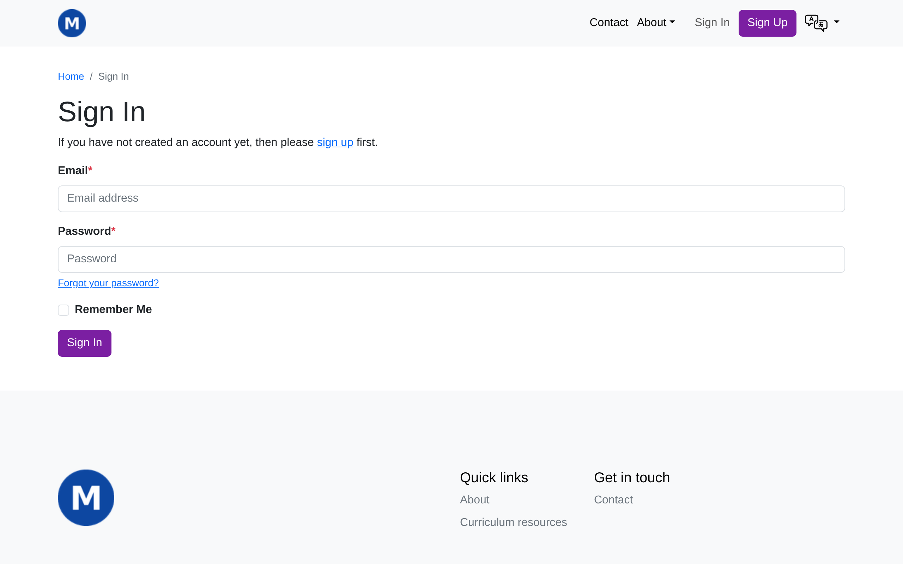
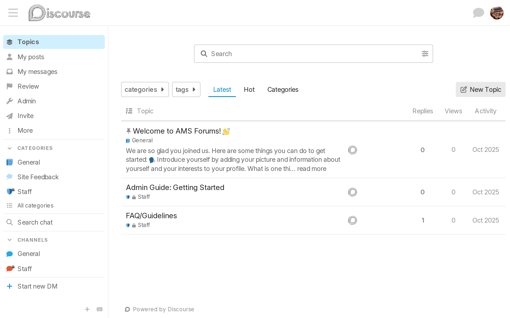
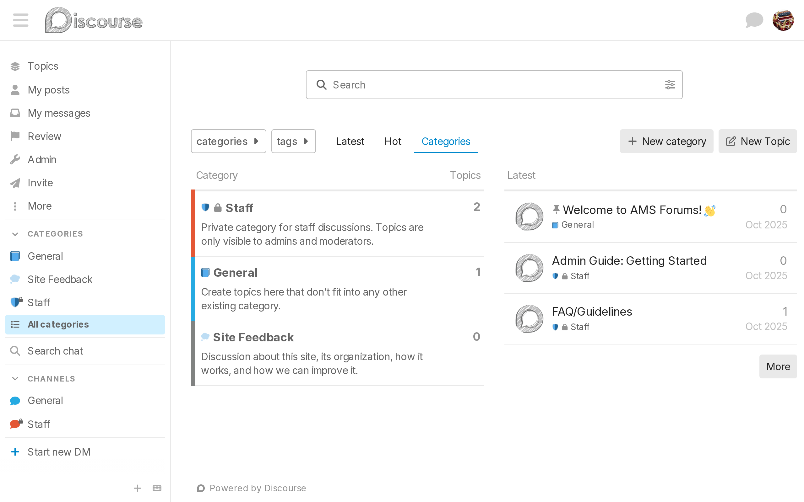
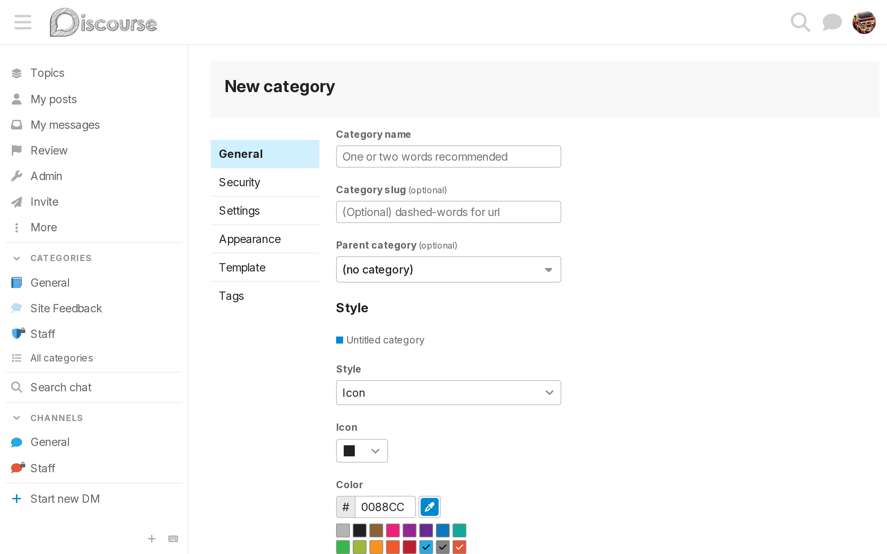
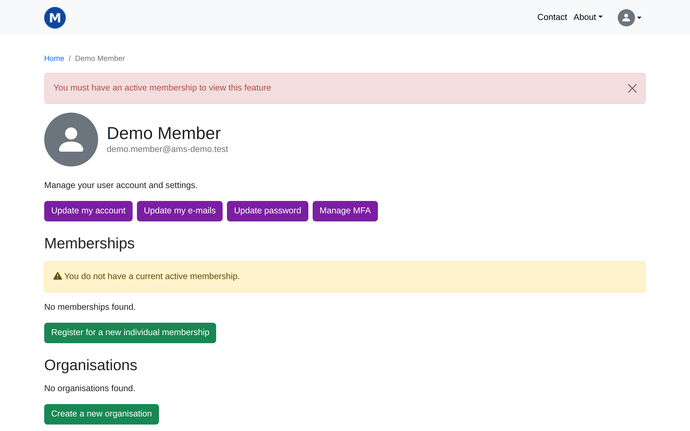

# Tutorial 8: Forum

**Who this page is for:** client website admins — the volunteers who will load content and run the day-to-day site, generally with no prior web-admin experience.

## What you'll have at the end

You'll know your way around the forum your provider has set up for you, understand the starter categories you're launching with and how to add more once you're ready, and know what a member sees the first time they sign in.

## Before you start

Whether your site has a forum at all is a decision from onboarding — see [question 5 of the decision questionnaire](../../getting-started/decision-questionnaire.md#5-optional-features).
If you have one, your provider has already set it up and connected it to your AMS site — see the [accounts checklist](../../getting-started/accounts-checklist.md) and the [forum admin guide](../reference/forum.md) if you're not sure that's happened yet.
Only members with an active membership can actually use it once they're signed in — see [Tutorial 6: Memberships](memberships.md) if you haven't set memberships up yet.

## Steps

1. Visit your forum's own address — a separate address your provider gives you, often something like `forum.yourassociation.org`.
    If you're not already signed in to your website, visiting it sends you to sign in there first, the same as any other page that needs you to be signed in.

    

2. Sign in with your usual account.
    You're carried straight through into the forum — no separate forum password to remember, ever (see [SSO](../../getting-started/glossary.md#sso)).
    Because you're the site admin, you're automatically a forum admin too, shown here by the **Admin** link in the sidebar.

    

3. Look at **Categories** in the sidebar (or click **All categories**).
    You're starting with three: **General**, for anything that doesn't fit anywhere else; **Site Feedback**, for feedback about the forum itself; and **Staff**, a private category only admins and moderators can see.
    Starting minimal like this, then growing the category list once members tell you what they actually want, works better than guessing a big structure up front.

    

4. When you're ready to add more, click **+ New category** and fill in a name.

    

## How members experience the forum

A member signs in to the forum exactly the way you did in step 2 above — the same account, the same single sign-on, no extra password to set up or remember.
The only difference is what they can see: a private category like **Staff** stays hidden from them, and they need an active membership before they can get in at all.

If someone without one tries, they're sent back to their account page with a message explaining why, instead of into the forum:

## Admins are synced automatically

Anyone who's a superuser on your AMS site becomes a forum admin the moment they sign in — and loses forum admin the moment they stop being one, even if someone made them an admin by hand directly in the forum.
Regular staff access doesn't carry over this way; only superusers do.
See [Admin sync](../reference/forum.md#admin-sync) for the full detail.

## Let members find the forum

Nothing links to your forum automatically — there's no "Forum" item in your menu until you add one.

Your site has a shortcut built in for this: visiting `/forum/` on your own site (for example, `https://yourassociation.org/forum/`) signs a visitor in and sends them straight into the forum, the same single sign-on hop from step 2 above.
Use this address, not your forum's own separate one, whenever you link to the forum from your menu — it keeps working even if your forum's actual address ever changes, and it makes sure every visitor goes through sign-in correctly on the way in.

Add it the same way you'd link to any other external website: see [Footer links](navigation-menus.md#footer-links) in Tutorial 4 for how, typing `/forum/` into **Link to a custom URL** instead of a full web address.

## What's next

The next tutorial covers [events](events.md) — if your association uses them.
