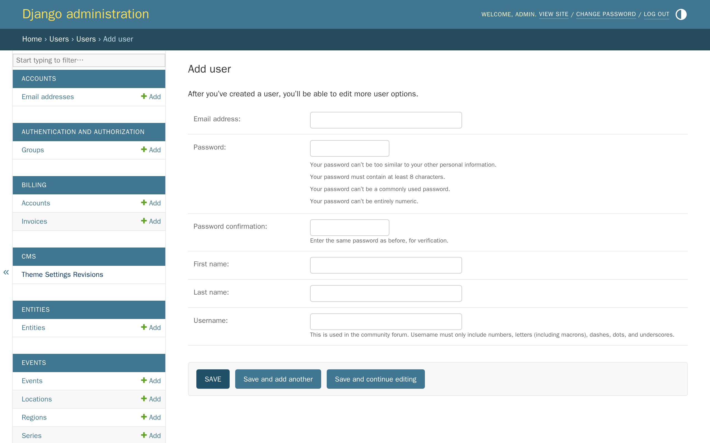
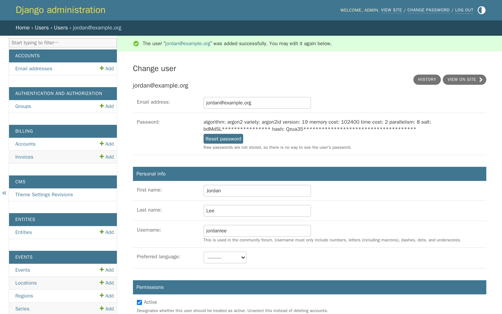
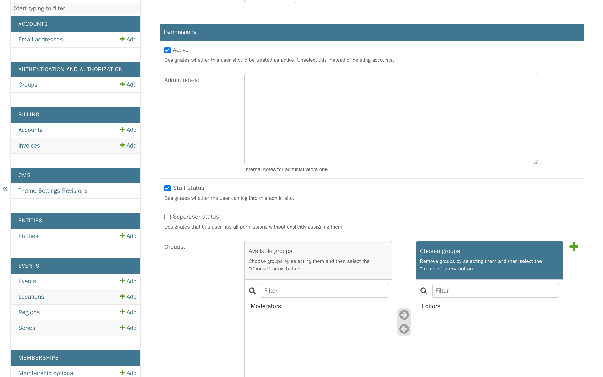
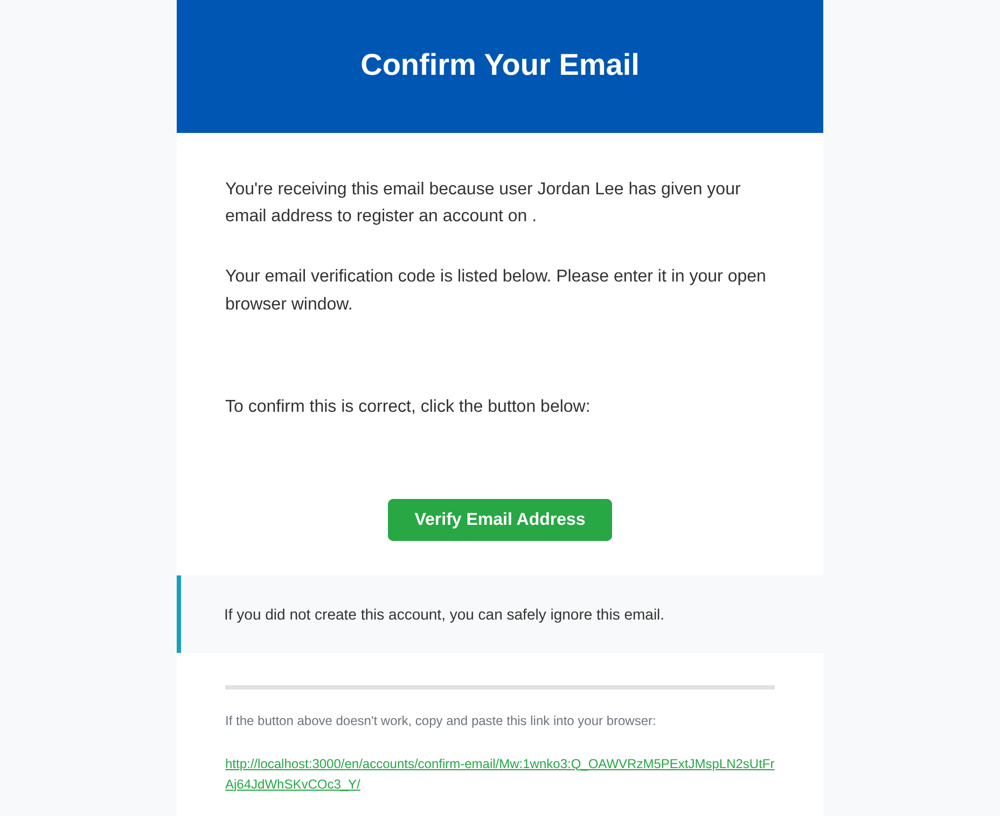
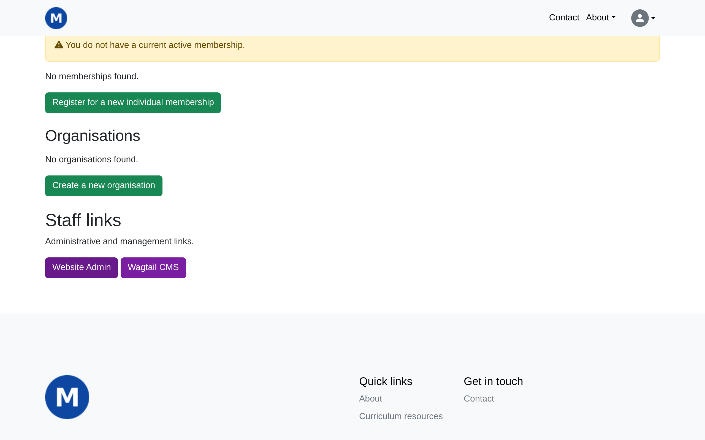

# Tutorial 11: Inviting your team

**Who this page is for:** client website admins — the volunteers who will load content and run the day-to-day site, generally with no prior web-admin experience.

## What you'll have at the end

You'll have added a new team member with their own sign-in, given them Editor or Moderator access to the CMS (and Website Admin access too, if they'll help with memberships, events, or resources), and you'll know what each permission level actually lets someone do.

## Before you start

New team member accounts are created in the **Django admin**, not the CMS — see [Tutorial 1: Orientation](orientation.md) if you're not sure how to get there.

## Steps

1. In the Django admin, click **Users**, then click **Add** next to **Users**.

    

2. Fill in their name, email address, and a password, then click **Save**.
    The username becomes part of their own account page's web address, and is also used for [the forum](forum.md) — anything short and simple works.

    

    You choose this password yourself — there's no way to invite someone without setting one first.
    Give it to them however you'd share any password, or skip that altogether and tell them to click **Forgot your password?** on the sign-in page to set their own the first time they sign in.

3. Under **Permissions**, tick **Staff status** and add them to **Editors** or **Moderators** under **Groups** (see the table below for the difference), then click **Save and continue editing**.

    

4. Tell your new team member to check their email.

    

    Every new account has to be confirmed by email before it can sign in — this isn't optional, and it happens the first time they try to sign in, not the moment you create the account.

## What they'll see

Once they've confirmed their email and signed in, they'll land on their own account page, with buttons under **Staff links** for whichever access you gave them.

## What each permission level does

| Permission | How to grant it | What it lets them do |
| --- | --- | --- |
| Editor | Add to **Editors** under Groups | Add and edit pages in the CMS, but not publish them — someone with Moderator access (or you) needs to publish their work. |
| Moderator | Add to **Moderators** under Groups | Add, edit, and publish pages in the CMS — the level most people loading day-to-day content need. |
| Website Admin | Tick **Staff status** | Access to the Django admin, where memberships ([Tutorial 6](memberships.md)), events ([Tutorial 9](events.md)), and resources ([Tutorial 10](resources.md)) are managed — most people helping with day-to-day site work will need this too, alongside Editor or Moderator. |
| Full administrator | Tick **Superuser status** (as well as **Staff status**, to actually reach the Django admin) | Every permission everywhere, automatically, including ones added after this page was written — reserve this for people who should have the same full access you do. |

A **Group** and **Staff status** are independent, and cover different areas: a Group controls CMS access, Staff status controls Django admin access.
Someone can have either, both, or neither.
See [Feature reference: Users & permissions](../reference/users.md) for a higher-level summary of what each control is for, including the CMS's own simpler way to edit a user's name or username.

## Changing permissions for someone who already has an account

You don't need to recreate an account to change what someone can do.
In the Django admin, click **Users**, search for them by name, and click their email to open the same **Permissions** section shown in Step 3.
Tick or untick whatever you need, then click **Save**.

## Examples

The table above covers CMS access (Editors/Moderators) and blanket Django admin access (Staff status/Superuser status).
For anything more specific — access to only *some* of the Django admin — you create a new Group with exactly the permissions you want, once, and reuse it for anyone who needs the same access, the same way Editors and Moderators already work for the CMS.

### I want to add a user who can only edit CMS content

Follow Steps 1–2 to create their account.
In Permissions, add them to **Editors** — leave **Staff status** unticked entirely.
They'll see only the **Wagtail CMS** button under Staff links, with no way into the Django admin at all.
(If they should be able to publish their own work too, not wait for someone else to, use **Moderators** instead of **Editors**.)

### I want to add a user who can manage users and memberships

Editors and Moderators only cover the CMS — managing users and memberships happens in the Django admin, so this needs its own Group:

1. In the Django admin, click **Groups**, then click **Add** next to **Groups**.
2. Name it something clear, like **Membership Managers**.
3. In the permissions list, type `user` into the filter box and tick **Can view user**, **Can add user**, **Can change user**, and **Can delete user**, from the rows starting **Users | user |** — ignore the **profile field** and **user profile** rows the same search also turns up; those are for something else.
4. Clear the filter, type `membership`, and tick the view/add/change/delete permissions for **membership option**, **Membership: Individual**, and **Membership: Organisation**.
5. Click **Save**.

Now follow Steps 1–3 to create (or open an existing) account, tick **Staff status**, and add them to **Membership Managers** under Groups instead of Editors or Moderators.
They'll see only **Users** and **Memberships** in the Django admin — nothing else.

### I want to add a user who can only add and edit resources

Same idea, with a Group scoped to resources instead:

1. **Groups** → **Add** → name it something like **Resource Editors**.
2. Type `resource` into the filter box and tick **Can add resource** and **Can change resource**, plus **Can add resource component** and **Can change resource component** — the second pair is what lets them attach the actual file or link, not just create an empty entry. Leave **resource category** and **resource tag** alone unless they should manage those too, and leave every **delete** permission off.
3. Click **Save**, then add the person to this group — with **Staff status** ticked — the same way as the example above.

They'll see only **Resources** in the Django admin, and can add and edit resources but not delete them.

## What's next

The last tutorial in this series covers [the launch checklist](launch-checklist.md) — the pre-launch review, going live, and what to tell your members.
