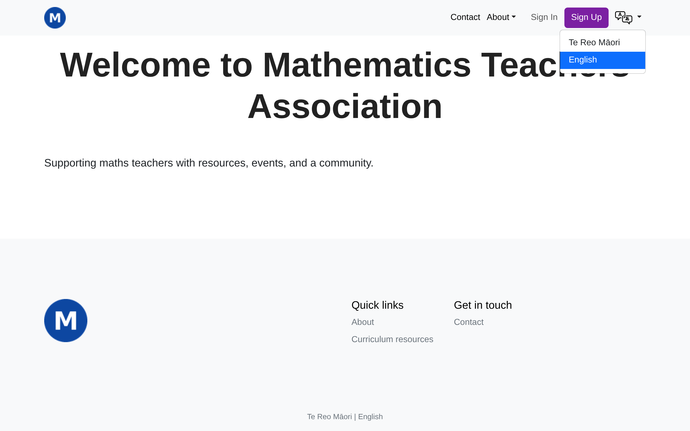
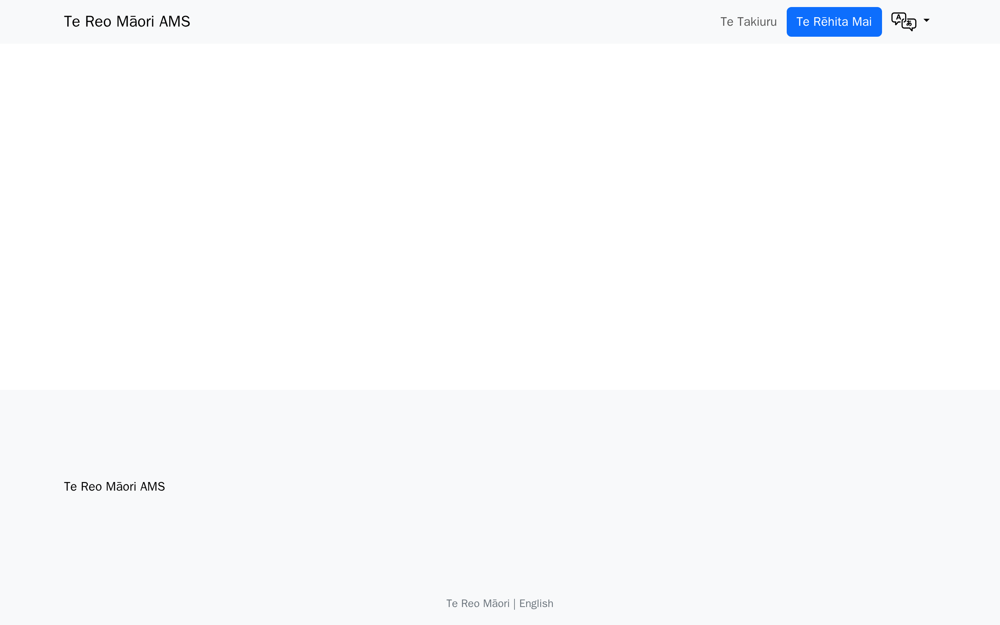
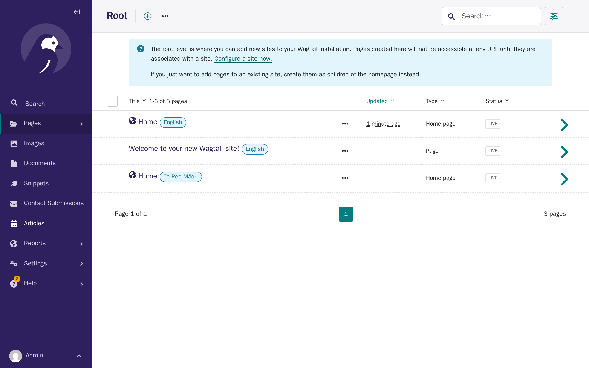
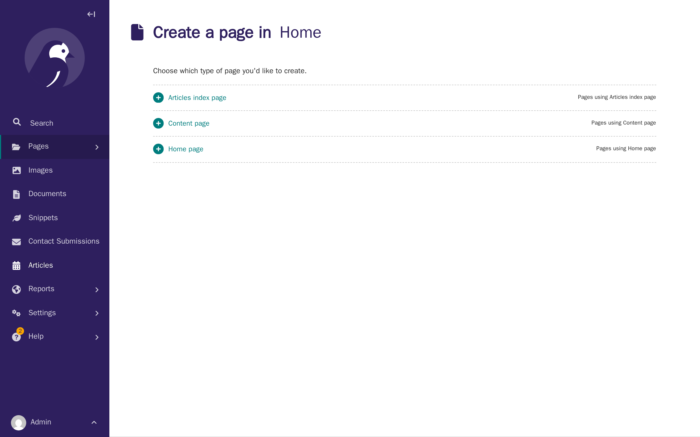
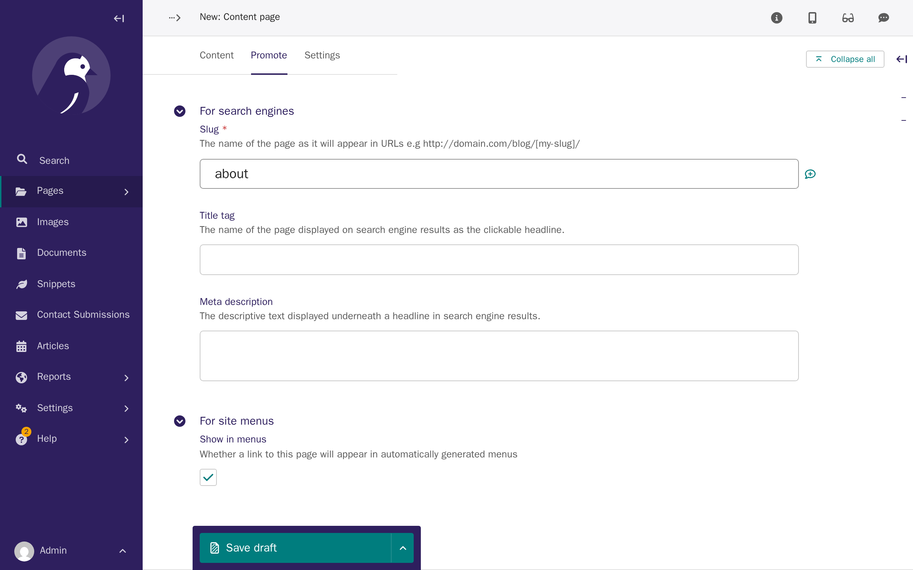
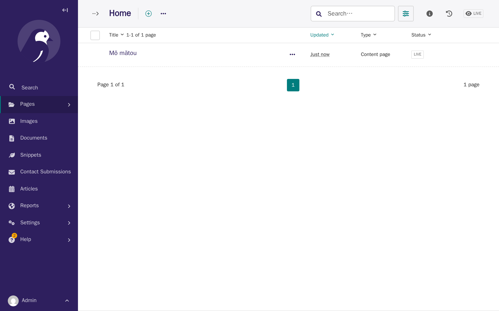
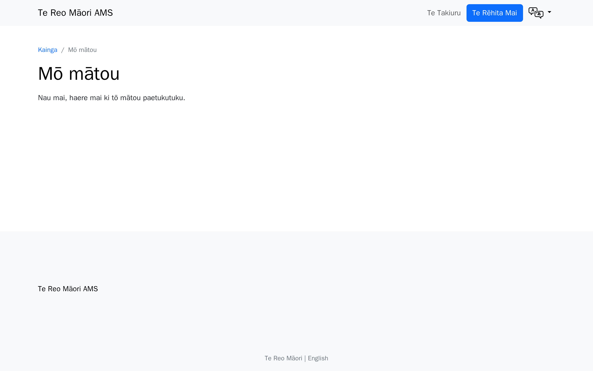

# Tutorial 5: Languages & translations

**Who this page is for:** client website admins — the volunteers who will load content and run the day-to-day site, generally with no prior web-admin experience.

## What you'll have at the end

You'll understand why your site's language switcher works automatically, but each language's pages have to be added separately.
You'll have added your About page in a second language, and you'll know why matching web addresses across languages matters.
You'll also know who to ask if you want to change which language shows first, or if you spot built-in wording that isn't translated yet.

## Before you start

You should already have a published About page in your main language — see [Tutorial 3: Your first pages](first-pages.md) if you haven't.
AMS currently supports English and Te Reo Māori, so this tutorial uses Te Reo Māori as the example second language.
If your site only has one language enabled, most of this tutorial won't apply yet — skip ahead to [Memberships](memberships.md).

## Steps

1. Sign out, or open your website in a private/incognito browser window, then click the language icon near the top of the page.
    This particular switcher only appears for signed-out visitors — once you're signed in, you're assumed to already be viewing the site in the language you want, so it's hidden.
    Every page also has a second switcher at the very bottom, in the footer, which is always there whether you're signed in or not — that's the one to point people to if they ever ask how to change language while signed in.

    

2. Click **Te Reo Māori**.

    

    Your site now shows its Te Reo Māori version — but it's empty, because switching languages takes visitors to a completely separate set of pages, and nobody has added anything to this one yet.

3. Sign back in to the CMS and click **Pages**.

    

    Notice there are two **Home** pages, one labelled English and one labelled Te Reo Māori.
    Each language has its own separate set of pages underneath its own Home — adding a page in English never adds it anywhere else.

4. Open the Te Reo Māori **Home**, click **Add child page**, then click **Content page** — the same as [Tutorial 3](first-pages.md).

    

5. Type a title in your other language, and add your content, the same as Tutorial 3.
    Then click **Promote**, and look at the **Slug** field.
    Wagtail fills this in automatically from your title — but because this page needs to line up with its English version, change it to match that page's web address exactly: here, `about`.

    

6. Click the arrow next to **Save draft**, then click **Publish**.

    

7. Go to your English About page and click the language switcher again, as a signed-out visitor.

    

    This time, it takes you straight to your new Māori About page, because the two pages now share the same web address.

## Keeping matching pages lined up

The language switcher doesn't know which pages are "the same page" in different languages — it just swaps the language part of the current web address and looks for a page there.
If your two languages' pages don't share the same slug, a visitor who switches languages partway through your site will see a "page not found" message instead of your translated page, exactly like Te Reo Māori's About page did before you fixed its slug in step 5.
You don't have to translate every page — a page can exist in only one language — but for any page you do build in both, matching slugs are what makes the switcher find it.

## Changing which language shows first

Which languages your site has enabled, and the order they appear in the switcher, is decided during onboarding — this is the [`AMS_ENABLED_LANGUAGES`](../../getting-started/settings-glossary.md#ams_enabled_languages) setting.
It's set by your provider, not something you change yourself in the CMS.
If you want to change the order later — for example, to show Te Reo Māori before English — ask your provider to update it for you.

## Translating your site's wording

Everything on your own pages — headings, paragraphs, forms you build yourself — is translated by typing it in directly, in each language, the same way you just did for the About page.
But some wording is built into AMS itself: button labels, the sign-up and sign-in forms, error messages.
This built-in wording isn't editable in the CMS at all, and it's shared across every AMS site rather than written specifically for yours — so it's usually already translated by the time you launch, and most clients won't need to do anything about it.

If you do spot some of this built-in wording still showing in English where you'd expect your other language, that's a genuine gap rather than something you can fix yourself in the CMS.
Ask your provider how you can help translate it.
Your provider isn't necessarily the one who does the translating themselves — they may not speak your other language — but they're responsible for adding your translations to the site's code and publishing them.
A practical way to close a gap like this: ask your provider for a list of the missing wording, sorted so the most visible pieces — your home page, the sign-up and sign-in forms — are at the top, so you can prioritise what visitors see first if you're short on time.
Then you can translate these wordings, for the provider to add into the AMS for all to use.

## What's next

The next tutorial covers [memberships](memberships.md) — setting up membership types and pricing, and how sign-ups and approvals work.
