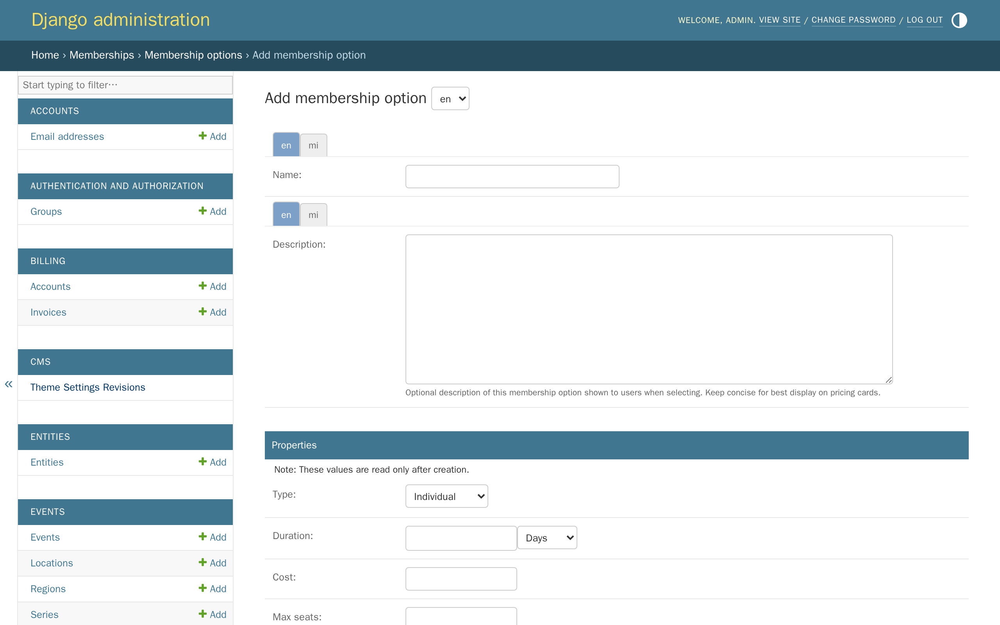
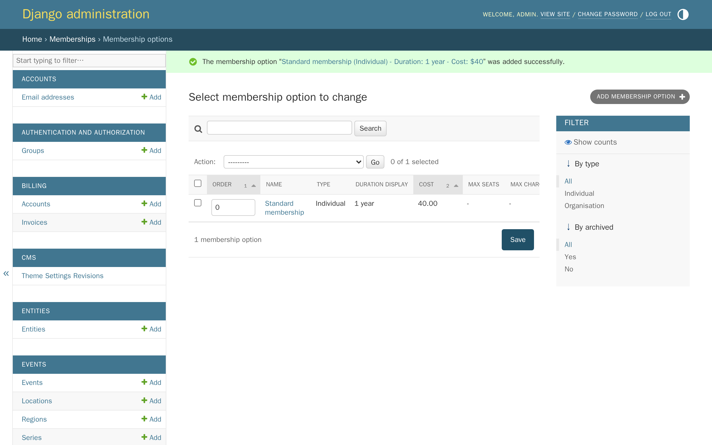
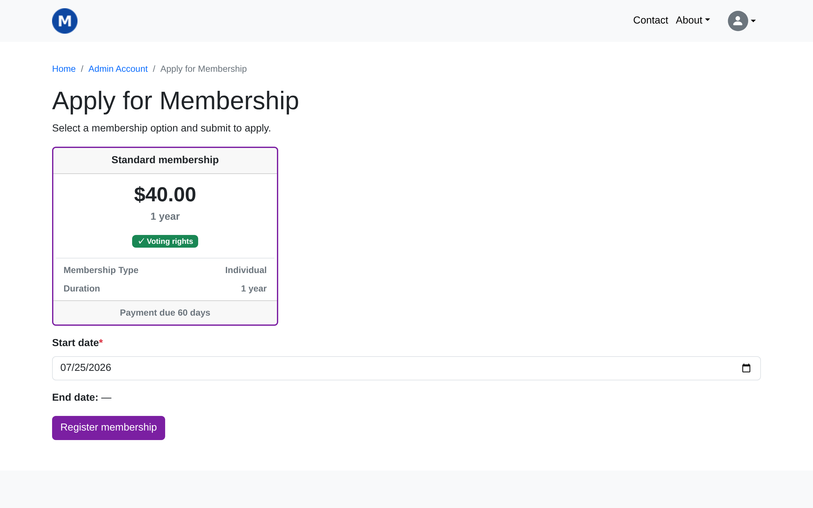
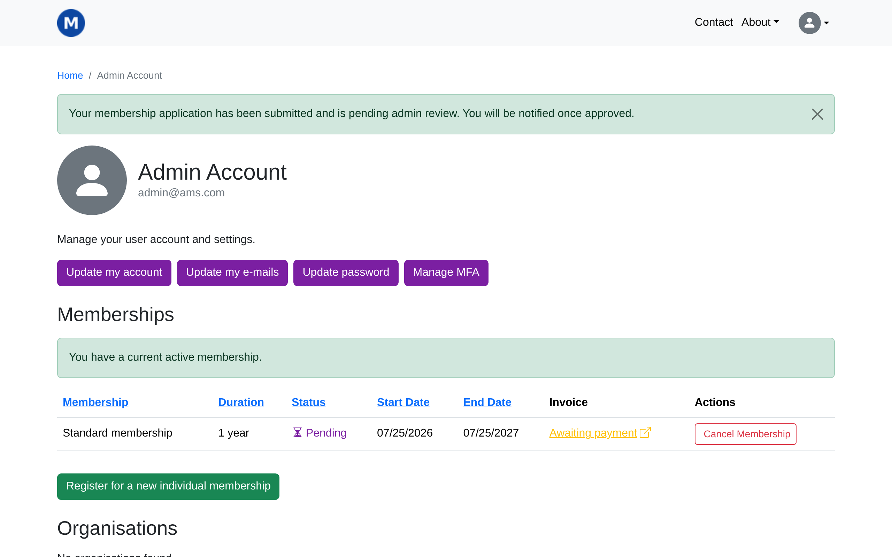
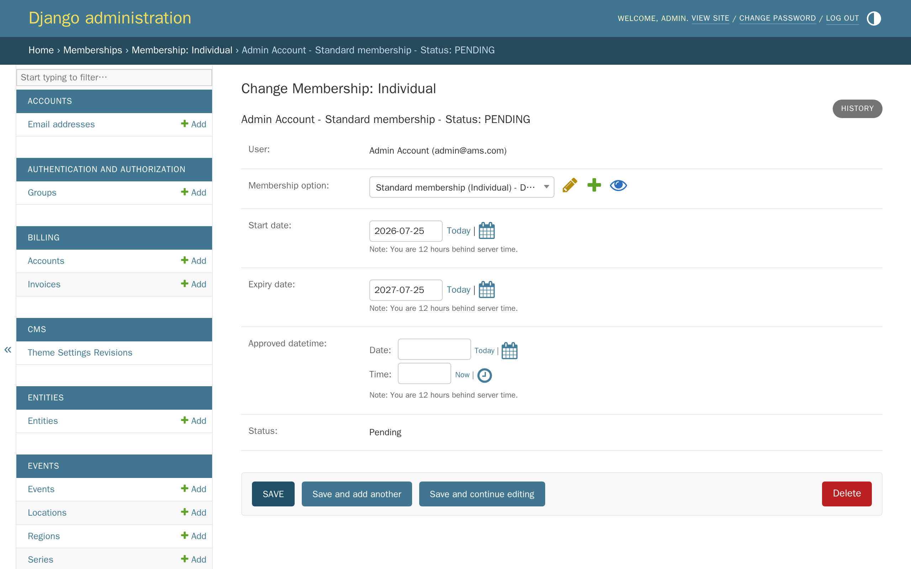
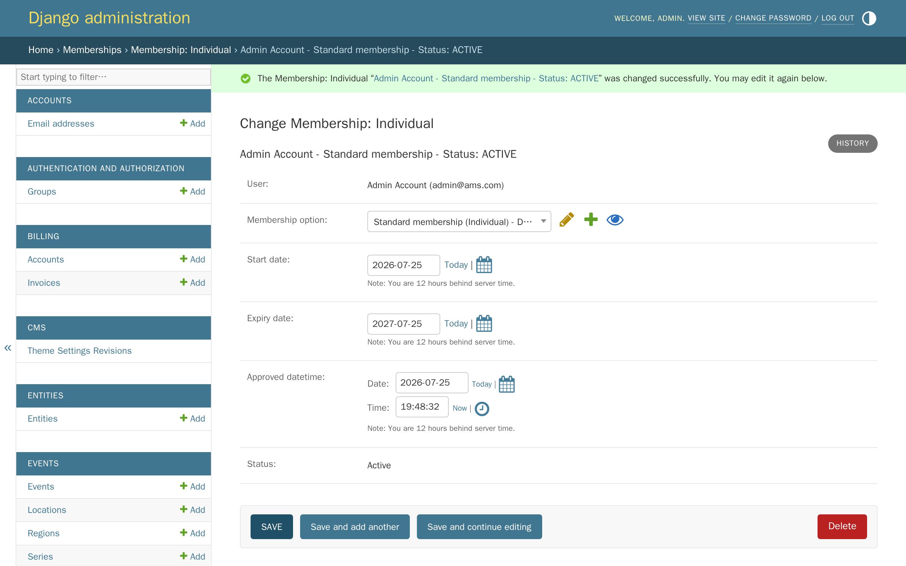
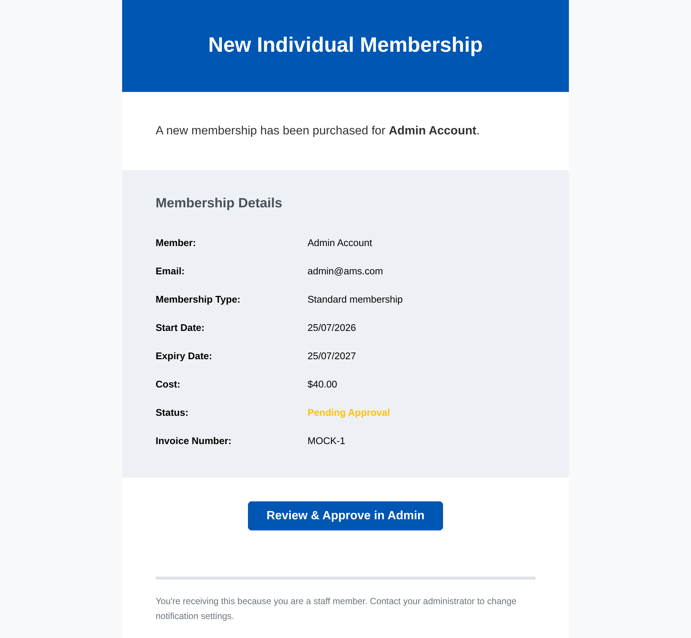

# Tutorial 6: Memberships

**Who this page is for:** client website admins — the volunteers who will load content and run the day-to-day site, generally with no prior web-admin experience.

## What you'll have at the end

You'll have created a membership type with its own price and length, understood what each of its settings actually controls, and applied for it the same way a visitor would.
You'll know how to approve a pending membership, and what the emails your team receives about memberships actually mean.

## Before you start

Membership types are managed in the **Django admin**, not the CMS — see [Tutorial 1: Orientation](orientation.md) if you're not sure how to get there.
This tutorial creates a paid membership type, since that's the clearest way to see the whole application-to-approval flow in one pass.
If your association only offers free memberships, most of the steps still apply — free memberships are covered under [Approving a membership](#approving-a-membership) below.

## Steps

1. In the Django admin, click **Memberships**, then click **Add** next to **Membership options**.

    

2. Fill in the fields below, then click **Save**.

    

    | Field | What it does | Can you change it later? |
    | --- | --- | --- |
    | Name | Shown to members when they apply, and everywhere else this membership is listed. | Yes |
    | Description | Optional extra text shown under the price when a member is choosing a membership — use it for anything the name doesn't already say. | Yes |
    | Type | Whether this is a membership for one person (**Individual**) or a whole organisation (**Organisation**), which applies with a number of seats instead of one person — see [Organisation memberships](#organisation-memberships) below. | No |
    | Duration | How long the membership lasts once it starts, in days, weeks, months, or years. | No |
    | Cost | The price. A cost of 0 makes this a free membership. | No |
    | Max seats | **Organisation memberships only.** The most seats this option allows. Leave blank for no limit. | No |
    | Max charged seats | **Organisation memberships only.** How many seats are actually charged for; any beyond this number are free. Leave blank to charge for every seat. | No |
    | Voting rights | Whether a member with this option can vote in association matters (Voting feature coming soon). | Yes |
    | Invoice due days | How many days a member has to pay their invoice, counted from the day it's issued. | Yes, but only affects invoices issued after the change |
    | Invoice reference | The text shown as the reference on invoices this option generates. | Yes |
    | Display order | Where this option appears among others on the application page — lower numbers show first. | Yes |
    | Archived | Hides this option from new applications, without affecting members who already have it. | Yes |

    **Type, Duration, Cost, Max seats, and Max charged seats are locked the moment you save** — the Django admin won't let you edit them again, so it's worth getting them right the first time.
    This is deliberate: it stops a membership's price or length from shifting under a member after they've already signed up.
    If you need to change one of these later, archive this option and create a new one instead — existing members keep the terms they signed up for.

3. On your account page, click **Register for a new individual membership** — this is exactly what a visitor sees when they apply.

    

4. Choose the membership and a start date, then click **Register membership**.

    

    The green message near the top always says "you have a current active membership" for a site administrator's own account, like the one used throughout this tutorial series — administrators always have full access to the site, whatever their own membership status is, so this message isn't the one to trust here.
    The **Status** column in the table below it is the real indicator: it shows **Pending** until someone approves the membership.

## Approving a membership

The membership you just applied for is a paid one, so it's sitting **Pending** until its invoice is paid — once your invoicing system shows the payment recorded, it's approved automatically, and there's nothing for you to do.

Sometimes a membership needs approving by hand instead: a member who paid you another way, like bank transfer or cash, or a free membership that needs approval (see below).
Here's how, using the membership you just created as the example:

In the Django admin, click **Memberships**, then **Membership: Individual**, and open the pending record.

Next to **Approved datetime**, click **Today**, then click **Now**, then click **Save and continue editing**.

### Free memberships

If your association also offers a free membership option, whether it needs the same approval step depends on [`AMS_REQUIRE_FREE_MEMBERSHIP_APPROVAL`](../../getting-started/settings-glossary.md#ams_require_free_membership_approval) — a decision made during onboarding (see [the decision questionnaire, question 3](../../getting-started/decision-questionnaire.md#3-membership-model)).

With this setting off, the default, a free membership is approved automatically the moment someone applies — there's nothing for you to do.
With it on, a free membership sits **Pending** exactly like the paid example above, and you approve it the same way, in **Membership: Individual**.

### A paid membership before payment

If a member has paid you another way — bank transfer or cash, say — rather than through your invoicing system, their membership has no way of knowing that, and stays **Pending** indefinitely.
Approving their record by hand, the same way as above, is how you reflect a payment your invoicing system never saw.

## What the staff notifications mean

Whenever someone applies for a membership, everyone with staff access gets an email about it.
Here's an example of what that email looks like:

Whether this email is sent is controlled by [`AMS_NOTIFY_STAFF_MEMBERSHIP_EVENTS`](../../getting-started/settings-glossary.md#ams_notify_staff_membership_events) — decided during onboarding, not something you change yourself.
There's one exception: a free membership that needs approval always sends this email, even with the setting off, since somebody still has to approve it.
You can tell the two cases apart by the subject line: an application that needs approval is subject "REQUIRES APPROVAL: ...", one that doesn't is just "New Individual Membership: ...".

## Organisation memberships

Organisations apply for membership in a similar way, from their own organisation page, with a number of seats instead of a single person.
The same staff notification setting applies, and a pending organisation application is approved the same way, in **Membership: Organisation** instead of **Membership: Individual**.

## What's next

The next tutorial covers [the forum](forum.md) — setting up Discourse for launch, and how member accounts and sign-in work there.
