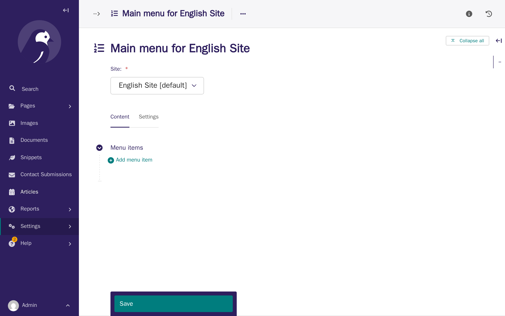
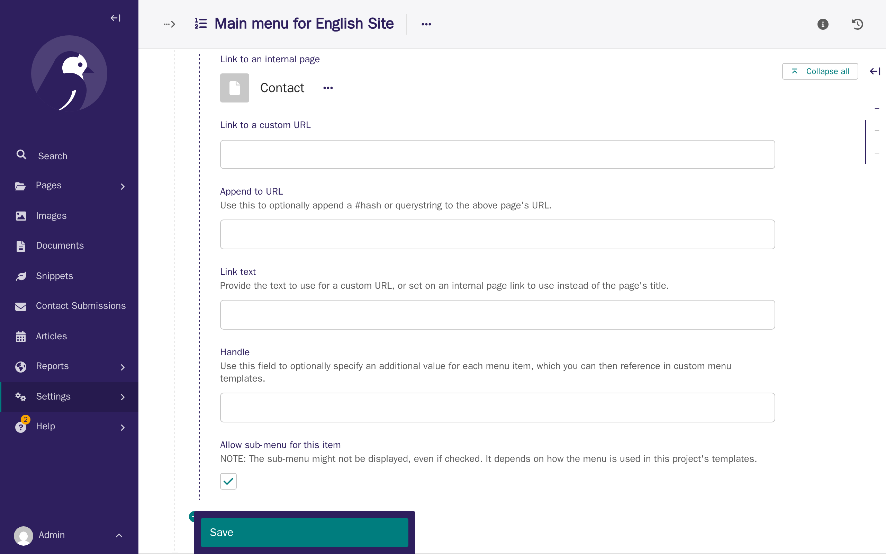
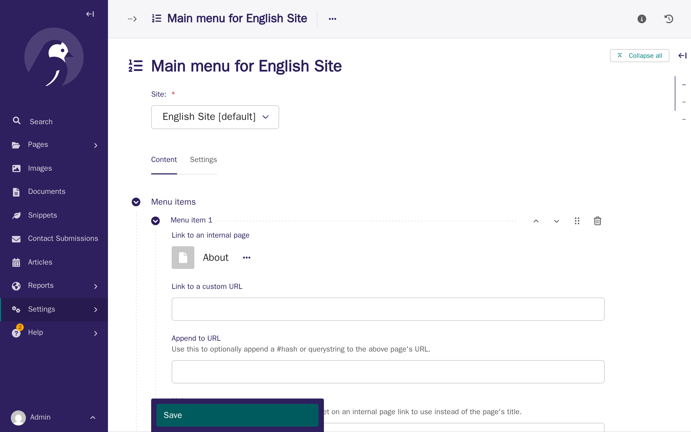
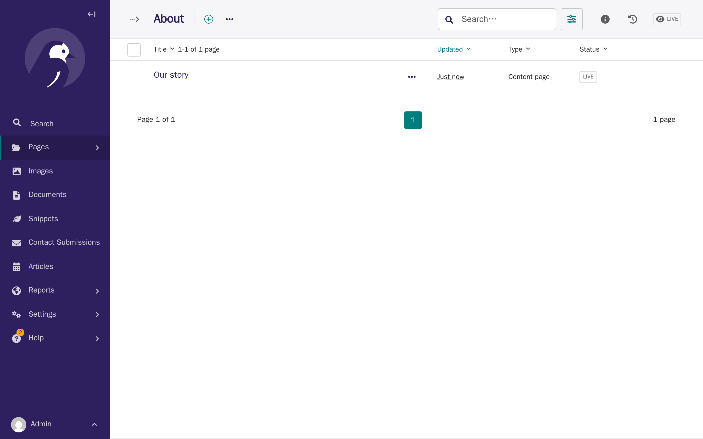
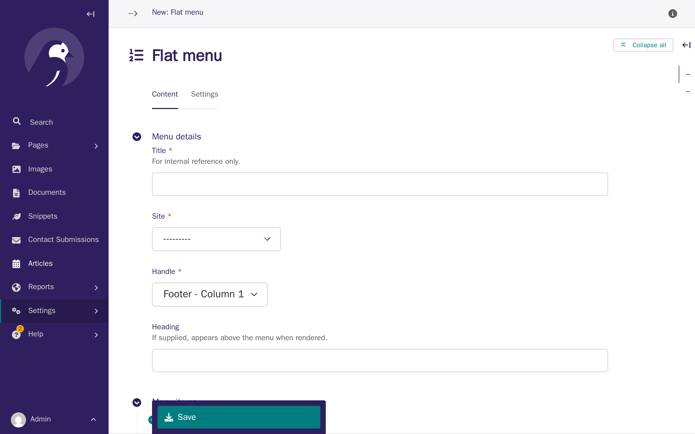
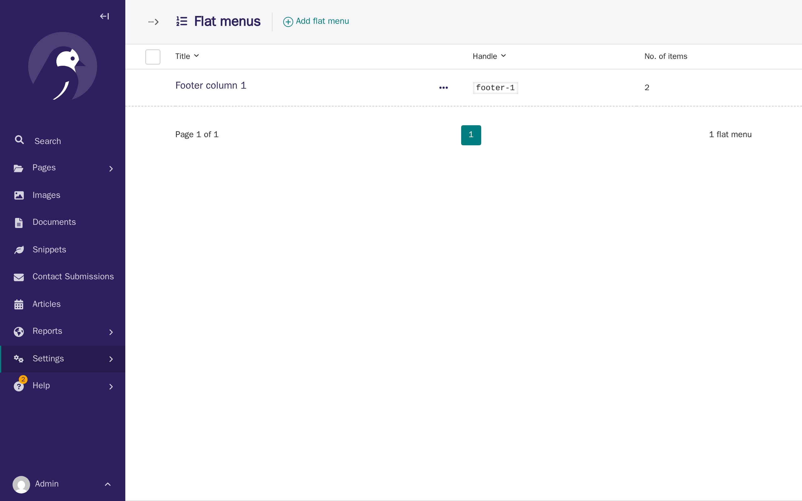

# Tutorial 4: Navigation & menus

**Who this page is for:** client website admins — the volunteers who will load content and run the day-to-day site, generally with no prior web-admin experience.

## What you'll have at the end

Your About and Contact pages, from [Tutorial 3](first-pages.md), will appear in your site's navigation menu, in the order you choose.
You'll know how to group related pages into a dropdown, reorder menu items, rename a menu label without renaming the page, and remove a page from the menu without deleting it.

## Before you start

You should have already published some pages — see [Tutorial 3: Your first pages](first-pages.md) if you haven't.
This tutorial adds the About and Contact pages from that tutorial to your menu.

## Steps

1. In the CMS, click **Settings** in the left sidebar, then click **Main menu**.
    Your menu starts empty — the pages you publish don't appear in it automatically.

    

2. Click **Add menu item**, click **Choose a page**, then click **Explore** next to Home and choose **About**.

    

3. Click **Add menu item** again and choose **Contact** the same way.
    You can link to somewhere outside your own site the same way, too — see [Footer links](#footer-links) below for how.

    

4. Click **Save**.

    

5. Open your site to see your new menu.

    

6. To group pages together, make one page a child of another.
    In **Pages**, open **About**, click **Add child page**, and create a page called **Our story**: give it a title and some content, the same as in [Tutorial 3](first-pages.md), then publish it.
    A page created here only ever offers one page type, so — unlike Tutorial 3 — you won't see a page-type list to choose from first.

    

7. Open your site again.
    **About** is now a dropdown, and **Our story** appears inside it — this happens automatically, because About now has a published page underneath it.

    

8. Back in **Settings > Main menu**, click **Move up** next to **Contact**, then click **Save**, to move it above About.

    

## Reordering pages inside a dropdown

Dropdown items follow the order of the pages themselves, not a separate menu setting.
To reorder them, go to **Pages**, open the parent page (for example, About), click **⋯ (more options)** next to any of its child pages, and choose **Sort menu order**.
Drag a page up or down, or use the keyboard: focus the drag handle, press the up or down arrow key, then press Enter to confirm.

## Renaming a menu label without renaming the page

Sometimes you want a menu item to say something different from the page's actual title — for example, a page titled "About" that you want the menu to say "Who we are".
Open **Settings > Main menu**, open that item, and type your preferred wording into **Link text**.
This only changes the menu label — the page's own title stays the same everywhere else.

## Moving a page to a different dropdown

If you decide a page belongs under a different section, you can move it in the page tree instead of editing the menu.
In **Pages**, find the page, open its **⋯ (more options)** menu, and click **Move**.
Choose the page you want it to sit under and confirm.
It now appears in that page's dropdown instead, with no changes needed in the menu editor itself.

The same **Move** action is also how you merge two existing pages under one dropdown: move one of them so it becomes a child of the other (or a child of a shared parent page).
There's no separate "merge" command — it's the same move, just applied to two pages you already have instead of a new one.

## Removing a page from the menu

To take a page out of the menu without deleting it, open **Settings > Main menu**, open that menu item, and click **Delete**, then **Save**.
The page itself is untouched — only the menu item is removed.
To get rid of a page entirely (for example, a duplicate created by mistake), delete the page itself instead: in **Pages**, open its **⋯ (more options)** menu and click **Delete**.

## Keeping your menu easy to use

Every item you add to the top-level menu takes up space across the top of every page, including on a phone screen.
A menu with more than five or six top-level items usually feels crowded — group related pages into dropdowns instead of adding them all to the top level.

## Footer links

Your site also has a separate footer menu, split into three independent columns, for links you want visible at the bottom of every page rather than the top.
Each column is its own menu, under **Settings > Flat menus**, and needs its own name before visitors see anything — an empty column with no heading just looks like nothing is there.

1. In the CMS, click **Settings**, then click **Flat menus**, then click **Add flat menu**.

    

2. Fill in a **Title** (so you can find this menu again later — visitors never see this one), choose your association's **Site**, choose a **Handle** (which column: Footer - Column 1, 2, or 3), and type a **Heading**.
    The Heading is the name visitors see above the column's links — this is optional, but useful if you want groups of links.

    

3. Click **Add menu item**, click **Choose a page**, and pick a page — the same as adding a page to the Main menu above.

    

4. Click **Add menu item** again.
    This time, to link to somewhere outside your site, type the full web address into **Link to a custom URL** instead of choosing a page, and type the words you want visitors to see into **Link text**.
    A custom URL always needs `https://` (or `http://`) at the start — without it, visitors' browsers won't know it's a web address.

    

    **Linking to your forum is the one exception to the rule above:** type `/forum/` into **Link to a custom URL** instead of a full web address, with no `https://` in front.
    That's a shortcut built into your own site that signs a visitor in and sends them straight into the forum — see [Tutorial 7: Forum](forum.md#let-members-find-the-forum) for why it's worth using instead of your forum's own address.

5. Click **Save**.

    

Repeat these steps for **Footer - Column 2** or **Footer - Column 3** to add more columns.
Each one is completely independent, with its own heading and its own links — here's a site with two columns filled in, each with its own name:

## What's next

The next tutorial covers [languages & translations](languages-translations.md) — how your site's content works across more than one language.
