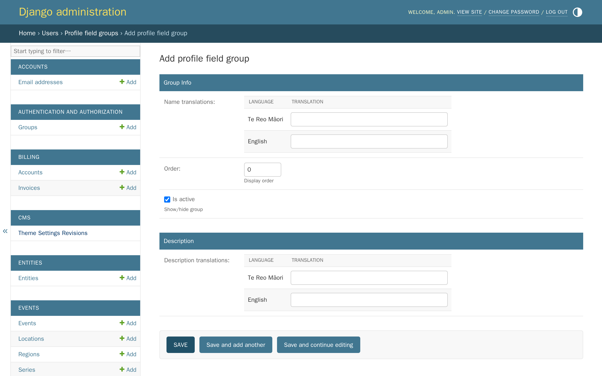
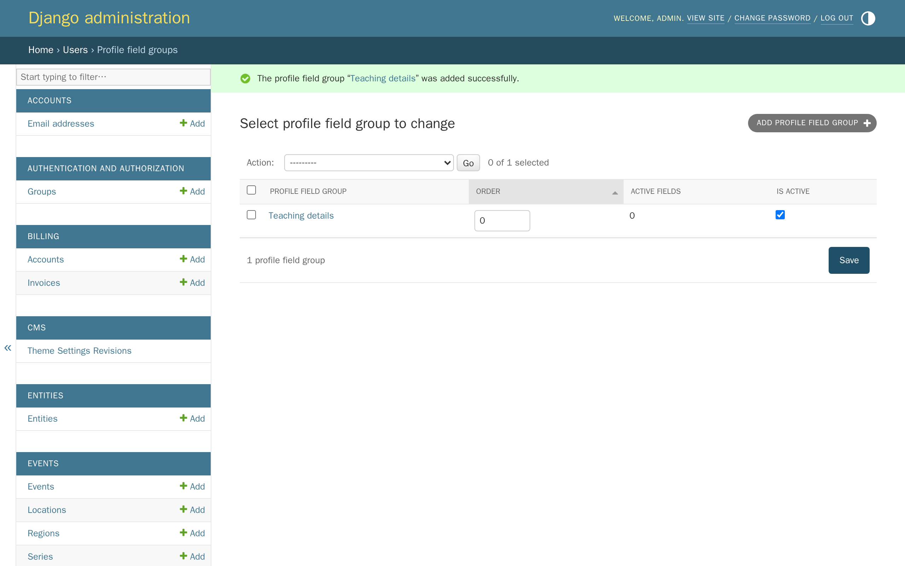
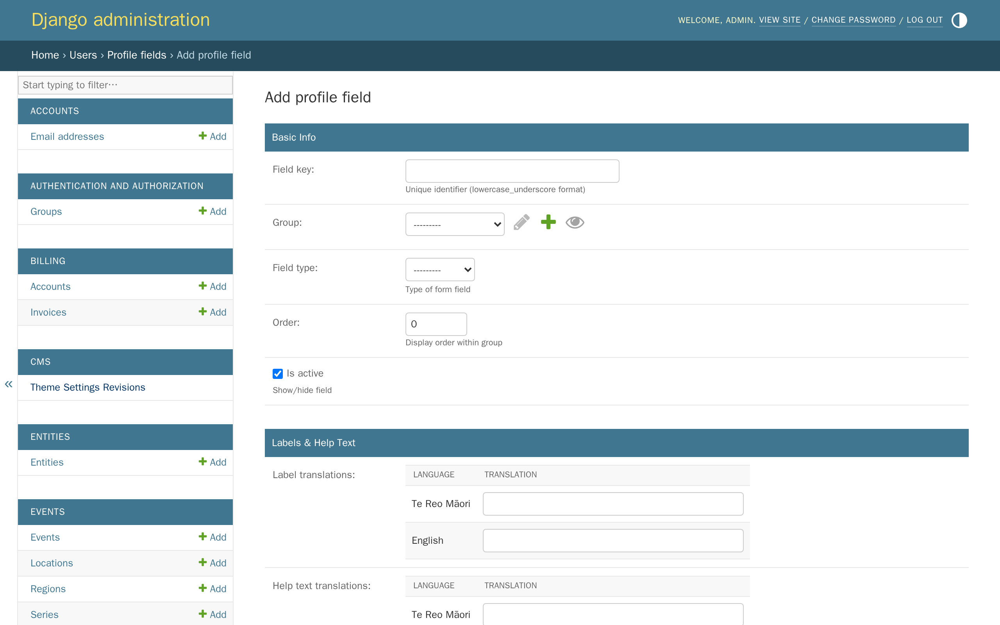
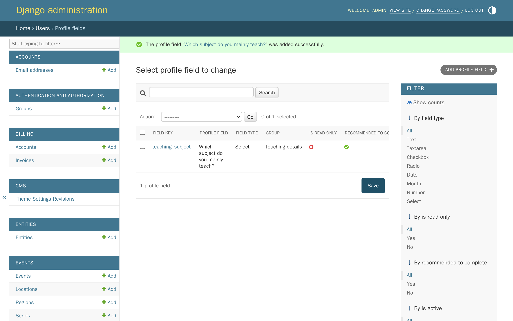
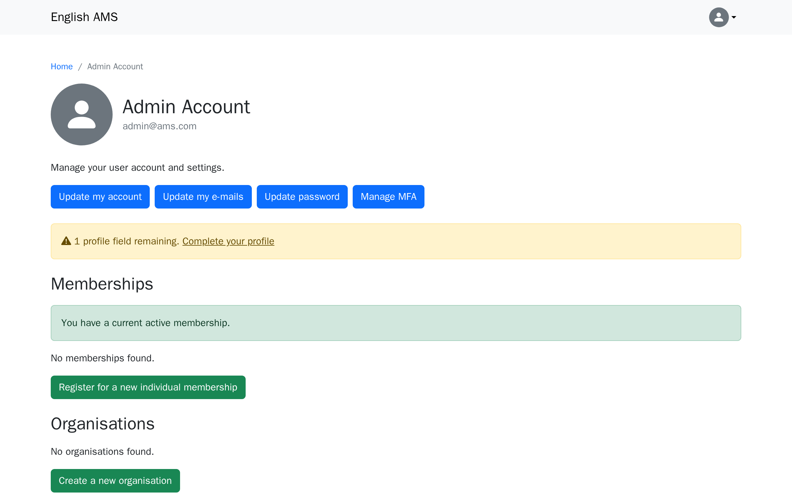
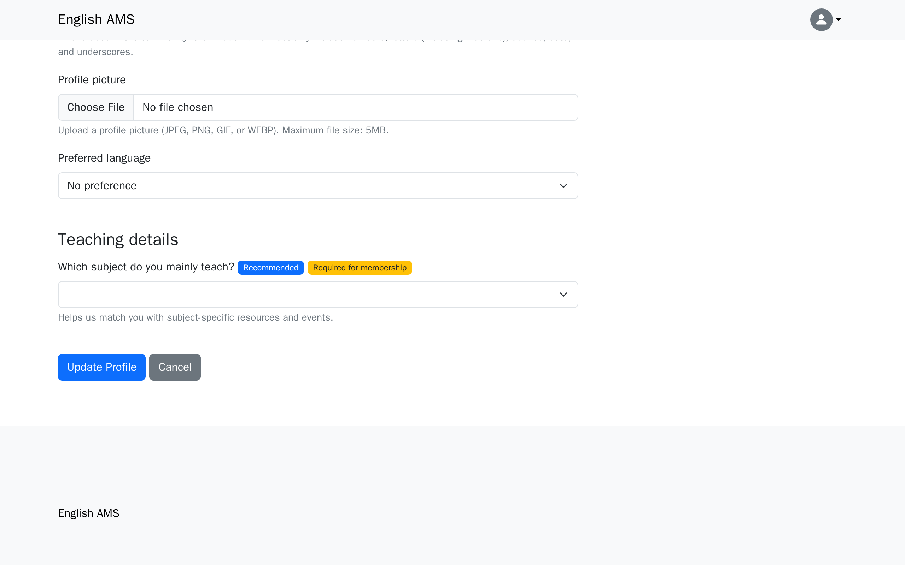
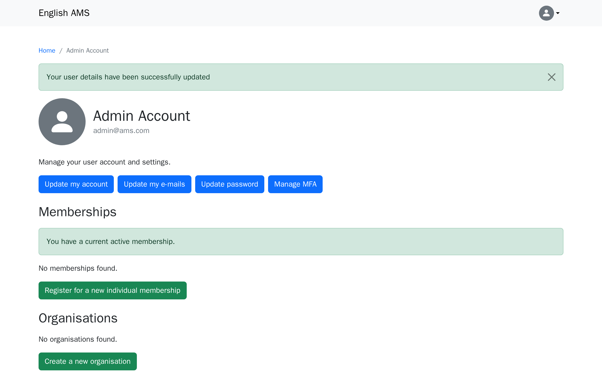

# Tutorial 7: Custom profile fields

**Who this page is for:** client website admins — the volunteers who will load content and run the day-to-day site, generally with no prior web-admin experience.

## What you'll have at the end

You'll have created a profile field group and a custom profile field of your own, and seen exactly what a member sees when they're asked to fill it in — both the nudge on their account page and the field itself on their profile form.

## Before you start

Profile field groups and fields are managed in the **Django admin**, not the CMS — see [Tutorial 1: Orientation](orientation.md) if you're not sure how to get there.
This tutorial's example ties back to the membership type you created in [Tutorial 6](memberships.md): it marks its field "required for membership" to show what that flag does — and, just as importantly, what it doesn't.
If your site has more than one language enabled, you can add a translation for each group and field the same way you added a second language to a page in [Tutorial 5](languages-translations.md) — this tutorial only fills in English, to keep the steps focused on profile fields themselves.

## Groups and fields

Two things work together to build your profile form:

- A **group** is a heading that organises related questions together, like a section title.
- A **field** is one actual question inside a group — the thing a member answers.

Every field belongs to exactly one group, but a group can hold as many fields as you like — so you always create the group first, then add fields to it.

For example, a single "Teaching details" group could hold several related fields together, rather than each one standing alone:

| Group | Field |
| --- | --- |
| Teaching details | Which subject do you mainly teach? |
| Teaching details | How many years have you been teaching? |
| Teaching details | Do you teach at more than one school? |

On the member's profile form, this shows as one "Teaching details" heading with three questions underneath it — not three separate, unlabelled questions scattered down the page.
This tutorial creates just one group with one field, but grouping is what lets you add more related questions later without the profile form turning into a long, flat list.

## Steps

1. In the Django admin, click **Users**, then click **Add** next to **Profile field groups**.

    

2. Type a name for the group — this is the heading members see above the questions in it — then click **Save**.

    

3. Click **Users** in the breadcrumbs, then click **Add** next to **Profile fields**.

    

4. Fill in the fields below, then click **Save**.

    

    | Field | What it does | Can you change it later? |
    | --- | --- | --- |
    | Field key | A short, computer-only identifier — lowercase letters and underscores only, e.g. `teaching_subject`. Never shown to members. | No |
    | Group | Which group this field's question appears under on the profile form. | Yes |
    | Field type | What kind of answer this field collects — see [Field types](#field-types) below. | Yes |
    | Order | Where this field appears among others in its group — lower numbers show first. | Yes |
    | Is active | Whether the field shows up on the profile form at all. | Yes |
    | Label translations | The question shown to the member. | Yes |
    | Help text translations | Optional extra text shown under the question. | Yes |
    | Options | The list of choices — only used by the Select, Radio, and Checkbox types. | Yes |
    | Min value / Max value | Optional lower and upper limits — only used by the Number type. | Yes |
    | Is read only | Only staff can set this field's value — a member sees it but can't edit it. | Yes |
    | Is required for membership | Adds a **Required for membership** badge next to the question — see the note below for what this does and doesn't do. | Yes |
    | Recommended to complete | Included in the profile-completion nudge shown on a member's account page. | Yes |

    **Field key is locked the moment you save** — the Django admin won't let you edit it again, so it's worth getting it right the first time.
    If you need to change it, create a new field instead; the old one's existing answers stay attached to it under its old key.

    **"Required for membership" is a label, not a rule — today.**
    Ticking it adds a badge next to the question, but AMS doesn't yet stop someone applying for a membership without answering it.
    Treat it as a strong hint to members, not a guarantee — for the full picture of what actually gates membership access, see [Feature reference: Memberships & organisations](../reference/memberships.md).

## What a member sees

Custom profile fields aren't part of the sign-up form itself — a new member signs up with their name, email, username, and password, then answers these questions afterwards, from their account page.
A member who hasn't answered a recommended or required field sees a nudge there, telling them how many profile fields are left.

Clicking **Complete your profile** — or **Update my account**, at any time — opens the account update form, with your new group and its field added at the bottom, carrying whichever badges you set.

Answering it and clicking **Update Profile** takes the member back to their account page — the nudge is gone, and their answer is saved.

## Field types

| Type | What the member sees |
| --- | --- |
| Text | A single-line text box. |
| Textarea | A multi-line text box. |
| Checkbox | A list of choices — pick as many as apply. |
| Radio | A list of choices — pick one. |
| Select | A drop-down list — pick one. |
| Date | A date picker. |
| Month | A month-and-year picker. |
| Number | A number box, optionally limited to a min/max range. |

## What's next

The next tutorial covers [the forum](forum.md) — setting up Discourse for launch, and how member accounts and sign-in work there.
