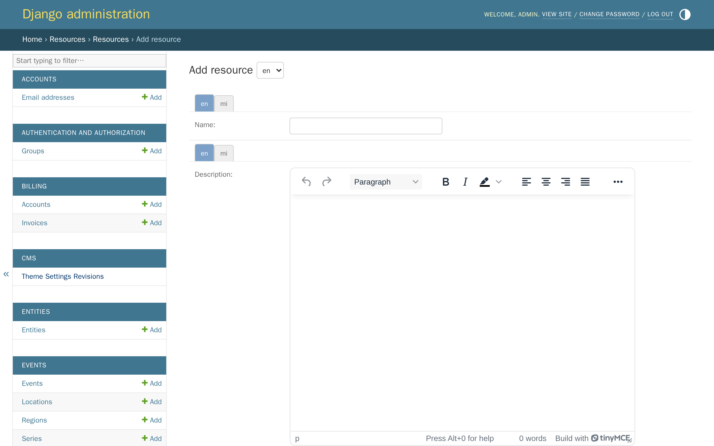
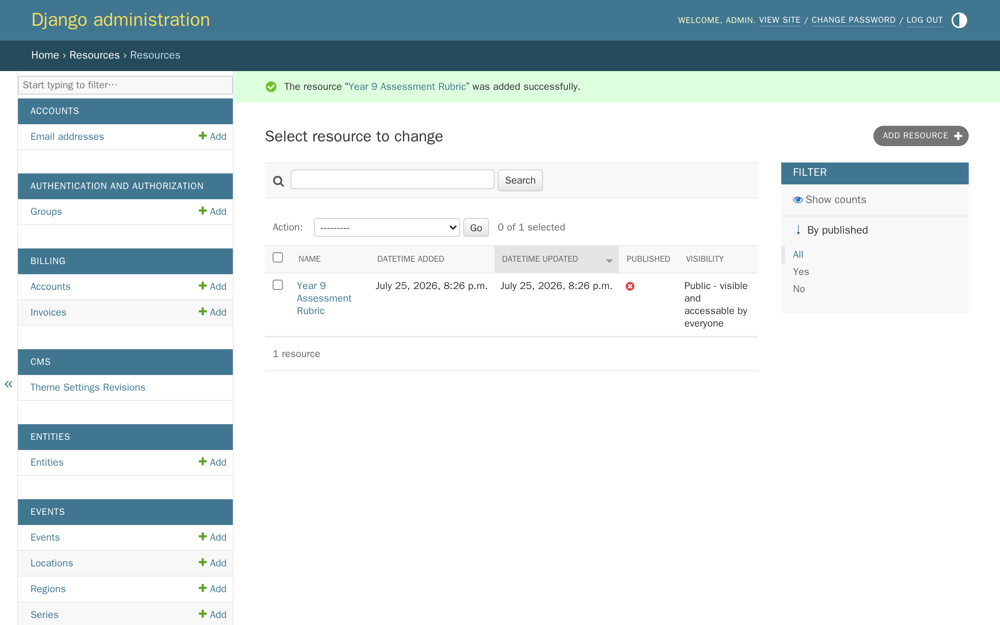
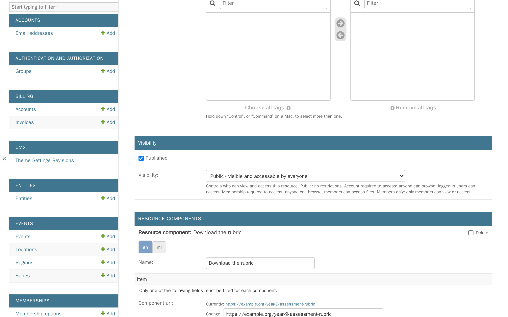
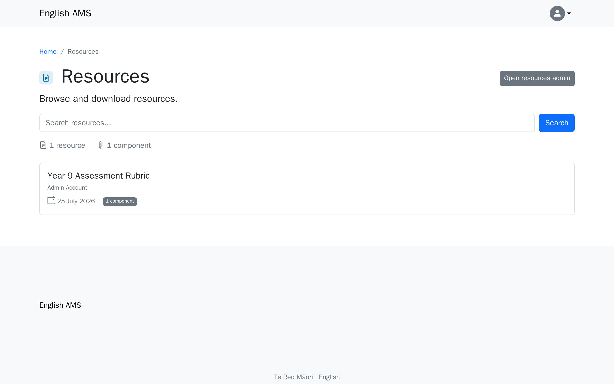
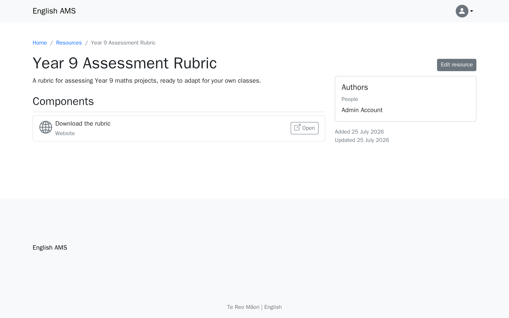

# Tutorial 9: Resources

**Who this page is for:** client website admins — the volunteers who will load content and run the day-to-day site, generally with no prior web-admin experience.

## What you'll have at the end

You'll have added a resource with a downloadable link, published it, and seen it live on your public site.

## Before you start

Whether your site has resources at all is a decision from onboarding — see [question 5 of the decision questionnaire](../../getting-started/decision-questionnaire.md#5-optional-features).
Turning it on ([`AMS_RESOURCES_ENABLED`](../../getting-started/settings-glossary.md#ams_resources_enabled)) needs an environment change and a restart, so if you don't see **Resources** in the Django admin yet, your provider hasn't switched it on — see the [resources admin guide](../reference/resources.md).
Resources are managed in the **Django admin**, not the CMS — see [Tutorial 1: Orientation](orientation.md) if you're not sure how to get there.

## Steps

1. In the Django admin, click **Resources**, then click **Add** next to **Resources**.

    

2. Fill in the fields below, then click **Save**.

    | Field | What it does |
    | --- | --- |
    | Name | The resource's title. |
    | Description | Shown on the resource's own page. |
    | Author entities / Author users | Who made this resource — an entity is an organisation or group rather than a person. At least one author, of either kind, is required. |
    | Tags | Optional. See [Categories and tags](#categories-and-tags) below. |
    | Visibility | Who can see and access this resource — see [Who can see a resource](#who-can-see-a-resource) below. Leave it as **Public** for this tutorial. |
    | Resource components | The resource's actual content — at least one is required. Give it a name, then fill in exactly one of **Component url**, **Component file**, or **Component resource** (a link to another resource already in the system). Click **Add another Resource component** for more than one. |

    A component's type (PDF, document, video, website, and so on) is worked out automatically from what you gave it — you don't choose it yourself.

    

3. The resource is hidden from the public until you mark it as published — the same way a CMS page stays a draft until you publish it.
    Open the resource, check **Published**, then click **Save**.

    

4. Visit your resources page to see it live.

    

## The resource's own page

Click through to the resource's name from the listing to see its full page — this is what a visitor sees after clicking through.

## Who can see a resource

The **Visibility** field controls both whether a resource is listed at all, and whether its components can actually be opened or downloaded:

| Visibility | Who can see it listed | Who can open its components |
| --- | --- | --- |
| Public | Everyone | Everyone |
| Account required to access | Everyone | Anyone signed in |
| Membership required to access | Everyone | Members only |
| Members only | Members only | Members only |

Most associations only need **Public** and **Members only** — the two middle options exist for the less common case of wanting a resource visible to everyone, but its actual content restricted.

## Categories and tags

If you have more than a handful of resources, tagging them helps members filter and find what they need.
Set this up from **Resources**, in the Django admin: create one or more **Resource categories** (e.g. "Year Level"), then add **Resource tags** within each (e.g. "Year 9") — see the [resources admin guide](../reference/resources.md#taxonomy-categories-and-tags) for the full walkthrough.
Tags are entirely optional and don't change anything about how a resource is added — skip this if you only have a few resources to start with.

## Adding resources to your menu

Nothing links to your resources page automatically.
See [Adding resources to menus](../reference/resources.md#adding-resources-to-menus) — the short version is you link to `/resources/` the same way you'd link to any other page, in [Tutorial 4: Navigation & menus](navigation-menus.md).

## What's next

The next tutorial covers [inviting your team](inviting-your-team.md) — giving other volunteers admin or editor access to your site.
